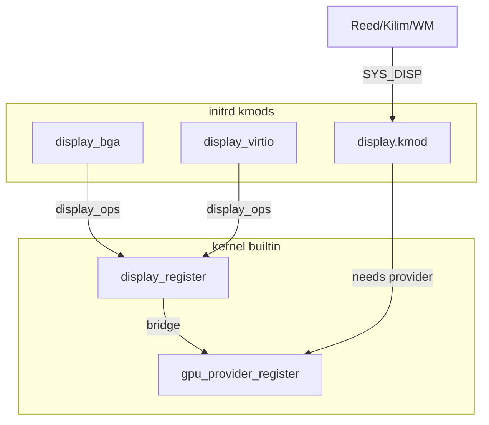

# Drivers / GFX restructure + BGA provider

## klock ASM — doğru mu?

**Evet.** [`klock_t`](include/kernel/klock.h) reentrant + irqsave wrapper; altındaki `spinlock_t` → `spinlock.asm` (`XCHG` + `PAUSE`). Playbook ile uyumlu; soft atomics yok.

Dikkat: `klock_gfx` şu an **disp_api + `drivers_poll` (PS/2)** için tek büyük kilit — isim yanlış (“gfx/DX”), mekanizma doğru. Bu planda rename + yorum güncellemesi var; kilidi ikiye bölmek (disp vs input) ayrı iş, şimdi yapmıyoruz.

## GFX isim temizliği

| Eski | Yeni |
|------|------|
| `klock_gfx` | `klock_disp` |
| init name `"gfx"` | `"disp"` |
| yorumlar: DX / gfx big-lock | `disp_api` + `drivers_poll` serialize |

Dokunulacak: [`klock.c`](src/kernel/klock.c), [`klock.h`](include/kernel/klock.h), [`disp_api.c`](src/kernel/disp_api.c), [`driver.c`](src/drivers/driver.c), [`display_mod.c`](src/drivers/disp/display_mod.c), [`process.c`](src/kernel/process.c) yorumu, [`README.md`](README.md) SDK satırı (`gfx` → `reed/kilim`).

`rg 'klock_gfx|\bgfx\b|GFX'` ile aktif path doğrulanır. Hardware Bochs isimleri (`VBE_DISPI_*`, PCI 0x1234:0x1111) kalır — bunlar GFX legacy değil.

## Hedef ağaç

```text
src/drivers/
  core/           driver.c, internal.c
  bus/pci/        pci.c
  console/        serial.c, vga.c (text), console.c
  input/          ps2.c, keyboard.c, mouse.c
  block/          (aynı)
  fs/ part/ vfs/ net/  (aynı)
  display/
    display.c     display_ops registry (+ GpuProvider bridge çağrısı)
    gpu.c         GpuProvider registry
    display_mod.c Reed orchestrator (eski disp/)
    providers/
      bga/        Bochs/QEMU -vga std LFB  (eski vga_lfb)
      virtio_gpu/ mevcut virtio

include/drivers/
  driver.h
  bus/pci.h
  console/{serial,vga,console}.h
  input/{ps2,keyboard,mouse}.h
  display/{display,gpu}.h
  vfs/{fs,export}.h   # vfs_fs.h → vfs/fs.h, vfs_export.h → vfs/export.h
```



**Politika:** Display orchestrator (`display.kmod` / `display_mod.c`) provider’lardan ayrı. Provider’lar sadece `providers/` altında; scanout için `display_ops` kaydı + mevcut bridge ile `GpuProvider`. Çift registry bilinçli tutulur (boot splash / `display_active` call site’ları kırılmasın); yeni kod `gpu_provider_active()` tercih eder.

## BGA provider

- [`vga_lfb/`](src/drivers/display/vga_lfb/) → `display/providers/bga/`
- Kmod adı: `display_bga` (xmake + layout order: `display_bga`, `display_virtio`, `display`)
- Ops name / log: `bga`; prio: `DISPLAY_PRIO_BGA` / `GPU_PRIO_BGA` (= 10, virtio 20)
- QEMU: mevcut `-vga std` + `-device virtio-gpu-pci` kalır

## xmake / build

- [`xmake/kernel.lua`](xmake/kernel.lua): `src/drivers/*.c` yerine `core/`, `console/`, `input/`, `bus/pci/`, `display/{display,gpu}.c`
- [`xmake/drivers.lua`](xmake/drivers.lua) + [`layout.lua`](xmake/modules/kernel/layout.lua): path’ler `providers/bga`, `providers/virtio_gpu`, `display/display_mod.c`
- Include: sadece `include/` root; nested `#include <drivers/display/gpu.h>` vb.

## Import güncelleme

Tüm aktif `#include <drivers/...>` (kernel, kmods, ksym) yeni path’lere. Ölü ağaçlar (`src/user/apps`, `apps/imgui-demo`, plan md) build’e girmiyorsa dokunulmaz; aktif path’te `gfx`/`klock_gfx` kalmayacak.

## Doğrulama (sen çalıştırırsın)

`xmake` sonrası boot log: `load display_bga` → `[bga] mode …` → `load display` → `[display] ready` → GUI / `/init`. Console’da tek `kernel>`.
