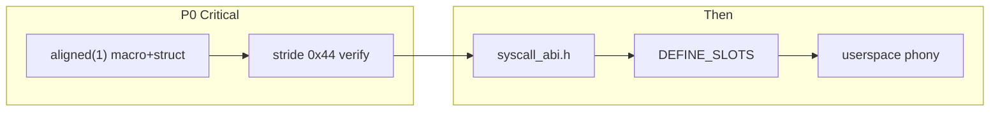

# Dynlib Import System — Migration Playbook (Codebase-Adapted)

## Mevcut durum (envanter)

Bölüm 2 büyük ölçüde **bitmiş**, ama **P0 runtime bug** doğrulandı (objdump):

| Madde | Durum |
|---|---|
| `import.cpp` | **0 adet** |
| [`dynlib_import.h`](userspace/sdk/core/dynlib_import.h) | Var — **eksik `aligned(1)`** |
| [`libfs_api.h`](userspace/sdk/libfs/libfs_api.h) | Var (9 import) |
| [`ld/user.ld`](ld/user.ld) `.dynimports` + 68B terminator | Var |
| [`pack.lua`](xmake/modules/kernel/pack.lua) | Dokunma |
| Entry stride (libfs-demo.elf) | **BUG: 0x60 (96)** beklenen **0x44 (68)** |

```
APP: libfs-demo / libfs-demo2 → libfs.dynlib via libfs_api.h
Diğer app’ler: needed[] boş
```

**Karar (Bölüm 3):** Yeni `libproc`/`libmem`/`libwin` **açılmayacak**. `EXEC_NEEDED_MAX=4` dokunulmaz.



---

## Faz P0 — Entry stride bug (ÖNCE BUNU, başka işe geçme)

### Teşhis (doğrulanmış)

`i686-elf-objdump -s -j .dynimports` libfs-demo:

- Entry1 `@0x3400240`, Entry2 `@0x34002a0` → delta **0x60 = 96**
- `sizeof(dynlib_import_t)` packed = **68 = 0x44**
- GCC, `packed` olsa bile her `_dynimp_*` nesnesini **32-byte align** ediyor → 28 byte padding
- `dynlib_bind_exec` `imp++` ile **68** ileri gider → padding’de `lib[0]==0` → döngü **ilk entry’den sonra sessizce biter**
- Sonuç: yalnızca `libfs_print_listdir` bind; diğer 8 slot NULL → çağrıda fault

### Düzeltme (üç yer, senkron)

1. [`userspace/sdk/core/dynlib_import.h`](userspace/sdk/core/dynlib_import.h) — makroya `aligned(1)`:

```c
__attribute__((section(".dynimports"), used, aligned(1)))
```

2. [`include/kernel/dynlib.h`](include/kernel/dynlib.h) **ve** [`include/user/dynlib.h`](include/user/dynlib.h) — struct:

```c
} __attribute__((packed, aligned(1))) dynlib_import_t;
```

İkisi de aynı layout’u tutmalı (kernel bind + userspace emit). `dynlib.c` / `pack.lua` / `user.ld` terminator boyutu (68) değişmez.

### Kalıcı playbook notu (Bölüm 2.4 genişletme)

`__dynlib_imports` varlığı **yetmez**. Her needed[] dolu app için:

```bash
i686-elf-nm -n <app>.elf | grep ' _dynimp_'
# Ardışık iki adres farkı TAM 0x44 olmalı (0x60 = regress)
i686-elf-objdump -s -j .dynimports <app>.elf | tail -20
# Son gerçek entry + 0x44 = all-zero terminator
```

Bu kontrol her yeni `*_api.h` / dynlib eklemesinde zorunlu — aksi halde “sadece listedeki ilk import çalışıyor” sessiz bug’ı tekrarlar.

---

## Faz 0 — Referans doğrulama

1. [`user.ld`](ld/user.ld): `.dynimports` `_exec_edata` öncesi; 17×`LONG(0)` = 68B terminator.
2. [`dynlib_bind_exec`](src/kernel/dynlib.c): `imp++` / `lib[0]==0` — **mantık doğru, stride fix yeterli**; döngüyü değiştirme.
3. `pack.lua` **dokunma**. `dynlib.h` yalnızca `aligned(1)` (P0).

---

## Faz 1 — `syscall_abi.h`

**Yeni:** [`userspace/sdk/core/syscall_abi.h`](userspace/sdk/core/syscall_abi.h) — `static inline` `sc0`…`sc5`.

**Güncelle:** [`libfs.c`](userspace/sdk/libfs/libfs.c) — yerel scN sil, include et. sdk-core `syscall.cpp` ile birleştirme yok (dynlib freestanding).

---

## Faz 2 — `libfs_api.h` DEFINE_SLOTS

```c
#ifdef LIBFS_API_DEFINE_SLOTS
  DYNLIB_IMPORT(...);
#else
  extern long (*libfs_open)(...);
#endif
```

Demolar: `#define LIBFS_API_DEFINE_SLOTS` header’dan önce. [`libfs.hpp`](include/user/sdk/libfs.hpp) emit yok.

---

## Faz 3 — Build wiring

[`xmake/userspace.lua`](xmake/userspace.lua): phony’ye `app-libfs-demo`, `app-libfs-demo2`; stale `import.cpp` yorumunu temizle.

---

## Faz 4 — Bölüm 3 tarama (kod yok)

| Bulgu | Karar |
|---|---|
| `syscall.cpp` | Dokunma |
| `libfs.c` scN | → `syscall_abi.h` |
| App YIELD / WM INPUT-DISP | keep-in-app |
| `fs.hpp` | Static kalsın |
| process/thread/time | sdk-core — libproc yok |
| MMAP | libmem yok |

`EXEC_NEEDED_MAX`: 1/4.

---

## Faz 5 — Doğrulama (P0 sonrası zorunlu)

1. Rebuild `app-libfs-demo` / `app-libfs-demo2`.
2. Sembol varlığı:
   ```bash
   i686-elf-nm -n build/userspace/libfs-demo/libfs-demo.elf | grep __dynlib_imports
   ```
3. **Stride (kritik):**
   ```bash
   i686-elf-nm -n build/userspace/libfs-demo/libfs-demo.elf | grep ' _dynimp_'
   ```
   Ardışık fark **tam `0x44`**. `0x60` = fail, dur.
4. Terminator: objdump `.dynimports` sonu — son entry’den +0x44 all-zero.
5. Yalnızca migration kırıklarını düzelt.

---

## Faz 6 — Yasaklar

- Eski `import.cpp` paralel tutma
- İmza tahmini
- `.dynimports` → `.bss`
- Terminator’sız section
- `packed` yeterli sanıp `aligned(1)` atlama (**P0’ın tekrarı**)
- `EXEC_NEEDED_MAX` sessiz artırma
- Tüm app’leri libfs’e zorla migrate
- Alakasız bug fix

---

## Teslim özeti (agent sonda)

- P0: stride 96→68; `aligned(1)` macro + her iki `dynlib.h`
- Oluşturulan: `syscall_abi.h`; güncellenen: `libfs.c`, `libfs_api.h`, demolar, `userspace.lua`
- Yeni dynlib: yok
- App: libfs-demo(2) → libfs.dynlib
- nm: `__dynlib_imports` var; `_dynimp_*` stride = **0x44**
- `EXEC_NEEDED_MAX`: 1/4
