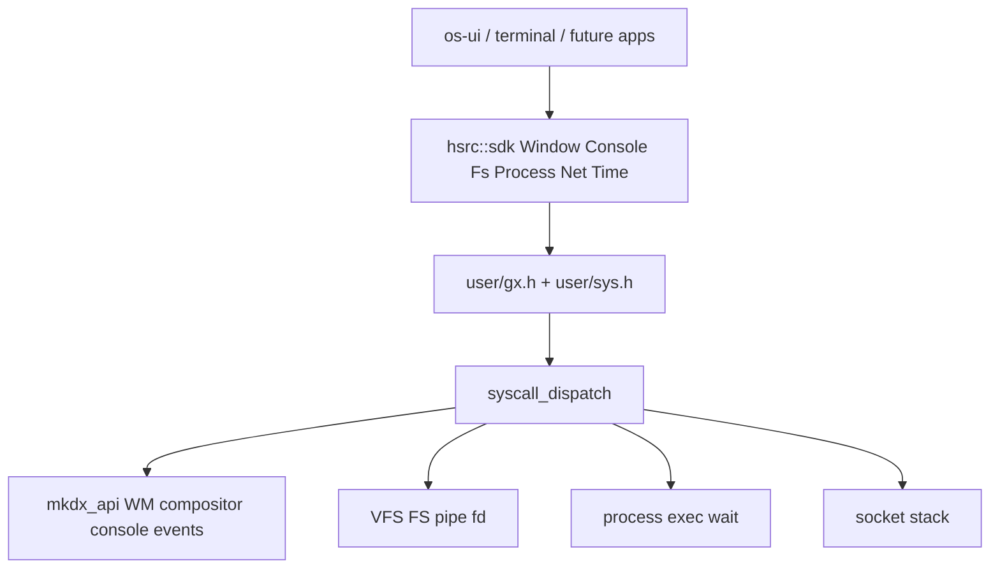
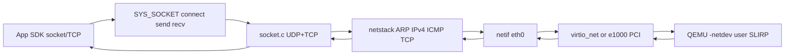
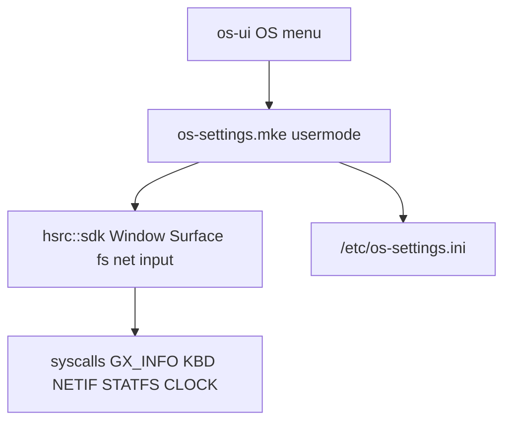

# Ultra God-level Graphics + OS Syscall Surface (v1, ABI break OK)

## İlkeler

- **ABI kırılır, first version mükemmellik öncelikli** — geriye uyumluluk yok; tüm driver/usermode tüketiciler aynı PR dalgasında fixlenir.
- **Window options = sadece boolean + düz alanlar** — bit shift / `1u << n` yok. C: `uint8_t` 0/1. Override: **get → değiştir → set** (tam struct pointer).
- **App development sırasında eksik kernel call kalmayacak** — Linux i386 benzeri numaralar + private range; Windows hissi SDK isimleriyle (`CreateWindow`, `AllocConsole`, `Sleep`, …) C++ sarmalayıcıda.
- **User-mode WindowServer yok** — WM/compositor kernel `mkdx` içinde kalır (mevcut omurga).
- **Networking full-ready** — QEMU’da PCI NIC (virtio-net, gerekirse e1000) + IP stack + socket ile gerçek IP’ye UDP/TCP bağlanabilme; app development için eksik net call kalmaz.
- **System Settings (yönetim masası)** — **usermode** `.mke` uygulama (`os-settings`); Windows/macOS Settings gibi sidebar + sayfalar. **Şimdilik öncelik:** tüm ayar sayfalarını UI olarak sunmak + genel OS bilgisini (ve mevcut syscall/SDK ile okunabilen her şeyi) göstermek. Kernel’e gömülü settings servisi yok — `hsrc::sdk` + syscall (veya usermode’da hesaplanan bilgi). Keyboard layout vb. H5 syscall’ları gelince aynı app’e bağlanır.
- **Dock özelleştirme** — os-ui alttaki uygulama barı (dock) Settings’ten yapılandırılır: hangi app pin’li / gizli. **Kural: çalışan (aktif) her uygulama dock’ta zorunlu görünür**; pin kapalı olsa bile running iken ikon durur, çıkınca pin yoksa kaybolur.
- **Menubar + deep-link** — Hiçbir app focus’ta değilken üst bar sahte File/Edit menüsü göstermez; OS ikonu + **Settings** / **System Information** (ve benzeri) sistem öğeleri durur. Tıklanınca Settings usermode app **deep-link** ile açılır (örn. About / system info sayfası). Deep-link mekanizması plana dahil **zorunlu implementasyon** (opsiyonel değil).
- **Image + wallpaper** — Image decode **geniş format**: PNG, WebP, JPEG, BMP, TGA, GIF (statik), vs. (aşağıda Wave J katalog); os-ui wallpaper cover-scale; 4K default asset; menubar/dock ~%70 frosted blur; ikon/metin opak siyah veya beyaz.
- **Input cihaz keşfi** — mevcut PS/2 (`keyboard.c`/`mouse.c`/`ps2.c`) kullanılır; ayrıca PCI’den `virtio-input` (keyboard/tablet) algılanırsa o path aktif olur. Cihaz yoksa net log; varsa o driver üzerinden çalışır.
- **Profesyonel shell** — os-ui tıklanabilir topbar + window yönetimi (aç/kapa/focus); önceki Settings/deep-link/dock/frosted maddeleriyle **birleşik** (çakışma yok, üzerine eklenir).
- **Apps & launch** — usermode binary’ler VFS `/applications`; File Explorer; terminal `run` / `./` exec.
- **System services** — usermode servisler Linux-like; kernel registry + boot scan + os-ui öldürülürse respawn.
- **Activity Monitor** — Windows benzeri process/CPU/RAM UI + kernel syscalls.
- **Per-process console** — her process’in konsolu var; GUI gizleyebilir; `./` vs Explorer double-click kuralları.
- **Env + PATH** — global ve process-level env; PATH ile tool register (`my-text-app --help`).
- Uygulama **dalga dalga / split workstream**; her dalga kendi başına boot edilebilir olmalı.

## Split workstream indeksi (paralel planlar)

Tek bu dosya kaynak gerçeklik olmaya devam eder. Uygulama sırası/workstream bölünmesi:

| Workstream | Dalgalar | Odak |
|------------|----------|------|
| **WS1 Desktop Shell** | A, H3–H5, H9, I, J, **K** | WM, Settings, wallpaper, frosted UI, tıklanır menubar, window chrome |
| **WS2 Apps & Files** | B, D, H7, H10, **L**, **O**, **Q** | `/applications`, Explorer, run/./, console attach, PATH terminal |
| **WS3 Services & Supervisor** | B, **M**, H11 | system services, boot install, os-ui respawn |
| **WS4 Observe & Env** | E, **N**, **P** | Activity Monitor, CPU/RAM API, global/process env |

AI bir workstream’i bitirmeden diğerine “shell kırarak” geçmesin; bağımlılık: WS1 ↔ K önce tıklanır shell; L/Q için B spawn; M için B+L path; N için proc stats syscall.

## Mimari



---

# WAVE A — God Graphics / Window / Console / Events

## A0) Neden mevcut gx’den daha profesyonel? (dürüst karşılaştırma)

Bugünkü API ([`include/user/gx.h`](include/user/gx.h)) **çalışan bir MVP**: create + bitflag style + map + move/resize/show/focus + global input snapshot + pop_key + full damage + fill. Eksikleri app yazarken can yakar:

| Konu | Şu an (gx) | Plan (v1 god) |
|------|------------|----------------|
| Style | `1u<<n` bitflag, create-time | Her özellik `uint8_t` bool; **set/get ile her an** |
| Durum | sadece `visible` | minimized / maximized / fullscreen / restore_frame |
| Events | yok (poll `input` + `pop_key`) | per-window event queue + wait timeout |
| Damage | global dirty | window + **rect** damage → present_rect |
| Geometry | move/resize ayrı | opts + min/max size + client/screen coords |
| Z-order | raise on focus only | raise/lower/topmost/bottom + relative |
| Chrome | sabit 28px title drag | hit-test codes (client/caption/close/min/max) |
| Cursor | sabit ok | set cursor shape / hide / hotspot |
| Clipboard | yok | text clipboard get/set |
| Enum | find by title | list windows / find class / owner pid |
| Parent | yok | owner/parent id (transient) |
| Input | Latin-5 byte | KEY_DOWN/UP + mods + repeat; mouse wheel |
| Console | yok | AllocConsole log window |
| Draw | fill + userspace buf helpers | blit/line/text/clip + damage entegrasyonu |
| Lifecycle | destroy | close request event → sonra destroy; process ölümünde cleanup |
| Error | çoğu -1 | tutarlı errno (EINVAL, EPERM, ENOMEM, …) |

**Emin miyiz?** Evet — yön ve kapsam mevcut MVP’den üstün; ama “profesyonel” iddiası ancak aşağıdaki **tam syscall + opts + SDK katalogu** uygulanırsa geçerli. Sadece create/set bool yapmak yetmez; A1–A6’daki liste **zorunlu teslimat**.

## A1) Boolean window ABI — [`include/user/gx.h`](include/user/gx.h)

Eski `UGX_STYLE_*`, `ugx_win_create`, parçalı move/resize/show **kullanıcı ABI’sinden kalkar** (kernel içinde `wm_apply` kullanır).

```c
typedef struct ugx_window_opts {
    int32_t  x, y, w, h;
    int32_t  min_w, min_h, max_w, max_h;  /* 0 = limitsiz */
    int32_t  radius;
    uint8_t  opacity;           /* 0..255 */
    char     title[64];
    char     class_name[32];
    int32_t  owner_id;         /* -1 yok; transient owner */
    int32_t  parent_id;         /* -1 yok; child relative */

    /* görünüm — hepsi bool */
    uint8_t  acrylic;
    uint8_t  rounded;
    uint8_t  alpha;
    uint8_t  background;
    uint8_t  no_drag;
    uint8_t  no_title;
    uint8_t  topmost;
    uint8_t  always_on_bottom;
    uint8_t  resizable;
    uint8_t  fullscreen;
    uint8_t  framed;            /* 1 = WM chrome hit zones aktif */
    uint8_t  shadow;            /* compositor soft shadow */

    /* durum */
    uint8_t  visible;
    uint8_t  minimized;
    uint8_t  maximized;
    uint8_t  closable;
    uint8_t  can_minimize;
    uint8_t  can_maximize;
    uint8_t  accept_focus;
    uint8_t  modal;             /* owner üzerinde modal */

    /* input */
    uint8_t  capture_keys;
    uint8_t  capture_mouse;
    uint8_t  mouse_passthrough; /* tık alttaki pencereye */
} ugx_window_opts;
```

**Override kuralı (değişmez):** `get(id,&o)` → alan değiştir → `set(id,&o)`. Bit mask yok.

### A1.1) Zorunlu WM / GX syscall katalogu (eksik kalmayacak)

Private range 200+; numaralar `sys.h`’de tek yerde.

**Pencere yaşam döngüsü**

| Call | Rol |
|------|-----|
| `SYS_WM_CREATE` | `opts*` → id |
| `SYS_WM_SET` | id + `opts*` (tam apply) |
| `SYS_WM_GET` | id + `opts*` out |
| `SYS_WM_CLOSE` | CLOSE event veya hemen destroy (`force` arg) |
| `SYS_WM_DESTROY` | anında yok et |
| `SYS_WM_MAP` | surface map; resize sonrası yeniden çağrılır |
| `SYS_WM_UNMAP_NOTIFY` | (opsiyonel) remap gerektiğini event ile de ver |

**Z-order / focus / bulma**

| Call | Rol |
|------|-----|
| `SYS_WM_FOCUS` | focus ver |
| `SYS_WM_RAISE` / `SYS_WM_LOWER` | z |
| `SYS_WM_FIND` | title |
| `SYS_WM_FIND_CLASS` | class_name |
| `SYS_WM_ENUM` | callback/buffer: id listesi (owner filter) |
| `SYS_WM_AT_POINT` | screen x,y → topmost win id |
| `SYS_WM_GET_FOCUS` | focused id |

**Koordinat / hit-test**

| Call | Rol |
|------|-----|
| `SYS_WM_SCREEN_TO_CLIENT` | |
| `SYS_WM_CLIENT_TO_SCREEN` | |
| `SYS_WM_SET_HIT_TEST` | app özel hit map: client/caption/close/min/max/none (region veya callback-lite: titlebar_h + button rects struct) |
| `SYS_WM_GET_FRAME` | screen frame (opts içinde de var; convenience) |

**Cursor**

| Call | Rol |
|------|-----|
| `SYS_WM_SET_CURSOR` | id + shape enum (ARROW/HAND/IBEAM/SIZE_*/NONE) veya custom surface |
| `SYS_WM_SHOW_CURSOR` | show/hide |
| `SYS_WM_WARP_POINTER` | x,y (debug/UI) |

**Clipboard (text v1)**

| Call | Rol |
|------|-----|
| `SYS_CLIP_SET` | utf8/latin buffer |
| `SYS_CLIP_GET` | out buffer + len |

**Compose / draw / damage**

| Call | Rol |
|------|-----|
| `SYS_GX_INFO` | screen w/h/bpp + refresh_hz lite |
| `SYS_GX_PRESENT` | compose + flip; vsync wait lite (arg: wait_bool) |
| `SYS_GX_DAMAGE` | full |
| `SYS_GX_DAMAGE_RECT` | global veya win-local (args struct) |
| `SYS_GX_SET_WALLPAPER` | |
| `SYS_GX_FILL` / `FILL_ROUND` | |
| `SYS_GX_BLIT` | src/dst win veya map + rect |
| `SYS_GX_DRAW_LINE` | |
| `SYS_GX_DRAW_TEXT` | kernel font |
| `SYS_GX_READ_PIXELS` | screenshot/readback rect (debug/UI) |

**Input / events**

| Call | Rol |
|------|-----|
| `SYS_INPUT_STATE` | anlık snapshot (debug; asıl yol events) |
| `SYS_WM_POLL_EVENTS` | win veya -1=hepsi; buf+max → count |
| `SYS_WM_WAIT_EVENTS` | timeout_ms; sleep+poll (CPU yakmaz) |
| `SYS_WM_PUSH_EVENT` | (test/synthetic) |
| `SYS_WM_POP_KEY` | legacy; KEY events tercih |

Kernel: [`window.c`](src/drivers/mkdx/window.c) `wm_apply_opts` / `wm_get_opts`; `restore_frame`; minimize = invisible + hit skip; process exit → owner pencereleri destroy; `WM_MAX_WINDOWS` yükselt (örn. 64).

## A2) Events (WndProc hissi — profesyonel minimum set)

```c
typedef struct ugx_event {
    uint32_t type;      /* düz sabit: UGX_EV_* = 1,2,3... bitflag DEĞİL */
    int32_t  win;
    int32_t  x, y, w, h;
    int32_t  key;       /* keycode veya button */
    int32_t  utf;       /* karakter (latin/unicode BMP lite) */
    uint32_t mods;
    uint32_t data0, data1;
    uint32_t timestamp_ms;
} ugx_event;
```

Zorunlu `UGX_EV_*` tipleri: `NONE`, `CLOSE`, `DESTROY`, `RESIZE`, `MOVE`, `FOCUS`, `BLUR`, `KEY_DOWN`, `KEY_UP`, `CHAR`, `MOUSE_MOVE`, `MOUSE_DOWN`, `MOUSE_UP`, `MOUSE_WHEEL`, `SHOW`, `HIDE`, `PAINT`, `DAMAGE`, `MINIMIZE`, `MAXIMIZE`, `RESTORE`, `ENTER`, `LEAVE`, `CURSOR`, `CLIPBOARD`, `CONSOLE_INPUT`, `TIMER` (opsiyonel id).

Akış: WM input → kuyruk → `poll`/`wait`. Close butonu → `CLOSE` (app `destroy` çağırır) veya `closable` + auto-destroy boolean opts’ta.

Chrome hit: `framed` + default titlebar/button rects; app `SET_HIT_TEST` ile override.

## A3) Damage + present kalitesi

- `damage(win)` / `damage_rect(win,x,y,w,h)`
- Compositor dirty **union**; `present_rect` path kullan
- `present(wait_vsync)` — tearing azalt
- `PAINT` event: dirty varken app’e ipucu (zorunlu değil; damage hâlâ app-driven)

## A4) Console (AllocConsole)

```c
ugx_console_open(opts*) → id
ugx_console_write(id, buf, len)
ugx_console_read(id, buf, len)
ugx_console_set(id, opts*)
ugx_console_close(id)
```

Kernel ring buffer + paint; gizli open → sonra show. `CONSOLE_INPUT` event.

## A5) C++ SDK — profesyonel yüzey

[`gfx.hpp`](include/user/sdk/gfx.hpp) / [`gfx.cpp`](src/user/sdk/gfx.cpp):

- `WindowOptions` — tüm bool + geometry limits + owner/parent
- `Window`: create/set/get; show/hide/minimize/maximize/restore/close/destroy; raise/lower/focus; map/remap; damage/damage_rect; poll_events/wait_events; set_cursor; screen↔client
- `Console`: open/write/printf/show/close
- `Surface`: clear/set/fill/fill_round/rect/line/text/blit/clip
- `Clipboard`: get_text/set_text
- `Screen`: info, at_point, warp_pointer
- Eski `create(..., uint32_t style)` **yok**

Tüketiciler: [`os-ui.cpp`](src/user/apps/os-ui.cpp), [`terminal.cpp`](src/user/apps/terminal.cpp) tamamen yeni API; event loop `wait_events` ile.

## A6) Kalite kapısı (Wave A bitmeden Wave B’ye geçilmez)

- [ ] Bitflag / `UGX_STYLE_` sıfır referans
- [ ] Her `ugx_window_opts` alanı get/set ile round-trip
- [ ] hide → show, max → restore frame doğru
- [ ] CLOSE event + destroy; process kill cleanup
- [ ] damage_rect sadece o bölgeyi present ediyor (gözle veya log)
- [ ] wait_events timeout ile idle CPU düşüyor
- [ ] cursor IBEAM (terminal) / ARROW (os-ui) değişiyor
- [ ] clipboard set/get terminal veya os-ui’da duman testi
- [ ] enum + at_point dock/Terminal focus’ta kullanılıyor

---

# WAVE B — Process (Linux + Windows CreateProcess hissi)

Mevcut: `exit`, `getpid`, `yield`; **`fork` = -1 stub**.

Eklenecek syscalls:

| Linux-like | Anlam |
|------------|--------|
| `SYS_FORK` | gerçek copy veya COW-lite (en azından userspace entry clone) |
| `SYS_EXECVE` | path + argv + env → yeni image (`.mke` / ELF-lite mevcut loader) |
| `SYS_WAITPID` | child reaping + exit code |
| `SYS_GETPPID` | parent pid |
| `SYS_KILL` | sinyal-lite: 0=exists, 9=terminate, 15=request exit |
| `SYS_EXIT_GROUP` | alias exit |
| `SYS_SPAWN` (private) | atomik spawn `.mke` path + args (Windows CreateProcess) |

SDK [`process.hpp`](include/user/sdk/process.hpp): `spawn`, `wait`, `kill`, `getpid`, `getppid`, `exit`.

Kernel: [`process.c`](src/kernel/process.c) / [`mke.c`](src/kernel/mke.c) spawn path genişlet; zombie + wait kuyruğu.

---

# WAVE C — FD / IPC / multiplex

| Call | Anlam |
|------|--------|
| `SYS_PIPE` / `SYS_PIPE2` | pipefd[2] |
| `SYS_DUP` / `SYS_DUP2` / `SYS_DUP3` | fd kopyala |
| `SYS_FCNTL` | F_GETFL/SETFL (O_NONBLOCK), F_GETFD/SETFD |
| `SYS_IOCTL` | TTY/gfx/device request tablosu (en az `TIOCGWINSZ`, generic) |
| `SYS_POLL` | fd + timeout (socket/file/pipe hazır) |
| `SYS_SELECT` | lite (veya poll üzerine SDK emülasyonu — kernel’de `POLL` zorunlu) |

Pipe VFS inode veya process-local ring. Terminal/console stdin buna bağlanabilir.

---

# WAVE D — Filesystem completeness

Mevcut: open/close/read/write/lseek/chdir/getcwd/mkdir/unlink/rmdir/rename/mount/getdents/xattr/flock/aio/mmap…

Eksik → ekle:

| Call | Anlam |
|------|--------|
| `SYS_STAT` / `SYS_FSTAT` / `SYS_LSTAT` | `struct stat` |
| `SYS_ACCESS` | F_OK/R_OK/W_OK/X_OK |
| `SYS_CHMOD` / `SYS_FCHMOD` | mode |
| `SYS_CHOWN` / `SYS_FCHOWN` | uid/gid (en az stub + root) |
| `SYS_TRUNCATE` / `SYS_FTRUNCATE` | boyut |
| `SYS_READLINK` | symlink oku |
| `SYS_SYMLINK` / `SYS_LINK` | link oluştur |
| `SYS_UTIMENSAT` | mtime/atime |
| `SYS_FSYNC` / `SYS_FDATASYNC` | flush |
| `SYS_SYNC` | global |
| `SYS_STATFS` / `SYS_FSTATFS` | fs bilgi |
| `SYS_GETDENTS64` | 64-bit dent (veya mevcut getdents genişlet) |
| `SYS_OPENAT` / `SYS_MKDIRAT` / `SYS_UNLINKAT` | *at ailesi |
| `SYS_READLINKAT` | |

SDK [`fs.hpp`](include/user/sdk/fs.hpp) genişlet: `stat`, `access`, `chmod`, `readlink`, `truncate`, `sync`.

---

# WAVE E — Time + memory

| Call | Anlam |
|------|--------|
| `SYS_CLOCK_GETTIME` | CLOCK_MONOTONIC / REALTIME |
| `SYS_CLOCK_SETTIME` | realtime (root) |
| `SYS_NANOSLEEP` | sleep |
| `SYS_GETTIMEOFDAY` | timeval |
| `SYS_TIME` | time_t |
| `SYS_BRK` / `SYS_SBRK` | heap |
| `SYS_MPROTECT` | prot değiş |
| `SYS_MINCORE` | opsiyonel lite |

Mevcut `mmap/munmap/msync` kalır; brk userspace allocator için.

SDK [`time.hpp`](include/user/sdk/time.hpp): `sleep_ms`, `monotonic_ns`, `wall_time`.

---

# WAVE F — Full-ready Networking (driver + stack + sockets + SDK)

Hedef: **QEMU’dan paket çıkıp gerçek IP’ye (SLIRP üzerinden host/internet) UDP ve TCP ile bağlanabilmek.** Socket API Linux-benzeri; SDK Windows `connect`/`send` hissi. Mevcut omurga korunup genişletilir: [`virtio_net.c`](src/drivers/net/virtio_net/virtio_net.c), [`netstack.c`](src/kernel/netstack.c), [`socket.c`](src/kernel/socket.c), [`netif.h`](include/kernel/netif.h).



## F0) Bugünkü durum (başlangıç noktası — silinmez, üzerine inşa)

- Makefile zaten: `-netdev user,id=n0 -device virtio-net-pci,netdev=n0,disable-legacy=on`
- Driver: virtio-net **modern** PCI (`1AF4:1041`), static `10.0.2.15/24` gw `10.0.2.2`
- Stack: Ethernet demux, ARP, IPv4 TX, ICMP echo reply, UDP → `sock_input_udp`
- Sockets: sadece `AF_INET` + `SOCK_DGRAM` (UDP) + `SOCK_RAW` (ICMP); **`SOCK_STREAM`/TCP yok**
- Syscalls: socket/bind/connect/sendto/recvfrom (TCP listen/accept/send/recv yok)

## F1) NIC driver — QEMU PCI’den al, eksikse yaz

1. **virtio-net-pci (birincil)**  
   - PCI enumerate + modern capability map doğrula  
   - RX/TX virtqueue: paket kaybı, notify, feature bits (`VIRTIO_NET_F_MAC`, checksum offload opsiyonel)  
   - `netif_register` + `poll` path; IRQ varsa kullan, yoksa poll (mevcut `DRIVER_FLAG_POLL`)  
   - Link up log: MAC, IP, gateway  
   - Stress: sürekli `net_poll` altında TX/RX

2. **Fallback: e1000 PCI** (`8086:100E` — QEMU `-device e1000`)  
   - virtio bulunamazsa veya test için  
   - MMIO/PIO register init, RX/TX ring, `netif_t` aynı arayüz  
   - Makefile’a opsiyonel `QEMU_NET=e1000` target; default virtio kalır

3. **Ortak netif sözleşmesi** (zaten var, sıkılaştır):  
   - `tx(frame)`, `poll()`, MAC, MTU, up  
   - Tüm IP/TCP sadece `netif_*` üzerinden — driver bağımsız

## F2) L2/L3 stack — IP conn çalışsın

| Parça | Yapılacak |
|-------|-----------|
| ARP | Cache + request/reply (var); gateway next-hop; timeout/retry sertleştir |
| IPv4 | output/input (var); fragmentation lite veya “DF + drop oversized”; TTL |
| ICMP | echo request (userspace ping) + reply (var); dest-unreach lite |
| Routing | default route = gateway; aynı subnet → direct ARP; `netif_set_addr` |
| DHCP | client: DISCOVER/OFFER/REQUEST/ACK → IP/mask/gw/DNS doldur; fail olursa QEMU static `10.0.2.15` fallback |
| DNS lite | `getaddrinfo` / `gethostbyname` SDK: önce inet_aton, sonra UDP DNS query (gw/DNS 10.0.2.3 QEMU) |

Yeni / geniş syscalls (config):

| Call | Anlam |
|------|--------|
| `SYS_NETIF_LIST` / `SYS_NETIF_GET` | isim, mac, ip, mask, gw, up |
| `SYS_NETIF_SET` | ip/mask/gw (root) |
| `SYS_NETIF_UP` / `DOWN` | link admin |
| `SYS_DHCP_START` | DHCP yenile (veya boot’ta otomatik) |

## F3) Socket yapısı — UDP + TCP full

[`socket.c`](src/kernel/socket.c) yeniden yapılandır (ABI break OK):

```c
/* SOCK_STREAM + IPPROTO_TCP desteklenir */
sock_create(AF_INET, SOCK_STREAM, 0) → TCP
sock_create(AF_INET, SOCK_DGRAM, 0)  → UDP
```

**UDP (sertleştir):** checksum opsiyonel hesapla; bağlı `send()`/`recv()`; büyük RX ring; `MSG_DONTWAIT`.

**TCP (yeni — zorunlu):**

- States: CLOSED, SYN_SENT, ESTABLISHED, LISTEN, FIN_WAIT, TIME_WAIT (minimal ama çalışan)
- `connect(ip, port)` → SYN → SYN-ACK → ACK; QEMU SLIRP ile `10.0.2.2:port` veya dış IP
- `bind` + `listen` + `accept` → sunucu
- `send` / `recv` stream buffer (ayrı `SYS_SEND` / `SYS_RECV`)
- Seq/ack, retransmission timer (`net_poll` + clock), window basit
- `shutdown(rd/wr)`, `close` → FIN
- Concurrent: en az N TCP PCB (ör. 16–32)

**Syscalls (Wave F net listesi — önceki listen/accept maddeleri burada, genişletilmiş):**

| Call | Anlam |
|------|--------|
| `SYS_SOCKET` | + SOCK_STREAM |
| `SYS_BIND` / `SYS_CONNECT` | TCP handshake dahil |
| `SYS_LISTEN` / `SYS_ACCEPT` / `SYS_ACCEPT4` | |
| `SYS_SEND` / `SYS_RECV` | stream (+ UDP connected) |
| `SYS_SENDTO` / `SYS_RECVFROM` | datagram |
| `SYS_SHUTDOWN` | |
| `SYS_GETSOCKNAME` / `SYS_GETPEERNAME` | |
| `SYS_SETSOCKOPT` / `SYS_GETSOCKOPT` | SO_REUSEADDR, SO_RCVBUF/SNDBUF, SO_KEEPALIVE lite, TCP_NODELAY lite |
| `SYS_IOCTL` (sock) | FIONBIO nonblock |

`poll` (Wave C) socket fd’lerini de kapsar: readable/writable/connected/err.

## F4) Net SDK + errno + genel SDK glue

[`include/user/sdk/net.hpp`](include/user/sdk/net.hpp) genişlet:

```cpp
socket / bind / connect / listen / accept
send / recv / sendto / recvfrom / shutdown / close
getsockname / getpeername / setsockopt
inet_aton / inet_ntoa
getaddrinfo lite
TcpClient { connect(host_or_ip, port); send; recv; }
TcpServer { listen(port); accept; }
UdpSocket { bind; sendto; recvfrom; }
netif_info / dhcp_renew
```

**errno:** userspace `errno` + negatif syscall return Linux uyumu. Ortak [`include/user/errno.h`](include/user/errno.h) / [`sys.h`](include/user/sys.h).

Windows-benzeri C++ isimleri (aynı syscall üstü) — önceki liste + net:

- `CreateWindow` → `Window::create`
- `ShowWindow` / `CloseWindow` → show/hide/close
- `AllocConsole` / `WriteConsole` → `Console`
- `CreateProcess` → `process::spawn`
- `WaitForSingleObject` → `process::wait`
- `Sleep` → `time::sleep_ms`
- `CreateFile` / `ReadFile` → fs SDK
- `socket` / `connect` / `send` / `recv` → net SDK (Winsock hissi)
- `WSAStartup` gerekmez — SDK init no-op veya `net_init()` dokümantasyonu

## F5) QEMU / test senaryoları (AI doğrulama)

Makefile net satırı kalır / güçlendirilir:

```text
-netdev user,id=n0,hostfwd=tcp::8080-:80
-device virtio-net-pci,netdev=n0,disable-legacy=on
```

Doğrulama checklist (net):

1. Boot log: `virtio-net: eth0 … up` (veya e1000)
2. ARP: gateway `10.0.2.2` resolve
3. UDP: userspace echo veya DNS query `10.0.2.3:53`
4. TCP client: `connect(10.0.2.2, 80)` veya hostfwd ile host’taki servise bağlan / dış IP
5. TCP server: guest listen:80 + `hostfwd` ile host `curl 127.0.0.1:8080`
6. Ping: ICMP echo request + reply path
7. DHCP: dinamik adres (veya fallback static) — `SYS_NETIF_GET` doğru

İsteğe bağlı küçük usermode net test app veya terminal builtin (`ping`, `nc`) — plana dahil.

---

# WAVE G — Doğrulama checklist

- Boot: os-ui + terminal yeni window API ile
- Window: hide/show/max/restore/close + events CLOSE/RESIZE
- Console: open gizli/açık, write log görünür
- Process: spawn child `.mke` veya exec path + waitpid exit code
- Pipe: parent↔child byte akışı
- FS: stat/access/chmod path’leri terminal `ls`/`stat` benzeri
- Time: sleep_ms çalışır
- Net: virtio (veya e1000) up; UDP IP; TCP connect + listen/accept; send/recv
- Settings: OS menü → System Settings (yönetim masası) → Keyboard → layout; Prefs aynı hub; persist
- Input: PS/2 ve/veya PCI virtio-input device list’te görünür
- Wallpaper: 4K default cover; menubar/dock ~%70 blur glass; text/icon opak siyah veya beyaz
- Repoda `UGX_STYLE_` ve ölü `SYS_WM_MOVE/SHOW` kalmaz

---

# Bilerek dışarıda (gerçekçi v1 sınırı)

Bunlar “god OS” sonrası; planda **yok** (yoksa bitmez):

- SMP/preempt full, user preemptive scheduling redesign
- POSIX signals tam set + sigaction delivery
- UNIX domain sockets / abstract namespace
- GPU shader pipeline / 3D userspace
- Multi-monitor / DPI
- SELinux / full ACL
- ELF dynamic linker / shared libs
- IPv6, IPsec, full TCP congestion control (CUBIC vb.), offload checksum hardware zorunluluğu
- Wi‑Fi / USB-net

v1’de **app yazarken ihtiyaç duyulan** call’lar + **IPv4 TCP/UDP over Ethernet (QEMU)** yukarıdaki dalgalarda var.

---

# Uygulama sırası (AI)

1. Wave A (gfx/WM/console/events) — kernel + mkdx tarafı önce
2. Phase H1 headers + Phase H3 mkdx + Phase H4 display + Phase H5 input
3. Phase H8 SDK (gfx) + Phase H9 os-ui + Phase H10 terminal (gfx kısmı)
4. Wave B process → Phase H2 process/mke kısımları
5. Wave C pipe/poll → Phase H2 + H7
6. Wave D FS → Phase H7 vfs/fs
7. Wave E time/mem → Phase H2
8. Wave F networking → Phase H6 virtio_net/e1000 + H2 netstack/socket + H8 net SDK + H10 terminal net builtins
9. Phase H5 input (PS/2 + PCI virtio-input + layout syscalls) — Settings’ten önce
10. Phase H13 os-settings + Phase H9 Prefs wiring + persist (Wave I)
11. Phase H11 Makefile/boot (settings.mke + wallpaper asset + opsiyonel virtio-keyboard-pci)
12. Wave J image/wallpaper + frosted menubar/dock (H3/H8/H9 ile birlikte veya hemen sonra)
13. Wave G verify (checklist + Settings + wallpaper glass chrome)

**Kural:** Her Phase H* kendi “Dosyalar / Yapılacaklar / Kabul kriteri” listesini bitirmeden bir sonrakine geçilmez. Plan kısaltılmaz; aşağıdaki her madde uygulanır.

---

# WAVE H — Etkilenen her bileşen için entegrasyon phase’leri (DETAY)

Bu bölüm **kasıtlı olarak uzun**. ABI kırılınca dokunulması gereken her driver, kernel modülü ve usermode process burada ayrı phase. “Bir yerde fixleriz” yok — her hedef net.

## Phase H1 — Ortak header / ABI yüzeyi

**Amaç:** Tüm kernel + usermode aynı struct/syscall numaralarını görsün.

**Dosyalar (zorunlu düzenleme):**

- [`include/kernel/syscall.h`](include/kernel/syscall.h) — yeni `SYS_*` numaraları (WM/GX/CONSOLE/CLIP/NET/FS/PROCESS/TIME); ölü `SYS_WM_MOVE/RESIZE/SHOW` kaldır veya SET’e delege notu ile sil
- [`include/user/sys.h`](include/user/sys.h) — **yeni**: userspace’in gördüğü tek syscall numarası header’ı (`syscall.h` ile senkron)
- [`include/user/errno.h`](include/user/errno.h) — **yeni**: Linux-benzeri errno sabitleri
- [`include/user/gx.h`](include/user/gx.h) — `ugx_window_opts`, `ugx_event`, `ugx_console_opts`, damage/blit/cursor/clip API; `UGX_STYLE_*` ve `ugx_win_create` **sil**
- [`include/kernel/mkdx_api.h`](include/kernel/mkdx_api.h) — function pointer tablosu yeni WM/GX/CONSOLE/CLIP imzalarına genişlet
- [`include/kernel/socket.h`](include/kernel/socket.h) — `SOCK_STREAM`, `IPPROTO_TCP`, `sockaddr` helpers, `send`/`recv`/`listen`/`accept` deklarasyonları
- [`include/kernel/netif.h`](include/kernel/netif.h) — netif get/set info struct’ları (userspace kopyası `user/net.h` olabilir)
- [`include/kernel/process.h`](include/kernel/process.h) — wait/zombie/ppid alanları
- [`include/kernel/types.h`](include/kernel/types.h) — `stat`, `timespec`, `pollfd` gibi eksik tipler burada veya ayrı `stat.h`/`poll.h`
- [`include/drivers/keyboard.h`](include/drivers/keyboard.h) — layout get/set/list API
- [`include/user/input.h`](include/user/input.h) — **yeni**: userspace layout + `input_device_info` struct’ları
- [`include/user/sdk/input.hpp`](include/user/sdk/input.hpp) — **yeni** SDK (H8’de impl)

**Yapılacaklar:**

1. Tüm yeni syscall numaralarını tek tabloda listele (yorum satırı: eski→yeni mapping); input: `SYS_KBD_*`, `SYS_INPUT_DEVICE_LIST`
2. `ugx_window_opts` alanlarını plana göre eksiksiz yaz (bool = `uint8_t`)
3. `ugx_event` + `UGX_EV_*` düz sabitler (1,2,3… bit shift yok)
4. mkdx_api her yeni call için slot: NULL bırakma — implement veya `-ENOSYS` dönen stub

**Kabul kriteri:**

- Kernel + usermode aynı header’lardan compile olur
- `rg UGX_STYLE_` → sıfır match
- `rg ugx_win_create` → sıfır match

---

## Phase H2 — Kernel core (syscall + process + net stack glue)

**Amaç:** `int $0x80` yolundan yeni call’ların tamamı dispatch edilsin; process/net altyapısı bağlansın.

**Dosyalar:**

- [`src/kernel/syscall.c`](src/kernel/syscall.c) — her yeni `case SYS_*`; `do_wm_*`, `do_console_*`, `do_clip_*`, `do_net_*`, `do_stat_*`, `do_pipe_*`, `do_clock_*`, `do_exec_*` …
- [`src/kernel/mkdx_api.c`](src/kernel/mkdx_api.c) — register/get (gerekirse değişmez; tablo boyutu header’da)
- [`src/kernel/process.c`](src/kernel/process.c) / [`include/kernel/process.h`](include/kernel/process.h) — fork/spawn/wait/zombie/exit status; ölen process’in window cleanup için mkdx’e bildirim hook’u
- [`src/kernel/mke.c`](src/kernel/mke.c) — `execve`/`spawn` path; argv taşıma
- [`src/kernel/main.c`](src/kernel/main.c) — boot sırası: netstack_init, socket_init, mkdx load sonrası; gerekirse DHCP kick
- [`src/kernel/ksym.c`](src/kernel/ksym.c) — kmod’ların ihtiyaç duyduğu yeni export’lar (`tcp_*`, `dhcp_*`, `wm_apply_opts`, …)
- [`src/kernel/netstack.c`](src/kernel/netstack.c) / [`include/kernel/netstack.h`](include/kernel/netstack.h) — TCP/DHCP/DNS lite / route
- [`src/kernel/netif.c`](src/kernel/netif.c) — netif_get/set, list
- [`src/kernel/socket.c`](src/kernel/socket.c) — UDP sertleştir + TCP PCB + listen/accept/send/recv
- [`src/kernel/mm.c`](src/kernel/mm.c) — brk/mprotect (Wave E)
- Yeni dosyalar (gerekirse): `src/kernel/tcp.c`, `src/kernel/dhcp.c`, `src/kernel/pipe.c`, `src/kernel/clock.c`

**Yapılacaklar (detay):**

1. `syscall_dispatch` switch’ini kategorilere ayır (yorum blokları: FS / PROC / WM / NET / TIME)
2. Userspace pointer copy: `copy_from_user` / `copy_to_user` tüm opts/event buffer’larda
3. `SYS_FORK` stub (-1) kaldır → gerçek veya documented spawn-only path; plan: `SYS_SPAWN` + `SYS_WAITPID` öncelikli, fork mümkünse
4. Process exit → `mkdx_api->wm_destroy_by_pid(pid)` (yeni API slot)
5. Socket fd’leri process fd tablosuna (mevcut sock encoding) `poll` ile uyumlu hale getir
6. Negatif return = `-errno`; userspace SDK `errno` set eder

**Kabul kriteri:**

- Bilinmeyen SYS_* → `-ENOSYS` (sessiz -1 değil)
- Boot sonrası `SYS_GX_INFO` ve `SYS_NETIF_GET` çalışır
- Process kill → pencereler kaybolur (leak yok)

---

## Phase H3 — Driver `mkdx.kmod` (window manager + compositor + server)

**Amaç:** Tüm god-level WM/GX/console/clipboard/cursor/events burada yaşar.

**Dosyalar (tek tek):**

- [`src/drivers/mkdx/window.h`](src/drivers/mkdx/window.h) / [`window.c`](src/drivers/mkdx/window.c)
  - `WM_STYLE_*` bit enum **sil**
  - `wm_window`: tüm boolean state, `restore_frame`, `min/max` size, `owner_id`, `parent_id`, `is_console`, event ring, hit-test rects, cursor id
  - `wm_create` / `wm_apply_opts` / `wm_get_opts` / `wm_close` / `wm_destroy` / `wm_destroy_by_pid`
  - `wm_raise` / `wm_lower` / `wm_at_point` / `wm_enum`
  - `wm_screen_to_client` / `wm_client_to_screen`
  - `wm_set_hit_test` / chrome button zones
  - `wm_push_event` / `wm_poll_events` / minimize/maximize/restore logic
  - `WM_MAX_WINDOWS` → 64
- [`src/drivers/mkdx/compositor.h`](src/drivers/mkdx/compositor.h) / [`compositor.c`](src/drivers/mkdx/compositor.c)
  - layer opacity/shadow/topmost/bottom z
  - dirty rect union + partial compose
  - occlusion skip (tamamen örtülü layer)
- [`src/drivers/mkdx/server.h`](src/drivers/mkdx/server.h) / [`server.c`](src/drivers/mkdx/server.c)
  - present + present_rect + vsync wait arg
  - cursor surface swap (shape)
  - input → `wm_on_*` → events
  - console paint hook her frame/dirty
- [`src/drivers/mkdx/mkdx_mod.c`](src/drivers/mkdx/mkdx_mod.c)
  - `mkdx_api_t` tablosunun **tüm** yeni slotlarını doldur
  - clipboard buffer (kernel static)
- [`src/drivers/mkdx/draw.c`](src/drivers/mkdx/draw.c) / [`accel.c`](src/drivers/mkdx/accel.c) / [`font.c`](src/drivers/mkdx/font.c)
  - blit/line/text syscall arkasındaki impl
- [`src/drivers/mkdx/surface.c`](src/drivers/mkdx/surface.c) — resize/remap güvenli
- [`src/drivers/mkdx/device.c`](src/drivers/mkdx/device.c) — screen info + refresh
- [`src/drivers/mkdx/mkdx.h`](src/drivers/mkdx/mkdx.h) — public includes güncelle
- Yeni: `src/drivers/mkdx/console.c` / `console.h` — AllocConsole buffer+paint
- Yeni: `src/drivers/mkdx/clipboard.c` (veya mkdx_mod içinde) — text clip
- Yeni: `src/drivers/mkdx/cursor.c` — shape atlas

**Kabul kriteri:**

- `mkdx.kmod` load + `gx_server_init` OK
- create/set/get round-trip tüm bool alanlar
- damage_rect partial present log’lanabilir
- console write ekranda görünür

---

## Phase H4 — Display drivers (`display_virtio.kmod`, `display_bga.kmod`)

**Amaç:** Compositor’un `present` / `present_rect` / (mümkünse) vsync ihtiyaçlarını karşıla; WM ABI kırığı display’i bozmasın.

**Dosyalar:**

- [`src/drivers/display/display.c`](src/drivers/display/display.c) / [`include/drivers/display.h`](include/drivers/display.h)
  - `display_ops_t`: `present`, `present_rect` zorunlu dokümante; opsiyonel `wait_vsync`
- [`src/drivers/display/virtio_gpu/virtio_gpu.c`](src/drivers/display/virtio_gpu/virtio_gpu.c) + [`virtio_pci.c`](src/drivers/display/virtio_gpu/virtio_pci.c)
  - `present_rect` doğru flush; dirty region
  - hata yolları serial/vga log
- [`src/drivers/display/bga/bga.c`](src/drivers/display/bga/bga.c)
  - aynı ops sözleşmesi; rect yoksa full present fallback

**Yapılacaklar:**

1. mkdx `gx_server_present` sadece `display_active()->present*` çağırır — driver crash olmamalı
2. QEMU virtio-gpu ile boot smoke
3. BGA fallback path Makefile/QEMU’da hâlâ derlenir

**Kabul kriteri:**

- os-ui + terminal frame’leri ekranda
- present_rect çağrısında bozulma/artefact yok (en azından full frame doğru)

---

## Phase H5 — Input stack: PS/2 (mevcut) + PCI cihaz keşfi + layout API

**Amaç:** Klavye/mouse çalışır olsun; cihaz **keşifle** bağlansın. Bugün PS/2 (`i8042`) üzerinden [`keyboard.c`](src/drivers/keyboard.c) / [`mouse.c`](src/drivers/mouse.c) / [`ps2.c`](src/drivers/ps2.c) var — **silinmez, birincil fallback**. Üzerine PCI’den `virtio-input` algılanırsa o path tercih edilir (QEMU `-device virtio-keyboard-pci` / `virtio-tablet-pci` veya `virtio-mouse-pci`). Ham input → layout → WM event kuyruğu. Dil/layout **OS Settings**’ten değişir (Wave I).

**Not (donanım gerçeği):** Klasik PS/2 PCI değil, IO port `0x60/0x64`. Kullanıcı isteği “PCI’den device algıla” → **PCI virtio-input** ek keşif + PS/2 self-test keşfi. İkisi de `input_device` tablosuna yazılır; Settings’te “bagli cihazlar” listelenir.

### H5.1 Mevcut driver’ları kullan / güçlendir

**Dosyalar:**

- [`src/drivers/ps2.c`](src/drivers/ps2.c) / [`include/drivers/ps2.h`](include/drivers/ps2.h)
  - Controller self-test; keyboard channel / mouse channel detect
  - Yoksa log: `ps2: no keyboard` / `ps2: no mouse` — panic yok
- [`src/drivers/keyboard.c`](src/drivers/keyboard.c) / [`include/drivers/keyboard.h`](include/drivers/keyboard.h)
  - Scancode → **aktif layout tablosu** (şu an sabit TRQ; layout API ile değiştirilebilir)
  - Layout’lar: en az `tr_q` (ISO-8859-9, mevcut), `us_qwerty`, `tr_f` (opsiyonel)
  - `keyboard_set_layout(const char *id)` / `keyboard_get_layout(char *out, len)`
  - KEY_DOWN/UP + CHAR üretimi; mods
- [`src/drivers/mouse.c`](src/drivers/mouse.c) / [`include/drivers/mouse.h`](include/drivers/mouse.h)
  - move/button/wheel; bounds; warp
  - `mouse_device_present()` flag

### H5.2 PCI virtio-input driver (yeni kmod veya input.kmod)

**Yeni dosyalar:**

- `src/drivers/input/virtio_input/virtio_input.c` (+ header)
  - PCI vendor `1AF4`, virtio-input device id (modern)
  - `pci_enumerate` ile bul; capability map; virtqueue
  - Evdev-like event: KEY / REL / ABS → ortak input katmanına
  - Ayrı instance: keyboard vs tablet/mouse (name/config select)
- Makefile: `KMOD_VIRTIO_INPUT`, QEMU args örneği:
  - `-device virtio-keyboard-pci`
  - `-device virtio-tablet-pci` (mutlak koordinat → mouse state)

**Keşif politikası (net):**

1. Boot: `input_init()`
2. PS/2 probe → varsa `input_register(PS2_KBD)` / `PS2_MOUSE`
3. PCI scan virtio-input → varsa register; **hem PS/2 hem virtio varsa ikisinden de event kabul** (merge), Settings’te ikisi de listelenir
4. Hiçbir keyboard yok → serial’a uyarı; sistem ayakta kalır

### H5.3 Ortak input + layout syscalls

| Call | Rol |
|------|-----|
| `SYS_INPUT_DEVICE_LIST` | bağlı cihazlar: name, type (kbd/mouse), bus (ps2/pci), id |
| `SYS_KBD_GET_LAYOUT` | aktif layout id string (`tr_q`, `us_qwerty`, …) |
| `SYS_KBD_SET_LAYOUT` | layout değiştir (hemen uygulanır) |
| `SYS_KBD_LIST_LAYOUTS` | desteklenen layout listesi |
| `SYS_INPUT_STATE` | (mevcut) snapshot |

Persist yolu (Wave I ile): Settings `/etc/os-settings.ini` veya `/var/lib/os/keyboard.layout` yazar; boot’ta `main`/settingsd lite veya ilk Settings açılışı / `os-ui` init dosyayı okuyup `SYS_KBD_SET_LAYOUT` çağırır.

### H5.4 WM event feed

- [`src/drivers/mkdx/server.c`](src/drivers/mkdx/server.c) — tüm kaynaklardan poll → events
- `MOUSE_EV_WHEEL` → `UGX_EV_MOUSE_WHEEL`
- `SYS_WM_WAIT_EVENTS` idle

**Kabul kriteri:**

- PS2-only QEMU’da klavye+mouse çalışır (regress yok)
- virtio-input eklenmiş QEMU’da PCI cihaz log + event gelir
- `SET_LAYOUT us_qwerty` sonrası tuş haritaları değişir; `tr_q` geri gelir
- `INPUT_DEVICE_LIST` en az bir cihaz döner (normal boot)
- Terminal / Settings dil testi geçer

---

## Phase H6 — Net drivers (`virtio_net.kmod` + yeni `e1000.kmod`)

**Amaç:** QEMU PCI NIC üzerinden paket TX/RX; stack’e `netif` ile bağlan.

**Dosyalar:**

- [`src/drivers/net/virtio_net/virtio_net.c`](src/drivers/net/virtio_net/virtio_net.c)
  - modern virtio-net PCI stabilize: RX refill, TX notify, MAC feature, hata log
  - DHCP sonrası `netif_set_addr` veya static `10.0.2.15/24` gw `10.0.2.2` (fallback)
  - `poll` path; mümkünse MSI/IRQ
- **Yeni:** `src/drivers/net/e1000/e1000.c` (+ header)
  - PCI `8086:100E` init, RX/TX ring, aynı `netif_t` kaydı
- [`Makefile`](Makefile)
  - `KMOD_E1000`, `KMODS` sırası
  - QEMU: default virtio-net; `QEMU_NET=e1000` alternate
  - `hostfwd=tcp::8080-:80` test için

**Yapılacaklar:**

1. `pci_enumerate` ile cihaz bulamazsa net net log: `virtio-net: no device`
2. eth0 register → netstack ARP gateway
3. ksym: driver’ın `netif_*` / `kmalloc` ihtiyaçları

**Kabul kriteri:**

- Boot log: `virtio-net: eth0 … up` (veya e1000)
- ARP resolve `10.0.2.2`
- UDP + TCP paket sayacı artar (debug counter)

---

## Phase H7 — VFS / FS / block kmod’lar (Wave C/D etkisi)

**Amaç:** Yeni FS/pipe/stat/chmod syscall’ları alttaki VFS ile gerçekten çalışsın; her FS driver’ı en az “desteklemediği call’da düzgün `-ENOTSUP`/`-EINVAL`” versin.

**Doğrudan etkilenen:**

- [`src/drivers/vfs/vfs_core.c`](src/drivers/vfs/vfs_core.c) + vfs_* — `stat`/`fstat`, `chmod`, `symlink`/`readlink`, `truncate`, `utimens`, `fsync`, pipe inode, `openat` path
- [`src/drivers/vfs/vfs_flock.c`](src/drivers/vfs/vfs_flock.c) — fcntl ile etkileşim
- [`src/drivers/fs/ramfs/ramfs.c`](src/drivers/fs/ramfs/ramfs.c) — symlink/chmod/truncate implement (birincil test FS)
- [`src/drivers/fs/tmpfs/tmpfs.c`](src/drivers/fs/tmpfs/tmpfs.c) — aynı
- [`src/drivers/fs/devtmpfs/devtmpfs.c`](src/drivers/fs/devtmpfs/devtmpfs.c) — `/dev` node’ları; ileride net/tun yok ama console/null kalır
- [`src/drivers/fs/procfs/procfs.c`](src/drivers/fs/procfs/procfs.c) — `/proc/net`, `/proc/self` lite (pid, fd list) — process wave ile
- [`src/drivers/fs/sysfs/sysfs.c`](src/drivers/fs/sysfs/sysfs.c) — netif sysfs lite opsiyonel
- [`src/drivers/fs/initrdfs/initrdfs.c`](src/drivers/fs/initrdfs/initrdfs.c) — kırılmadan kalır
- Fat/ext/exfat/ntfs/iso/udf — **en azından** `stat`/`lookup` path’leri yeni `stat` syscall ile uyumlu inode ops; eksik ops → net errno

**Block (dolaylı — bozma, smoke):**

- block, virtio_blk, ahci, nvme, ramdisk, loop, part_gpt, part_mbr — API değişmez; boot mount smoke

**Yapılacaklar:**

1. VFS’e `vfs_stat`, `vfs_chmod`, `vfs_symlink`, `vfs_readlink`, `vfs_truncate`, `vfs_pipe` ekle
2. ramfs/tmpfs’te implement et
3. Diğer FS: compile + mount; desteklenmeyen → `-ENOTSUP`
4. Terminal `stat`/`touch`/`chmod` builtin veya test path

**Kabul kriteri:**

- `stat("/")` userspace’ten dolu struct
- pipe parent/child veya aynı process echo
- Mevcut disk mount bozulmaz

---

## Phase H8 — Userspace SDK (tüm kütüphaneler)

**Amaç:** App’ler raw syscall yazmasın; profesyonel C++ API.

**Dosyalar:**

- [`include/user/sdk/gfx.hpp`](include/user/sdk/gfx.hpp) / [`src/user/sdk/gfx.cpp`](src/user/sdk/gfx.cpp) — Window/Surface/Console/Event/Clipboard/Screen; eski style create **sil**
- [`include/user/sdk/syscall.hpp`](include/user/sdk/syscall.hpp) / [`src/user/sdk/syscall.cpp`](src/user/sdk/syscall.cpp) — syscall0..6; errno set
- [`include/user/sdk/net.hpp`](include/user/sdk/net.hpp) — TcpClient/Server, UdpSocket, inet_*, netif
- **Yeni:** `include/user/sdk/process.hpp` + `src/user/sdk/process.cpp`
- **Yeni:** `include/user/sdk/time.hpp` + `src/user/sdk/time.cpp`
- [`include/user/sdk/fs.hpp`](include/user/sdk/fs.hpp) (+ cpp varsa) — stat/access/chmod/…
- [`include/user/sdk/color.hpp`](include/user/sdk/color.hpp) — kalır
- [`include/user/mke.h`](include/user/mke.h) — gerekirse
- Makefile user app link satırlarına yeni `.cpp` ekle

**Yapılacaklar:**

1. Her SDK method → doğru `SYS_*`
2. `WindowOptions` defaults plana uygun
3. `wait_events(timeout_ms)` terminal/os-ui loop’ta kullanılır
4. Dokümantasyon yorumları: Win32 karşılık isimleri

**Kabul kriteri:**

- Apps dışında `SYS_WM_*` doğrudan çağrı tercihen kalmaz (os-ui’daki ham find/focus SDK method’a taşınır)
- SDK compile temiz

---

## Phase H9 — Usermode process: `os-ui` (desktop shell + OS menü)

**Process:** `os-ui` / `.mke` (menubar + **OS system menu** + dock + watermark)

**Dosya:** [`src/user/apps/os-ui.cpp`](src/user/apps/os-ui.cpp)

**Yapılacaklar (satır satır migrasyon):**

1. `UGX_STYLE_*` create → `WindowOptions{ background=true, no_drag=true, no_title=true, alpha=..., rounded=..., visible=true, accept_focus=false, ... }`
2. `g_desktop` / `g_menubar` / `g_dock` ayrı opts
3. Main loop: `input()` yerine `wait_events` / `poll_events` (+ gerekirse snapshot)
4. Dock Terminal tıklama: `Window::find("Terminal")` veya `find_class` → `focus()` + `show()` / `restore()` (minimize ise)
5. `UGX_BTN_LEFT` → event `MOUSE_DOWN` button alanı
6. `present()` + dock/menubar `damage_rect`
7. Cursor: default ARROW
8. İsteğe bağlı: kendi `Console::open("os-ui-log")` debug

**Wallpaper + frosted chrome (Wave J — zorunlu görsel):**

8a. Boot’ta default **4K wallpaper** yükle (initrd/asset) → image decode → ekran `cover` scale → compositor `set_wallpaper` (düz renk sadece fallback)
8b. Menubar + dock pencereleri: **arka plan** `acrylic` / blur-behind, opacity ~**70%** saydam + blur (wallpaper’ı arkadan yumuşak göster). Mevcut `GX_LAYER_ACRYLIC` / `gx_blur_*` güçlendirilir; blur radius menubar/dock yüksekliğine uygun (görsel %70 frosted hissi)
8c. Menubar/dock **üzerine çizilen** OS ikonu, “Settings”, “System Information”, dock app ikonları ve etiketler: **tamamen opak** — `#000000` veya `#FFFFFF` (kontrasta göre; v1 menubar koyu yazı / dock açık yazı veya tersi, tek net seçim: menubar text **siyah veya beyaz solid**, alpha=255). Blur/glass **sadece BG layer**; content pass ayrı opak blit
8d. Eski düz `kMenubarBg` / `kDockBg` solid fill kaldırılır veya sadece fallback; asıl görünüm wallpaper + glass
8e. Wallpaper değişince (Settings) menubar/dock dirty → yeniden compose

**Menubar davranışı (zorunlu — sahte File/Edit kalkar):**

Şu an menubar’da `File Edit View Window Help` çiziliyor ama **hiçbir işe yaramıyor**. Bu kaldırılır / değiştirilir.

9. **Focus modeli**
   - `focus_id` bir kullanıcı app penceresine aitse (Terminal, Settings, …): menubar solunda o app adı (opsiyonel v1) **veya** yine OS bar kalır — v1 kararı: **global OS menubar** (basit)
   - **Hiçbir app focus’ta değilken** (desktop/wallpaper/menubar/dock chrome focus, `focus_id < 0`, veya sadece background pencereler): menubar şunu gösterir:
     - Sol: **OS logo / HSRC ikonu**
     - Yanında tıklanabilir metin öğeleri (sahte File/Edit **yok**):
       - **Settings** → deep-link `settings://general` veya hub root
       - **System Information** → deep-link `settings://about` (About / system info sayfası)
       - (opsiyonel) **Desktop & Dock** → `settings://dock`
     - Sağ taraf: saat vb. sonra eklenebilir
10. Logo tıklanınca küçük OS menü (ek):
    - System Settings…
    - System Information…  (= about deep-link)
    - About HSRC OS…       (= about)
    - ayırıcı / Sleep stub
11. Dock **Prefs** → `settings://` (hub) veya `settings://dock`
12. Hit-test: menubar üzerinde Settings / System Information satırları; tıklayınca deep-link API

**Deep-link (zorunlu implementasyon — H13.5 ile aynı mekanizma):**

13. `settings::open_category("about")` / `open_deeplink("settings://about")` — sadece yorum değil, **kodlanır**
14. Taşıma: `/run/settings.deeplink` dosyasına kategori yaz + Settings’i show/focus; Settings her loop başında dosyayı okuyup `g_category` set eder ve dosyayı siler
15. Alternatif/ek: window title geçici `"System Settings#about"` — v1’de **dosya IPC** tercih (basit, usermode)

**Dock model:**

16. sabit `kDockItems[]` yerine ini `pins` ∪ **running**; paint/hit-test dinamik
17. Running set güncelle; Settings `[dock]` reload

**Kabul kriteri:**

- Boot’ta menubar+dock görünür; **File/Edit/View/Help yok** (focus yokken)
- Focus yokken menubar: OS ikonu + **Settings** + **System Information**
- **System Information** tıklanınca Settings açılır ve **About / system info** sayfası seçili (deep-link çalışır)
- **Settings** tıklanınca Settings hub açılır
- Prefs aynı hub / dock sayfası
- Deep-link dosya IPC çalışır (ikinci kez tıklayınca da doğru kategori)
- Pin ∪ running dock kuralları
- Bitflag yok

---

## Phase H10 — Usermode process: `terminal`

**Process:** `terminal` / `.mke`

**Dosya:** [`src/user/apps/terminal.cpp`](src/user/apps/terminal.cpp)

**Yapılacaklar:**

1. `create(WindowOptions{ rounded=true, resizable=true, title="Terminal", ... })`
2. Loop: `wait_events` → `KEY`/`CHAR`/`RESIZE`/`CLOSE`
3. `CLOSE` → destroy + exit
4. `RESIZE` → remap surface + repaint
5. Cursor IBEAM when focused
6. `pop_key` yerine event `CHAR` (geçiş döneminde ikisi de OK, sonra pop_key kaldır)
7. `Console::open` ile debug log örneği (en az 1 write boot’ta)
8. **Net builtins (Wave F sonrası):** `ping <ip>`, `nc`/`connect` lite — TCP/UDP SDK kullan
9. FS: mevcut shell komutları yeni `stat`/`chmod` ile uyumlu

**Kabul kriteri:**

- Klavye ile komut
- hide/minimize sonra dock’tan geri gelince çalışır
- `ping 10.0.2.2` veya TCP connect duman testi

---

## Phase H11 — Build / boot / initrd / QEMU

**Dosyalar:**

- [`Makefile`](Makefile) — kmod list, e1000, virtio_input, user sdk objs, QEMU net/gpu/input args, hostfwd
- initrd / mke pack kuralları (mevcut target’lar)
- [`src/kernel/main.c`](src/kernel/main.c) — load order: block/vfs → display/mkdx → input/net → mke spawn; boot’ta `/etc/keyboard.layout` oku → `keyboard_set_layout`
- [`src/drivers/driver.c`](src/drivers/driver.c) — poll sırası; net+mkdx+input

**Yapılacaklar:**

1. `KMODS` sırası: FS/block → display → **mkdx** → **virtio_input** → **virtio_net** (+ e1000) → …
2. initrd `.mke`: **os-ui**, **terminal**, **os-settings**
3. QEMU net: `virtio-net-pci` + `hostfwd`
4. QEMU input (opsiyonel flag): `virtio-keyboard-pci` + `virtio-tablet-pci` (PS/2 default kalır)
5. Dokümante: `make run` / `NET=e1000` / `INPUT=virtio`

**Kabul kriteri:**

- Temiz `make` + QEMU boot
- Üç app ayakta (os-ui, terminal, settings) + eth0 up
- Wave G + Wave I checklist

---

## Phase H12 — Dolaylı / smoke-only bileşenler (bozma, doğrula)

Bunlar ABI’nin merkezinde değil; yine de **ayrı phase olarak smoke** edilir (atlamadan):

| Bileşen | Path | Ne yapılır |
|---------|------|------------|
| serial | `src/drivers/serial.c` | klog hâlâ çalışır |
| vga | `src/drivers/vga.c` | early boot print |
| console | `src/drivers/console.c` | text console vs mkdx console karışmaz |
| pci | `src/drivers/pci/pci.c` | virtio-net/gpu/e1000 enumerate |
| internal | `src/drivers/internal.c` | load order |
| ahci/nvme/virtio_blk/ramdisk/loop | block drivers | mount smoke |
| part_gpt/mbr | partition | smoke |
| fat/ext/exfat/ntfs/iso9660/udf | fs | mount veya `-ENOTSUP` temiz |
| mkdx render3d/context | 3D/context2d | compile kırılmaz; WM’den bağımsız kalabilir |

**Kabul kriteri:** Hepsi derlenir; boot’ta daha önce çalışan mount/display regress olmaz.

---

## Phase H13 — Usermode app: `os-settings` = **System Settings** (şimdilik öncelikli teslim)

### H13.0 Şimdilik kapsam (kullanıcı kararı — net)

**Ne yapılacak şimdi:** Ring-3 usermode OS uygulaması — System Settings. İçinde **ayar sayfaları** (sidebar + sağ panel) + **genel OS bilgisi** ve okunabilen tüm sistem durumu.

**Nasıl çalışır:**
- Sadece usermode process: `os-settings.mke`
- UI ve logic: `hsrc::sdk` (Window, Surface, present, input/events, screen_info, fs, net, …)
- Veri: **syscall / SDK** ile (`SYS_GX_INFO`, `getpid`, `getcwd`, netif, kbd layout, …)
- Kernel içinde ayrı “settings daemon” **yok**
- Henüz olmayan syscall → sayfa yine **dolu** kalır: usermode’da bilinen sabitler + “unavailable” satırı (boş “Coming soon” paneli yok; her sayfada gerçek satırlar)

**Bağımlılık sırası (pratik):**
1. Wave A gfx SDK + Window boolean API hazır olunca (veya geçiş döneminde mevcut `Window::create` ile) app yazılır
2. H5 layout syscall gelince Keyboard sayfası apply’ı bağlanır
3. Wave F net syscall gelince Network sayfası canlı dolar
4. OS menü (H9) app’i açar

### H13.1 Process / dosya

- **Yeni:** [`src/user/apps/os-settings.cpp`](src/user/apps/os-settings.cpp)
- Build: Makefile user app + initrd `.mke` (terminal/os-ui gibi)
- Entry: `mke_main` — window create → event loop → paint sidebar/content

**Pencere:**

```text
title = "System Settings"
class_name = "os.settings"
~720x480, rounded, resizable, closable
CLOSE → hide (process yaşasın) tercih
```

### H13.2 Kabuk UX (zorunlu — her sayfa var)

```text
+--------------------------------------------------+
| System Settings                              _ □ x|
+----------+---------------------------------------+
| General  |  <sayfa başlığı>                      |
| Keyboard |  row / value listeleri                |
| Mouse    |  ...                                  |
| Display  |                                       |
| Network  |                                       |
| Desktop  |  Dock pin / running rules             |
| Storage  |                                       |
| DateTime |                                       |
| Sound    |                                       |
| About    |                                       |
+----------+---------------------------------------+
```

- Sol sidebar: tüm kategoriler her zaman listelenir; tıklayınca sağ panel değişir
- Sağ: başlık + scroll’suz v1 için sığan row’lar (gerekirse basit scroll offset)
- Search satırı: v1 usermode filter (kategori adına göre sidebar filtre) — opsiyonel ama kolaysa ekle

### H13.3 Her sayfa — içerik zorunlu (hepsi dolu, hepsi usermode)

Aşağıdaki her kategori **kendi sayfasında** çizilir. Veri kaynağı: SDK/syscall; yoksa sabit/usermode.

#### General
- Computer name: `hsrc` (ini’den oku/yaz `/etc/os-settings.ini` `[general] hostname=` — usermode fs SDK)
- Logged-in context: `getpid()`, process name `os-settings`
- Default language link: aktif keyboard layout id (syscall varsa; yoksa ini)
- Button: “About…” → kategori `about`’a geç

#### Keyboard
- Layout listesi UI: Turkish Q / English (US) — tıklanınca:
  - H5 varsa: `SYS_KBD_SET_LAYOUT` + ini yaz
  - H5 yokken: sadece ini’ye yaz + UI’da seçili göster (boot’ta H5 gelince uygulanır)
- Test typing field (CHAR events / pop_key)
- Devices: `SYS_INPUT_DEVICE_LIST` varsa listele; yoksa “PS/2 (assumed)” / “No device API yet”

#### Mouse
- Devices list (input API)
- Pointer speed: ini `[mouse] speed=` 1–10; usermode sakla; kernel mouse scale API yoksa UI+persist (sonra H5’e bağlanır)
- Natural scroll / swap buttons: ini bool satırları (usermode persist)

#### Display
- Resolution, bpp: `screen_info()` / `SYS_GX_INFO` (**şimdiden zorunlu göster**)
- **Wallpaper:**
  - Default: kullanıcıdan gelen **4K image** (asset path, örn. `assets/wallpaper-default.png` veya initrd `/usr/share/wallpapers/default.png`) — decode + cover-scale → `SYS_GX_SET_WALLPAPER` / compositor wallpaper surface
  - Settings’ten renk swatch **veya** dosya yolu (v1: default image + solid color fallback)
  - ini: `wallpaper=default` | `wallpaper_rgb=...` | `wallpaper_path=...`
- Scale: “100%” + ini
- Önizleme: Display sayfasında küçük wallpaper thumb (usermode downscale)

#### Network
- Interface name, MAC, IP, mask, gateway: `SYS_NETIF_GET` / net SDK (Wave F sonrası canlı; öncesi “link down / API pending” satırları ama sayfa dolu)
- DHCP renew butonu (syscall varsa)
- Hostname again

#### Storage
- Usermode: `statfs` / bilinen mount path’ler (`/`, `/tmp`) — Wave D sonrası canlı
- Öncesi: initrd/ramfs notu + `getcwd` / disk.img bilinen string
- Free/total satırları syscall gelince dolar

#### Date & Time
- Wave E `clock_gettime` / `gettimeofday` ile duvar saati + monotonic uptime
- Öncesi: “clock API pending” + boot counter (usermode frame tick ile sahte uptime OK değil — mümkünse syscall; yoksa sabit mesaj + satır yapısı)

#### Sound
- Cihaz yok gerçeği: “No audio device registered”
- Output volume slider UI + ini persist (kernel audio yok — sadece ayar saklanır, sayfa yine interactive)

#### Desktop & Dock (zorunlu — dock özelleştirme)
os-ui alttaki bar buradan yönetilir (macOS Dock Settings / Windows taskbar benzeri).

**UI:**
- Başlık: `Desktop & Dock` (sidebar id: `dock`)
- Açıklama: “Choose which apps stay in the Dock. Running apps always appear.”
- **Pinned apps** listesi: bilinen launcher app’ler (Term, Files, Prefs/Settings, Find, …) her satırda:
  - app adı + kısa id (`terminal`, `os-settings`, `files`, …)
  - toggle / checkbox: **Show in Dock when not running** (pin)
- **Running now** (read-only bilgi): şu an aktif process’ler — hepsi dock’ta zorla gösterilir (pin kapalı olsa bile)
- Sıra: pinned sıra yukarı/aşağı (usermode; ini’de sıra index)
- Dock boyut / magnification: opsiyonel ini (`icon_size=52`) — os-ui okur

**Kurallar (net, kodda zorunlu):**

1. `dock.pins[]` = kullanıcının seçtiği kalıcı ikonlar (Settings’ten)
2. `running_apps[]` = WM/process’ten gelen aktif uygulamalar (en az bir görünür penceresi olan owner pid / mke name)
3. **Görünen dock = unique( pins ∪ running_apps )** — running her zaman subset olarak eklenir
4. Pin’den çıkarılan app **çalışmıyorsa** dock’tan düşer; **çalışıyorsa** kalır (zorunlu)
5. os-settings / terminal kendini pin’den çıkarsa bile açıkken dock’ta durur

**Persist** `/etc/os-settings.ini`:

```ini
[dock]
pins=terminal,os-settings,files
; order is pin list order; running-only apps append to the right
icon_size=52
```

**os-ui sözleşmesi (Phase H9 ek):**
- Boot/loop: ini’den `pins` oku
- Aktif app keşfi: `SYS_WM_ENUM` + owner pid → process name (Wave B) veya window title/class (`Terminal`, `System Settings`, …)
- Dock paint: pins önce, sonra pin’de olmayan running’ler
- Tıklama: pin → focus/show veya spawn; running → focus/show/restore
- Settings `Desktop & Dock` değişince: dosya yazılır; os-ui her loop’ta veya `damage` ile ini’yi yeniden okur (basit: per-N-frame / focus’ta reload)

**Keşif API (mümkün olan en erken):**
- v1: window title/class sabit map (`"Terminal"` → `terminal`, `"System Settings"` → `os-settings`)
- Sonra: `SYS_WM_ENUM` + `owner_pid` + process name

#### About (genel OS bilgisi — şimdilik vitrin)
Zorunlu satırlar (usermode’da doldur):
- Product: **HSRC OS**
- Version: Makefile/`mke` veya sabit `0.1.0-dev`
- Kernel: “mykernel” + isteğe bağlı compile-time string
- Screen: `WxH @ bpp`
- PID / apps: getpid
- Memory: brk/sysinfo yoksa “n/a”
- Network summary: IP if available
- Copyright / build date sabiti

### H13.4 Persist (usermode dosya)

`/etc/os-settings.ini` — Settings app okur/yazar (fs SDK: open/read/write; path yoksa oluştur).

```ini
[general]
hostname=hsrc

[keyboard]
layout=tr_q

[mouse]
speed=5
natural_scroll=0

[display]
wallpaper=default
; wallpaper_rgb=30805c   ; fallback if image missing
; wallpaper_path=/usr/share/wallpapers/default.png

[sound]
volume=80

[dock]
pins=terminal,os-settings
icon_size=52
```

### H13.5 Deep-link (zorunlu implementasyon)

Deep-link **opsiyonel değil**; os-ui menubar (**Settings** / **System Information**), logo menü ve Prefs bunu kullanır.

**URL şeması:**

| Deeplink | Hedef |
|----------|--------|
| `settings://` / `settings://general` | General |
| `settings://about` | About / System Information |
| `settings://keyboard` | Keyboard |
| `settings://mouse` | Mouse |
| `settings://display` | Display |
| `settings://network` | Network |
| `settings://dock` | Desktop & Dock |
| `settings://storage` | Storage |
| `settings://datetime` | Date & Time |
| `settings://sound` | Sound |

**Akış (kodlanır):**

1. os-ui: `hsrc::sdk::settings::open_deeplink("settings://about")`
2. SDK: `/run/settings.deeplink` dosyasına kategori yaz (`about`)
3. SDK: `find` `"System Settings"` / class `os.settings` → yoksa spawn → `show` + `focus` + `raise`
4. os-settings her loop: deeplink dosyası varsa oku → `g_category` → dosyayı sil → paint About (system info)
5. App zaten açıksa sadece kategori değişir ve öne gelir

**Yeni SDK:** [`include/user/sdk/settings.hpp`](include/user/sdk/settings.hpp) + `settings.cpp`

```cpp
namespace hsrc::sdk::settings {
  bool open();
  bool open_category(const char *id);
  bool open_deeplink(const char *url);
}
```

**Menubar eşlemesi (H9 — focus yokken):**

- **Settings** → `settings://` veya `settings://general`
- **System Information** → `settings://about`
- Logo menü aynı deep-link’ler
- Sahte File/Edit/View/Window/Help **yok**

### H13.6 OS menü + dock (H9 ile)

- Menubar OS öğeleri + Prefs → deep-link
- Dock pins ∪ running
- Boot’ta os-settings spawn (gizli veya görünür)

### H13.7 SDK kullanımı (zorunlu stil)

```cpp
// os-settings.cpp — örnek omurga
using hsrc::sdk::Window;
using hsrc::sdk::Surface;
using hsrc::sdk::screen_info;
using hsrc::sdk::present;
// events / input / fs / net SDK geldikçe

Window g_win;
int g_category; // 0=general ... 

void paint_sidebar();
void paint_about();      // OS bilgisi
void paint_keyboard();
void paint_display();    // GX_INFO
// ... her kategori için paint_* 

void mke_main() {
  // create window via SDK
  // loop: wait/poll events → hit-test sidebar → set category → damage → present
}
```

Ham `int $0x80` yalnızca SDK sarmalayıcısı içinde; app SDK çağırır.

### H13.8 Kabul kriteri (şimdilik)

- `os-settings` usermode app boot/initrd’de
- Focus yokken menubar: OS ikonu + Settings + System Information (File/Edit yok)
- System Information → Settings açılır, **About / system info** seçili (deep-link)
- `hsrc::sdk::settings::open_deeplink` implement ve kullanılır
- Sidebar’daki **her** sayfa dolu; About + Display gerçek bilgi
- **Desktop & Dock** pin → os-ui dock; running ∪ pins
- Kernel settings servisi yok; usermode + SDK/syscall

---

# WAVE I — System Settings usermode app (tam sayfa hub + OS info)

**Şimdilik ürün:** Usermode System Settings — tüm ayar sayfaları + genel OS bilgisi; SDK/syscall.



Keyboard layout tabloları + PCI input (H5) ve net (F) geldikçe **aynı app** sayfaları doldurur; app yeniden yazılmaz.

**Layout id’ler:** `tr_q`, `us_qwerty`

**QEMU input (opsiyonel):** `virtio-keyboard-pci`, `virtio-tablet-pci`

---

# WAVE J — Image rendering + wallpaper + frosted shell chrome

## J0) Hedef

1. **Image rendering sistemi** — dosyadan (veya gömülü blob) decode → ARGB surface → blit/scale
2. **os-ui wallpaper sistemi** — sağlam, ekran çözünürlüğüne `cover` (crop+scale), Settings’ten değiştirilebilir
3. **Default wallpaper** — kullanıcının vereceği **4K** image; AI/build bunu `assets/` veya initrd’ye koyar ve boot’ta render eder
4. **Menubar + dock BG** — arkadaki wallpaper’a göre **~%70 blurlu + saydam** (frosted glass)
5. **İkonlar / menü isimleri** — blur/alpha **yok**; solid **siyah veya beyaz** (opak)

## J1) Image pipeline — tüm yaygın formatlar

**Politika:** Tek bir `Image::load` / `gx_image_decode` girişi; magic bytes + uzantı ile format seçilir. Desteklenen her format ARGB8888 `gx_surface` / `ugx_map` üretir. Bilinmeyen format → net errno (`-ENOTSUP` / SDK false), crash yok.

**Zorunlu desteklenen formatlar (v1 hepsi):**

| Format | Ext | Not |
|--------|-----|-----|
| PNG | `.png` | zorunlu; zlib; 8-bit RGBA/RGB/gray |
| WebP | `.webp` | zorunlu; lossy + lossless (animasyon v1: ilk frame) |
| JPEG | `.jpg` `.jpeg` | zorunlu; baseline (+ progressive mümkünse) |
| BMP | `.bmp` | zorunlu; 24/32-bit |
| TGA | `.tga` | zorunlu; uncompressed / RLE |
| GIF | `.gif` | zorunlu; **statik** ilk frame (anim loop v1.1) |
| QOI | `.qoi` | zorunlu; küçük/hızlı (kolay impl) |
| ICO | `.ico` | zorunlu lite; en büyük PNG/BMP frame (dock ikon) |

**İsteğe bağlı / v1.1 (plana açık kapı, “diğer tüm tipler” hedefi):**
- TIFF (lite), PNM/PPM/PGM, SVG **rasterize yok** v1 (vektör sonra), HEIC/AVIF (büyük codec — sadece stub `-ENOTSUP` + listede “unsupported” değilse ertele)
- **v1 vaadi:** PNG/WebP/JPEG/BMP/TGA/GIF/QOI/ICO çalışır; geri kalanlar için decode tablosunda slot + temiz hata. “Tüm tipler” = yukarıdaki zorunlu set + Makefile’da `stb_image` / benzeri tek decoder ile pratikte stb’nin okuduğu ekstra tipler (PSD hariç) açılabilir.

**Implementasyon stratejisi (sabit seçim):**
- Usermode + isteğe bağlı kernel: **`stb_image.h`** (veya eşdeğeri) tek translation unit — PNG/JPEG/BMP/TGA/GIF (+ define ile PSD kapalı)
- **WebP:** `libwebp` decode-only statically linked **veya** küçük `webp_decode` subset; QEMU/host build’de `-lwebp` yoksa vendor `third_party/webp` / single-file webp decoder
- Ortak wrapper:

```cpp
// SDK
struct Image {
  bool load(const char *path);
  bool load_mem(const void *data, size_t len); // magic sniff
  uint32_t w, h;
  Color *pixels; // ARGB
};
const char *Image::format_name() const; // "png","webp",...
```

```c
/* kernel/mkdx optional */
int gx_image_decode(const void *data, size_t len, gx_surface **out);
int gx_image_load_path(const char *path, gx_surface **out);
```

**Sniff sırası:** RIFF/WEBP → PNG sig → JPEG SOI → GIF87/89 → BMP → TGA footer/heuristic → QOI magic → ICO → fail.

**Scale:** nearest + bilinear; wallpaper **cover**: `scale = max(sw/iw, sh/ih)`, center crop.

**Syscalls / API:**
- `SYS_GX_SET_WALLPAPER` — ARGB buffer (mevcut) + path load
- `SYS_GX_IMAGE_INFO` / decode-to-buffer (userspace decode tercih; büyük WebP için usermode)
- SDK: `Image`, `set_wallpaper_image`, `set_wallpaper_color`

**Asset:**
- Default wallpaper: kullanıcı 4K — `.png` / `.webp` / `.jpg` kabul; path `assets/wallpaper-default.*` (uzantı ne gelirse sniff)
- initrd: `/usr/share/wallpapers/default.webp` veya `.png`
- Makefile: asset kopyala; WebP/PNG tool chain dokümante

**Test matrisi (kabul):** aynı 4K görselin PNG + WebP + JPEG kopyaları wallpaper olarak yüklenir; ICO küçük ikon blit; bozuk dosya crash etmez.

## J2) Wallpaper (os-ui + compositor)

- Compositor `wallpaper` surface = scaled 4K (veya seçilen) image
- `wallpaper_blurred` cache (acrylic için mevcut yol) — menubar/dock region blur için de kullanılır
- Boot: renk fallback sadece image load fail olursa
- Settings Display: default image / solid color; persist ini

## J3) Menubar & dock frosted BG (%70 blur + saydam)

```text
compose order (chrome):
  1) wallpaper (full)
  2) other windows
  3) menubar layer: blur(wallpaper under menubar rect) + tint alpha ≈ 0.30 solid + 0.70 see-through
     → visual ~70% glassy
  4) menubar CONTENT pass: opaque glyphs/icons (white OR black, A=255)
  5) dock aynı: glass BG layer + opaque icons/labels
```

**Uygulama seçenekleri (plana sabit seçim):**
- Menubar/dock window `acrylic=true`, `alpha` uygun, `no_title`, `background` değil (hit-test menü için)
- Content: usermode surface’te önce **şeffaf clear**, glass’ı compositor halleder; text/icon’ları **opak** çiz (RGB siyah/beyaz, A=255). Dock ikon fill’leri de opak (mevcut renkli ikonlar kalabilir; etiket yazısı opak beyaz/siyah)
- Blur radius: mevcut `gx_blur_*`; menubar şeridi ve dock band’i için regional blur (full-screen blur her frame yasak — dirty rect)

**Kontrast kuralı v1:**
- Menubar text/icon: **solid white** veya **solid black** (tek seçim: wallpaper ortalama luma’ya göre otomatik **veya** sabit white-on-glass; planda default: **solid white** menubar + dock labels, A=255)
- Glass tint: hafif koyu veya açık (rgba) ki %70 blur okunaklı kalsın

## J4) Phase dokunuşları

| Phase | İş |
|-------|-----|
| H3 mkdx | wallpaper image set; acrylic/blur menubar-dock; blur cache |
| H8 SDK | Image load/scale; wallpaper helpers |
| H9 os-ui | load default 4K; glass chrome; opaque labels; remove flat gray fills |
| H11 | pack wallpaper asset into initrd |
| H13 Display | wallpaper picker + default image |

## J5) Kabul kriteri

- Boot’ta 4K default wallpaper ekranı kaplar (cover), düz mavi fallback değil (asset varsa)
- Menubar ve dock arkasında wallpaper **blur + saydam (~%70 glass)** görünür
- “Settings” / “System Information” / dock yazı ve ikonlar **opak** siyah veya beyaz; cam efekti yazıya uygulanmaz
- Settings’ten wallpaper rengi/image değişince shell güncellenir
- `Image::load` **PNG, WebP, JPEG, BMP, TGA, GIF, QOI, ICO** için başarılı smoke (örnek küçük fixture’lar `assets/test/`)
- Bilinmeyen/bozuk dosya → false / `-ENOTSUP`, panic yok
- WebP lossy + lossless en az birer sample

---

## Etkilenen bileşen özet matrisi

| Phase | Bileşen | Tip | Ana dalga |
|-------|---------|-----|-----------|
| H1 | headers / ABI | interface | A–F,I |
| H2 | kernel core | kernel | A–F,I |
| H3 | mkdx.kmod | driver | A |
| H4 | display_virtio / display_bga | driver | A |
| H5 | ps2 + keyboard + mouse + virtio-input + layout | driver | A+I |
| H6 | virtio_net / e1000 | driver | F |
| H7 | vfs + fs kmods | driver | C/D |
| H8 | user SDK (+ input.hpp) | library | A–F,I |
| H9 | os-ui (+ OS menü → System Settings) | usermode process | A+I |
| H10 | terminal | usermode process | A+F |
| H11 | Makefile / QEMU / boot / initrd settings | build | all |
| H12 | diğer kmods smoke | driver | all |
| H13 | os-settings.mke (usermode, SDK, tum sayfalar + OS info) | usermode process | I |
| J | image decode + 4K wallpaper + frosted menubar/dock | gfx + os-ui | J |
| K | os-ui profesyonel shell / window mgmt | usermode | K |
| L | File Explorer + /applications + run | usermode+kernel | L |
| M | system services supervisor | kernel+usermode | M |
| N | Activity Monitor + proc stats | usermode+kernel | N |
| O | per-process console attach rules | kernel+wm+apps | O |
| P | global/process env | kernel+SDK | P |
| Q | terminal PATH/tools | terminal+env | Q |

---

# WAVE K — os-ui profesyonel shell (madde 1 — öncekiyle birleşik)

**Not:** Bu madde eski “useless topbar” şikayetini giderir; **önceki** Settings deep-link, frosted glass, dock pins∪running, OS menü maddelerini **iptal etmez** — hepsi kalır, üzerine gerçek pencere yönetimi eklenir.

## K1) Tıklanabilir topbar

- Hit-test gerçek: logo, Settings, System Information, (focus varken opsiyonel app menü)
- Hover/active paint; `MOUSE_DOWN` → deep-link / menü (H9/H13.5)
- Menubar `accept_focus` false ama tıklama event’leri os-ui’ye gelir (chrome window)

## K2) Pencere yönetimi (shell)

os-ui veya küçük `window-manager` policy usermode’da (kernel WM hâlâ create/focus/close):

| Aksiyon | Nasıl |
|---------|--------|
| Focus window | dock / click / Alt-Tab lite |
| Close focused | menü **Close Window** → `SYS_WM_CLOSE` / deep event CLOSE |
| Minimize / Maximize / Restore | Settings/Window menü veya chrome; `WindowOptions` set |
| Open Terminal | dock / menü → spawn `/applications/terminal.mke` veya `run terminal` |
| Close Terminal | find Terminal → close; process exit |
| Open Settings | deep-link (mevcut) |
| Show all windows | enum + raise list (opsiyonel lite) |

Menü örneği (focus yokken OS bar): Settings | System Information | **Terminal** (aç/kapa toggle)

## K3) Kabul

- Topbar öğeleri tıklanınca aksiyon alır (useless değil)
- Terminal aç/kapa shell’den çalışır
- Focus’lu pencere kapatılabilir
- Deep-link + frosted + dock kuralları bozulmaz

---

# WAVE L — File Explorer + `/applications` + `run` / `./` (madde 2–3)

## L1) VFS layout

```text
/applications/          # usermode .mke / executables (build sonrası buraya)
  terminal.mke
  os-settings.mke
  os-ui.mke              # veya service olarak
  files.mke               # explorer
  activity-monitor.mke
/usr/bin/                 # PATH tools / symlinks → /applications/...
/etc/os-settings.ini
/etc/environment          # global env
/run/                     # deeplink, service runtime
```

Boot/build (H11): initrd veya disk image’a `.mke` dosyalarını **`/applications`** altına kopyala (sadece multiboot module spawn değil).

## L2) File Explorer (`files.mke`)

- Usermode GUI: sidebar (Home, Applications, /, mounts) + liste (name, size, type)
- Double-click:
  - dizin → chdir/navigate
  - `.mke` / executable → **launch without visible console** (Wave O kuralı)
- Terminal ile uyum: path kopyala; `open .` terminal builtin Explorer’ı cwd ile açar
- SDK fs: readdir/stat

## L3) Terminal `run` + `./`

- Builtin: `run <name|path> [args...]` → `SYS_SPAWN` / `execve` (Wave B)
- `./foo.mke` veya `./tool` → path exec; executable bit / `.mke` magic
- Extension: `.mke` resmi usermode app formatı
- PATH üzerinden `terminal`, `my-text-app` (Wave Q)

## L4) Kabul

- `/applications` listelenir; Explorer’dan Terminal/Settings açılır
- `run terminal` / `./applications/terminal.mke` process başlatır
- Explorer ↔ Terminal cwd/path birlikte kullanılabilir

---

# WAVE M — Usermode system services (madde 4)

## M1) Model

Linux systemd-lite:

- Unit dosyası veya `/etc/services.d/*.service` + binary `/applications` veya `/usr/lib/services/`
- Kernel **service registry** (isim, pid, path, restart policy, state)

```c
typedef struct kservice {
  char name[32];
  char path[VFS_PATH_MAX];
  pid_t pid;
  int   running;
  int   respawn;     /* 1 = kill olursa yeniden start */
  int   critical;    /* os-ui gibi */
} kservice_t;
```

Syscalls: `SYS_SERVICE_LIST`, `SYS_SERVICE_START`, `SYS_SERVICE_STOP`, `SYS_SERVICE_STATUS`

## M2) Boot

1. VFS mount sonrası `/etc/services.d` veya built-in table tara
2. Yoksa build artifact’ları disk/initrd’ye **install** et (Makefile `install-userland`)
3. Sırayla start: `os-ui` (critical), isteğe bağlı `settings` hidden, vs.
4. Kernel loop / scheduler tick: critical service pid dead → `spawn` tekrar (os-ui kill → diskten restart)

## M3) Usermode “drivers/services”

- Örnek: ileride usermode net helper; v1: `os-ui.service`, `logd` lite opsiyonel
- Kernel device driver’lar (virtio) kmod kalır; bu madde **usermode service** katmanı

## M4) Kabul

- Boot’ta service list dolu; os-ui kill edilince respawn
- `service list` terminal veya Activity Monitor’da görünür

---

# WAVE N — Activity / System Monitor (madde 5)

## N1) App `activity-monitor.mke`

Windows Task Manager benzeri UI:

- Tab/list: Processes (name, pid, cpu%, mem KB, state)
- Üst: total CPU, total RAM, process count (grafik: basit bar/history strip)
- Kill / End Task butonu → `SYS_KILL`
- Refresh timer (`nanosleep` / clock)

## N2) Kernel API

| Syscall | Çıktı |
|---------|--------|
| `SYS_PROC_LIST` | pid, name, state, parent |
| `SYS_PROC_STAT` | per-pid: cpu_ticks, mem_bytes, threads |
| `SYS_SYSINFO` | total/used ram, uptime, load lite |
| `SYS_PROC_KILL` | alias kill |

CPU: scheduler tick sayacı per-process; userspace yüzde = delta ticks / wall.

## N3) Kabul

- Monitor açılınca canlı liste; RAM/CPU dolu; End Task çalışır

---

# WAVE O — Per-process console (madde 6)

Her process doğuştan **console** sahibi (AllocConsole benzeri, Wave A3 genişler):

| Launch yolu | Görünür konsol? | Arkada console var? |
|-------------|-----------------|---------------------|
| Terminal `./` veya `run` | **Evet** (parent terminal veya attached console window) | Evet |
| Explorer double-click / dock GUI launch | **Hayır** (gizli) | **Evet** (gizli console; log yazılabilir) |
| GUI app `ShowConsole(false)` | Gizli | Evet |
| GUI app debug | `ShowConsole(true)` | Görünür |

Kurallar:

- `SYS_SPAWN` flags: `SPAWN_CONSOLE_VISIBLE` / `SPAWN_CONSOLE_HIDDEN`
- Terminal spawn → VISIBLE; Explorer/dock → HIDDEN
- Process stdout/stderr → console buffer (gizli bile yazılır)
- Settings/Terminal “Show console for app X” → show existing console window

## O1) Kabul

- `./app.mke` konsollu; Explorer double-click aynı app konsolsuz UI; gizli console’a log yazılabiliyor

---

# WAVE P — Environment variables (madde 7)

## P1) Global

- `/etc/environment` veya kernel `environ_global`
- `SYS_GETENV` / `SYS_SETENV` (global flag) / boot load
- Örnek: `PATH=/usr/bin:/applications`

## P2) Process-level

- `process_t` env block (key=value array)
- Spawn’da inherit global + override
- `putenv` / `setenv` process-local (`DATABASE_URL=...`)
- `SYS_EXECVE` envp[]

## P3) Kabul

- Child global PATH görür; process-local `DATABASE_URL` diğer process’e sızmaz

---

# WAVE Q — Terminal zenginleştirme + PATH tools (madde 8)

- `PATH` resolve: `run` / komut adı → `/usr/bin`, `/applications`
- Tool register: `.mke` veya native user binary symlink `/usr/bin/my-text-app` → `/applications/my-text-app.mke`
- `my-text-app --help` PATH ile çalışır
- Tab-complete lite opsiyonel; en azından exact name
- `which`, `env`, `export` builtins
- Wave L `run` ile birleşik

## Q1) Kabul

- PATH’te tool; `my-text-app --help` çıktı; `export` process env değiştirir

---

# Uygulama sırası (güncel — split uyumlu)

1. WS1: A → H* gfx → I Settings → J wallpaper → **K shell**
2. WS2: B process → D/H7 fs → **L** Explorer/applications → **O** console → H10/**Q** terminal PATH
3. WS3: **M** services + respawn (K sonrası os-ui critical)
4. WS4: E time → **P** env → **N** Activity Monitor
5. F networking (paralel mümkün WS2 sonrası)
6. G verify hepsi

---

## AI uygulama disiplini

1. Bir Phase H* / Wave bitmeden bağımlı sonrakine geçme.
2. Her phase sonunda: compile + ilgili kabul kriteri.
3. Plan maddesini “kısaltarak atlama” yok.
4. Usermode apps SDK olmadan migrate edilmez.
5. Net builtins Phase H6+F3 olmadan eklenmez.
6. Settings layout H5 `SYS_KBD_SET_LAYOUT` olmadan apply edilemez (UI önce olabilir).
7. PS/2 silinmez; PCI virtio-input ekdir.
8. Wave J wallpaper/frosted olmadan shell görsel olarak bitmiş sayılmaz; 4K asset `assets/wallpaper-default.*`.
9. Wave K, önceki menubar/deep-link/dock maddelerini **geçersiz kılmaz** — birleştirir.
10. `/applications` + services install H11/Makefile zorunlu.
11. Split workstream’ler aynı repo planına bağlı; çakışan ABI tek H1’den geçer.
