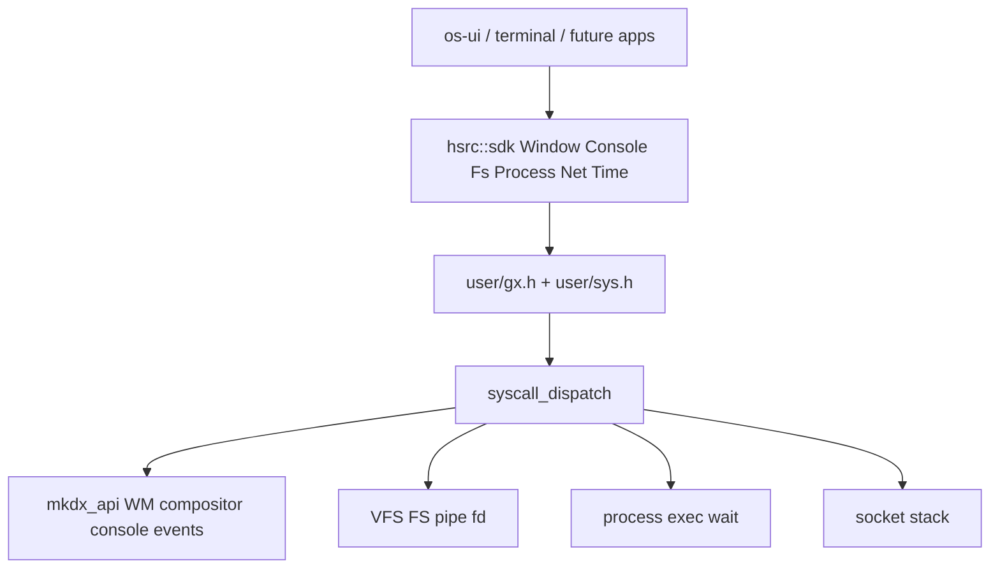

# Ultra God-level Graphics + OS Syscall Surface (v1, ABI break OK)

## İlkeler

- **ABI kırılır, first version mükemmellik öncelikli** — geriye uyumluluk yok; tüm driver/usermode tüketiciler aynı PR dalgasında fixlenir.
- **Window options = sadece boolean + düz alanlar** — bit shift / `1u << n` yok. C: `uint8_t` 0/1. Override: **get → değiştir → set** (tam struct pointer).
- **App development sırasında eksik kernel call kalmayacak** — Linux i386 benzeri numaralar + private range; Windows hissi SDK isimleriyle (`CreateWindow`, `AllocConsole`, `Sleep`, …) C++ sarmalayıcıda.
- **User-mode WindowServer yok** — WM/compositor kernel `mkdx` içinde kalır (mevcut omurga).
- Uygulama **dalga dalga**; her dalga kendi başına boot edilebilir olmalı.

## Mimari



---

# WAVE A — God Graphics / Window / Console / Events

## A1) Boolean window ABI — [`include/user/gx.h`](include/user/gx.h)

Eski `UGX_STYLE_*`, `ugx_win_create`, ayrı move/resize/show syscall’ları **silinir**.

```c
typedef struct ugx_window_opts {
    int32_t  x, y, w, h;
    int32_t  radius;
    uint8_t  opacity;           /* 0..255 */
    char     title[64];
    char     class_name[32];    /* opsiyonel app class */

    /* görünüm */
    uint8_t  acrylic;
    uint8_t  rounded;
    uint8_t  alpha;
    uint8_t  background;
    uint8_t  no_drag;
    uint8_t  no_title;
    uint8_t  topmost;
    uint8_t  resizable;
    uint8_t  fullscreen;        /* exclusive-ish: frame=screen, no chrome hit */

    /* durum */
    uint8_t  visible;
    uint8_t  minimized;         /* hide / aşağı */
    uint8_t  maximized;
    uint8_t  closable;
    uint8_t  can_minimize;
    uint8_t  can_maximize;
    uint8_t  accept_focus;      /* 0 = tıklanınca focus alma */
    uint8_t  always_on_bottom;

    /* input */
    uint8_t  capture_keys;
    uint8_t  capture_mouse;
} ugx_window_opts;
```

Syscalls (private 200+ yeniden numaralandırılabilir):

| Call | Rol |
|------|-----|
| `SYS_WM_CREATE` | `opts*` → id |
| `SYS_WM_SET` | id + `opts*` |
| `SYS_WM_GET` | id + `opts*` out |
| `SYS_WM_CLOSE` | destroy |
| `SYS_WM_MAP` | surface map (+ remap after resize) |
| `SYS_WM_FIND` | title veya class |
| `SYS_WM_RAISE` / `SYS_WM_LOWER` | z-order |
| `SYS_GX_INFO` | screen |
| `SYS_GX_PRESENT` | compose+flip |
| `SYS_GX_DAMAGE` | full dirty |
| `SYS_GX_DAMAGE_RECT` | x,y,w,h dirty |
| `SYS_GX_SET_WALLPAPER` | wallpaper |
| `SYS_GX_FILL` / `FILL_ROUND` | accel fill |
| `SYS_GX_BLIT` | surface→surface / win blit args |
| `SYS_GX_DRAW_TEXT` | kernel font text (opsiyonel hız) |
| `SYS_INPUT_STATE` | mouse snapshot (geriye ek; events asıl yol) |
| `SYS_WM_POLL_EVENTS` | per-window event drain |
| `SYS_WM_POP_KEY` | legacy key; events içine de gömülür |

Kernel: [`window.c`](src/drivers/mkdx/window.c) `wm_apply_opts` / `wm_get_opts`; `restore_frame` for max; minimize = layer invisible + hit skip.

## A2) Events (WndProc hissi, poll tabanlı)

```c
typedef struct ugx_event {
    uint32_t type;      /* enum ugx_ev_type — sayısal sabit, bitflag değil */
    int32_t  win;
    int32_t  x, y, w, h;
    int32_t  key;       /* veya button */
    uint32_t mods;
    uint32_t data0, data1;
} ugx_event;

/* type değerleri (ayrı #define, shift yok): */
/* UGX_EV_NONE, CLOSE, RESIZE, MOVE, FOCUS, BLUR, KEY_DOWN, KEY_UP,
   MOUSE_MOVE, MOUSE_DOWN, MOUSE_UP, MOUSE_WHEEL, SHOW, HIDE,
   PAINT, MINIMIZE, MAXIMIZE, RESTORE, CONSOLE_INPUT */
```

WM mouse/keyboard zaten biliyor → focused window kuyruğuna event push. App: `poll_events(buf, max)`.

Chrome hit: titlebar drag; sağ üst close/min/max zone’ları `closable` / `can_*` ile → `CLOSE` / minimize / maximize event veya doğrudan state.

## A3) Damage rect

- `ugx_damage_rect(x,y,w,h)` + window-local damage
- `gx_server` dirty union; mümkünse `present_rect` (zaten var)
- Full `damage()` hâlâ geçerli

## A4) Console (AllocConsole)

```c
ugx_console_open(opts*) → id
ugx_console_write(id, buf, len)
ugx_console_read(id, buf, len)   /* opsiyonel stdin satırı */
ugx_console_set(id, opts*)       /* visible/title/geometry */
ugx_console_close(id)
ugx_console_printf…              /* SDK */
```

Kernel ring text buffer + paint; app paint etmez. Gizli open → sonra show.

## A5) C++ SDK — [`gfx.hpp`](include/user/sdk/gfx.hpp) / [`gfx.cpp`](src/user/sdk/gfx.cpp)

- `WindowOptions` tüm bool alanlar
- `Window`: create/set/get, hide/show/minimize/maximize/restore/close/raise/lower, surface, damage/damage_rect, poll_events
- `Console`: open/write/show/close
- `Surface`: clear/fill/fill_round/rect/line/text/blit helpers (userspace CPU + syscall fill)
- Eski `create(..., uint32_t style, ...)` **yok**

Tüketiciler: [`os-ui.cpp`](src/user/apps/os-ui.cpp), [`terminal.cpp`](src/user/apps/terminal.cpp) tamamen yeni API.

---

# WAVE B — Process (Linux + Windows CreateProcess hissi)

Mevcut: `exit`, `getpid`, `yield`; **`fork` = -1 stub**.

Eklenecek syscalls:

| Linux-like | Anlam |
|------------|--------|
| `SYS_FORK` | gerçek copy veya COW-lite (en azından userspace entry clone) |
| `SYS_EXECVE` | path + argv + env → yeni image (`.mke` / ELF-lite mevcut loader) |
| `SYS_WAITPID` | child reaping + exit code |
| `SYS_GETPPID` | parent pid |
| `SYS_KILL` | sinyal-lite: 0=exists, 9=terminate, 15=request exit |
| `SYS_EXIT_GROUP` | alias exit |
| `SYS_SPAWN` (private) | atomik spawn `.mke` path + args (Windows CreateProcess) |

SDK [`process.hpp`](include/user/sdk/process.hpp): `spawn`, `wait`, `kill`, `getpid`, `getppid`, `exit`.

Kernel: [`process.c`](src/kernel/process.c) / [`mke.c`](src/kernel/mke.c) spawn path genişlet; zombie + wait kuyruğu.

---

# WAVE C — FD / IPC / multiplex

| Call | Anlam |
|------|--------|
| `SYS_PIPE` / `SYS_PIPE2` | pipefd[2] |
| `SYS_DUP` / `SYS_DUP2` / `SYS_DUP3` | fd kopyala |
| `SYS_FCNTL` | F_GETFL/SETFL (O_NONBLOCK), F_GETFD/SETFD |
| `SYS_IOCTL` | TTY/gfx/device request tablosu (en az `TIOCGWINSZ`, generic) |
| `SYS_POLL` | fd + timeout (socket/file/pipe hazır) |
| `SYS_SELECT` | lite (veya poll üzerine SDK emülasyonu — kernel’de `POLL` zorunlu) |

Pipe VFS inode veya process-local ring. Terminal/console stdin buna bağlanabilir.

---

# WAVE D — Filesystem completeness

Mevcut: open/close/read/write/lseek/chdir/getcwd/mkdir/unlink/rmdir/rename/mount/getdents/xattr/flock/aio/mmap…

Eksik → ekle:

| Call | Anlam |
|------|--------|
| `SYS_STAT` / `SYS_FSTAT` / `SYS_LSTAT` | `struct stat` |
| `SYS_ACCESS` | F_OK/R_OK/W_OK/X_OK |
| `SYS_CHMOD` / `SYS_FCHMOD` | mode |
| `SYS_CHOWN` / `SYS_FCHOWN` | uid/gid (en az stub + root) |
| `SYS_TRUNCATE` / `SYS_FTRUNCATE` | boyut |
| `SYS_READLINK` | symlink oku |
| `SYS_SYMLINK` / `SYS_LINK` | link oluştur |
| `SYS_UTIMENSAT` | mtime/atime |
| `SYS_FSYNC` / `SYS_FDATASYNC` | flush |
| `SYS_SYNC` | global |
| `SYS_STATFS` / `SYS_FSTATFS` | fs bilgi |
| `SYS_GETDENTS64` | 64-bit dent (veya mevcut getdents genişlet) |
| `SYS_OPENAT` / `SYS_MKDIRAT` / `SYS_UNLINKAT` | *at ailesi |
| `SYS_READLINKAT` | |

SDK [`fs.hpp`](include/user/sdk/fs.hpp) genişlet: `stat`, `access`, `chmod`, `readlink`, `truncate`, `sync`.

---

# WAVE E — Time + memory

| Call | Anlam |
|------|--------|
| `SYS_CLOCK_GETTIME` | CLOCK_MONOTONIC / REALTIME |
| `SYS_CLOCK_SETTIME` | realtime (root) |
| `SYS_NANOSLEEP` | sleep |
| `SYS_GETTIMEOFDAY` | timeval |
| `SYS_TIME` | time_t |
| `SYS_BRK` / `SYS_SBRK` | heap |
| `SYS_MPROTECT` | prot değiş |
| `SYS_MINCORE` | opsiyonel lite |

Mevcut `mmap/munmap/msync` kalır; brk userspace allocator için.

SDK [`time.hpp`](include/user/sdk/time.hpp): `sleep_ms`, `monotonic_ns`, `wall_time`.

---

# WAVE F — Net + errno + SDK glue

Mevcut: socket/bind/connect/sendto/recvfrom.

Ekle:

| Call | Anlam |
|------|--------|
| `SYS_LISTEN` | |
| `SYS_ACCEPT` / `SYS_ACCEPT4` | |
| `SYS_SHUTDOWN` | |
| `SYS_GETSOCKNAME` / `SYS_GETPEERNAME` | |
| `SYS_SETSOCKOPT` / `SYS_GETSOCKOPT` | lite (reuseaddr, rcv/snd buf) |

[`net.hpp`](include/user/sdk/net.hpp) güncelle.

**errno:** userspace `errno` + negatif syscall return Linux uyumu; SDK tüm call’larda tutarlı. Ortak [`include/user/errno.h`](include/user/errno.h) / [`sys.h`](include/user/sys.h) syscall numaraları tek header.

Windows-benzeri C++ isimleri (aynı syscall üstü):

- `CreateWindow` → `Window::create`
- `ShowWindow` / `CloseWindow` → show/hide/close
- `AllocConsole` / `WriteConsole` → `Console`
- `CreateProcess` → `process::spawn`
- `WaitForSingleObject` → `process::wait`
- `Sleep` → `time::sleep_ms`
- `CreateFile` / `ReadFile` → fs SDK

---

# WAVE G — Doğrulama checklist

- Boot: os-ui + terminal yeni window API ile
- Window: hide/show/max/restore/close + events CLOSE/RESIZE
- Console: open gizli/açık, write log görünür
- Process: spawn child `.mke` veya exec path + waitpid exit code
- Pipe: parent↔child byte akışı
- FS: stat/access/chmod path’leri terminal `ls`/`stat` benzeri
- Time: sleep_ms çalışır
- Net: listen/accept echo veya mevcut client bozulmaz
- Repoda `UGX_STYLE_` ve ölü `SYS_WM_MOVE/SHOW` kalmaz

---

# Bilerek dışarıda (gerçekçi v1 sınırı)

Bunlar “god OS” sonrası; planda **yok** (yoksa bitmez):

- SMP/preempt full, user preemptive scheduling redesign
- POSIX signals tam set + sigaction delivery
- UNIX domain sockets / abstract namespace
- GPU shader pipeline / 3D userspace
- Multi-monitor / DPI
- SELinux / full ACL
- ELF dynamic linker / shared libs

v1’de **app yazarken ihtiyaç duyulan** call’lar yukarıdaki dalgalarda var; eksik kalan “enterprise kernel” parçaları değil.

---

# Uygulama sırası (AI)

1. Wave A1–A5 (gfx/WM/console/events/SDK + app fix) — kullanıcıya en görünür
2. Wave B process
3. Wave C pipe/dup/poll
4. Wave D FS
5. Wave E time/mem
6. Wave F net + sys.h/errno/SDK
7. Wave G verify

Her dalgada: header → kernel impl → mkdx/syscall wiring → SDK → app/fix.
