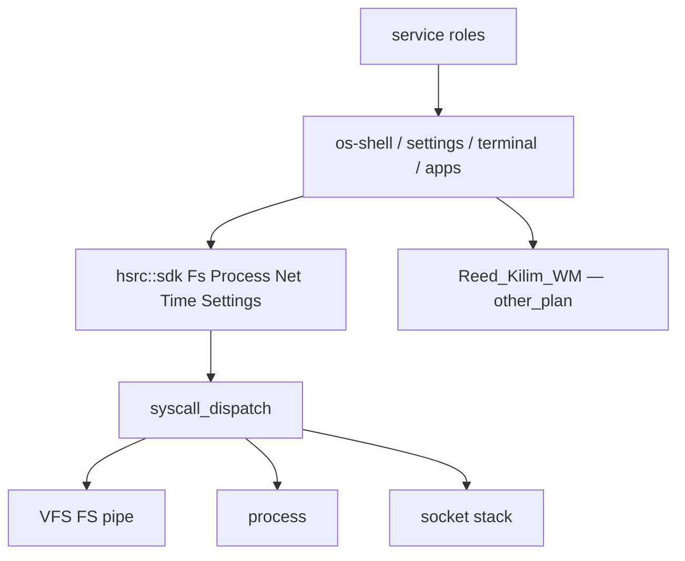
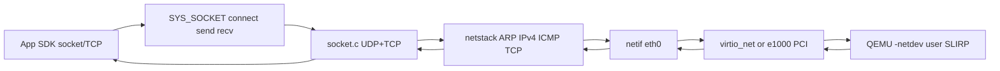
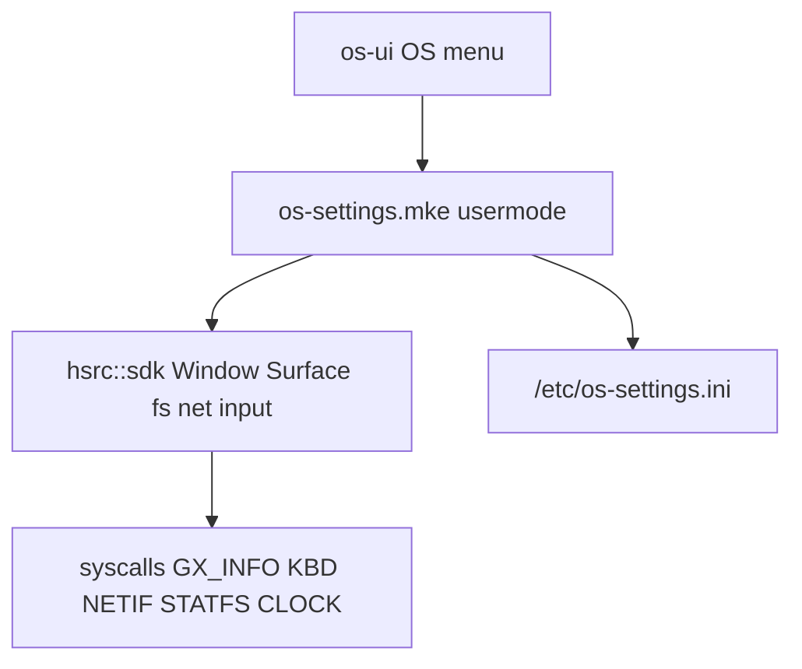

# God-level OS Syscall Surface (process / net / fs / shell apps)

## Grafik / build — bu dosyada YOK

| Konu                                               | Plan                                                                           |
| -------------------------------------------------- | ------------------------------------------------------------------------------ |
| Reed/Kilim/WM/GPU/display                          | [gpu_display_stack_bc5f6172.plan.md](gpu_display_stack_bc5f6172.plan.md)       |
| xmake, `userspace/`, init→systemd, `__old_shits__` | [xmake_userspace_boot_a3be45ab.plan.md](xmake_userspace_boot_a3be45ab.plan.md) |

Bu dosyada grafik ABI veya Makefile/xmake build yeniden tanımlanmaz.

## İlkeler (OS — grafik hariç)

- **ABI kırılır** — OS syscall’larda geriye uyumluluk yok.
- **App development sırasında eksik kernel call kalmayacak** — process/fs/net/time; Windows hissi SDK isimleri.
- **Networking full-ready** — virtio-net / e1000 + IPv4 TCP/UDP.
- **System Settings** — usermode `os-settings`; deep-link zorunlu; UI çizimi grafik plan (Kilim/Reed).
- **Dock pin kuralları** — Settings’ten pin; **çalışan app dock’ta zorunlu**; çizim/hibrit chrome grafik plan.
- **Menubar** — sahte File/Edit yok; Settings / System Information deep-link; chrome hibrit grafik plan.
- **Image decode + wallpaper asset** — Wave J; present/compose grafik plan.
- **Input** — PS/2 + virtio-input + layout API (H5); event routing grafik plandaki WM.
- **Apps & launch** — `/applications`; Explorer; `run` / `./`.
- **System services** — userspace **systemd** ([xmake_userspace_boot](xmake_userspace_boot_a3be45ab.plan.md)); kernel yalnızca **init**.
- **Activity Monitor / env / PATH / per-process console kuralları** — bu planda; console UI grafik plan.

## Split workstream

| Workstream                  | Dalgalar               | Odak                                                    |
| --------------------------- | ---------------------- | ------------------------------------------------------- |
| **WS-1 Build**              | _xmake_userspace_boot_ | xmake, userspace/, init→systemd                         |
| **WS0 Graphics**            | _gpu_display_stack_    | Reed/Kilim/WM/GPU/display                               |
| **WS2 Apps & Files**        | B, D, H7, H10, L, O, Q | `/applications`, Explorer, run, console kuralları, PATH |
| **WS3 Services**            | B, M                   | systemd units (build plan); process spawn B             |
| **WS4 Observe & Env**       | E, N, P                | Activity Monitor, env                                   |
| **WS5 Settings & Shell UX** | I, J, H9, H13, K       | Settings, deep-link, dock pin, wallpaper prefs          |

Bağımlılık: WS-1 önce/paralel; WS0 masaüstü çizimi; L/Q için B; Settings UI için WS0 SDK.

## Mimari (OS + grafik sınırı)


```mermaid
flowchart TB
  Apps["os-shell / settings / terminal / apps"]
  SDK["hsrc::sdk Fs Process Net Time Settings"]
  Gfx["Reed_Kilim_WM — other_plan"]
  Sys["syscall_dispatch"]
  Vfs["VFS FS pipe"]
  Proc["process"]
  Net["socket stack"]
  Svc["service roles"]

  Apps --> SDK
  Apps --> Gfx
  SDK --> Sys
  Sys --> Vfs
  Sys --> Proc
  Sys --> Net
  Svc --> Apps
```

---

# WAVE B — Process (Linux + Windows CreateProcess hissi)

Mevcut: `exit`, `getpid`, `yield`; **`fork` = -1 stub**.

Eklenecek syscalls:

| Linux-like            | Anlam                                                            |
| --------------------- | ---------------------------------------------------------------- |
| `SYS_FORK`            | gerçek copy veya COW-lite (en azından userspace entry clone)     |
| `SYS_EXECVE`          | path + argv + env → yeni image (`.mke` / ELF-lite mevcut loader) |
| `SYS_WAITPID`         | child reaping + exit code                                        |
| `SYS_GETPPID`         | parent pid                                                       |
| `SYS_KILL`            | sinyal-lite: 0=exists, 9=terminate, 15=request exit              |
| `SYS_EXIT_GROUP`      | alias exit                                                       |
| `SYS_SPAWN` (private) | atomik spawn `.mke` path + args (Windows CreateProcess)          |

SDK [`process.hpp`](include/user/sdk/process.hpp): `spawn`, `wait`, `kill`, `getpid`, `getppid`, `exit`.

Kernel: [`process.c`](src/kernel/process.c) / [`mke.c`](src/kernel/mke.c) spawn path genişlet; zombie + wait kuyruğu.

---

# WAVE C — FD / IPC / multiplex

| Call                                | Anlam                                                              |
| ----------------------------------- | ------------------------------------------------------------------ |
| `SYS_PIPE` / `SYS_PIPE2`            | pipefd[2]                                                          |
| `SYS_DUP` / `SYS_DUP2` / `SYS_DUP3` | fd kopyala                                                         |
| `SYS_FCNTL`                         | F_GETFL/SETFL (O_NONBLOCK), F_GETFD/SETFD                          |
| `SYS_IOCTL`                         | TTY/gfx/device request tablosu (en az `TIOCGWINSZ`, generic)       |
| `SYS_POLL`                          | fd + timeout (socket/file/pipe hazır)                              |
| `SYS_SELECT`                        | lite (veya poll üzerine SDK emülasyonu — kernel’de `POLL` zorunlu) |

Pipe VFS inode veya process-local ring. Terminal/console stdin buna bağlanabilir.

---

# WAVE D — Filesystem completeness

Mevcut: open/close/read/write/lseek/chdir/getcwd/mkdir/unlink/rmdir/rename/mount/getdents/xattr/flock/aio/mmap…

Eksik → ekle:

| Call                                          | Anlam                                       |
| --------------------------------------------- | ------------------------------------------- |
| `SYS_STAT` / `SYS_FSTAT` / `SYS_LSTAT`        | `struct stat`                               |
| `SYS_ACCESS`                                  | F_OK/R_OK/W_OK/X_OK                         |
| `SYS_CHMOD` / `SYS_FCHMOD`                    | mode                                        |
| `SYS_CHOWN` / `SYS_FCHOWN`                    | uid/gid (en az stub + root)                 |
| `SYS_TRUNCATE` / `SYS_FTRUNCATE`              | boyut                                       |
| `SYS_READLINK`                                | symlink oku                                 |
| `SYS_SYMLINK` / `SYS_LINK`                    | link oluştur                                |
| `SYS_UTIMENSAT`                               | mtime/atime                                 |
| `SYS_FSYNC` / `SYS_FDATASYNC`                 | flush                                       |
| `SYS_SYNC`                                    | global                                      |
| `SYS_STATFS` / `SYS_FSTATFS`                  | fs bilgi                                    |
| `SYS_GETDENTS64`                              | 64-bit dent (veya mevcut getdents genişlet) |
| `SYS_OPENAT` / `SYS_MKDIRAT` / `SYS_UNLINKAT` | \*at ailesi                                 |
| `SYS_READLINKAT`                              |                                             |

SDK [`fs.hpp`](include/user/sdk/fs.hpp) genişlet: `stat`, `access`, `chmod`, `readlink`, `truncate`, `sync`.

---

# WAVE E — Time + memory

| Call                   | Anlam                      |
| ---------------------- | -------------------------- |
| `SYS_CLOCK_GETTIME`    | CLOCK_MONOTONIC / REALTIME |
| `SYS_CLOCK_SETTIME`    | realtime (root)            |
| `SYS_NANOSLEEP`        | sleep                      |
| `SYS_GETTIMEOFDAY`     | timeval                    |
| `SYS_TIME`             | time_t                     |
| `SYS_BRK` / `SYS_SBRK` | heap                       |
| `SYS_MPROTECT`         | prot değiş                 |
| `SYS_MINCORE`          | opsiyonel lite             |

Mevcut `mmap/munmap/msync` kalır; brk userspace allocator için.

SDK [`time.hpp`](include/user/sdk/time.hpp): `sleep_ms`, `monotonic_ns`, `wall_time`.

---

# WAVE F — Full-ready Networking (driver + stack + sockets + SDK)

Hedef: **QEMU’dan paket çıkıp gerçek IP’ye (SLIRP üzerinden host/internet) UDP ve TCP ile bağlanabilmek.** Socket API Linux-benzeri; SDK Windows `connect`/`send` hissi. Mevcut omurga korunup genişletilir: [`virtio_net.c`](src/drivers/net/virtio_net/virtio_net.c), [`netstack.c`](src/kernel/netstack.c), [`socket.c`](src/kernel/socket.c), [`netif.h`](include/kernel/netif.h).


```mermaid
flowchart LR
  App["App SDK socket/TCP"]
  Sys["SYS_SOCKET connect send recv"]
  Sock["socket.c UDP+TCP"]
  Stack["netstack ARP IPv4 ICMP TCP"]
  Nif["netif eth0"]
  Drv["virtio_net or e1000 PCI"]
  Qemu["QEMU -netdev user SLIRP"]

  App --> Sys --> Sock --> Stack --> Nif --> Drv --> Qemu
  Qemu --> Drv --> Nif --> Stack --> Sock --> App
```

## F0) Bugünkü durum (başlangıç noktası — silinmez, üzerine inşa)

- Makefile zaten: `-netdev user,id=n0 -device virtio-net-pci,netdev=n0,disable-legacy=on`
- Driver: virtio-net **modern** PCI (`1AF4:1041`), static `10.0.2.15/24` gw `10.0.2.2`
- Stack: Ethernet demux, ARP, IPv4 TX, ICMP echo reply, UDP → `sock_input_udp`
- Sockets: sadece `AF_INET` + `SOCK_DGRAM` (UDP) + `SOCK_RAW` (ICMP); **`SOCK_STREAM`/TCP yok**
- Syscalls: socket/bind/connect/sendto/recvfrom (TCP listen/accept/send/recv yok)

## F1) NIC driver — QEMU PCI’den al, eksikse yaz

1. **virtio-net-pci (birincil)**
   - PCI enumerate + modern capability map doğrula
   - RX/TX virtqueue: paket kaybı, notify, feature bits (`VIRTIO_NET_F_MAC`, checksum offload opsiyonel)
   - `netif_register` + `poll` path; IRQ varsa kullan, yoksa poll (mevcut `DRIVER_FLAG_POLL`)
   - Link up log: MAC, IP, gateway
   - Stress: sürekli `net_poll` altında TX/RX

2. **Fallback: e1000 PCI** (`8086:100E` — QEMU `-device e1000`)
   - virtio bulunamazsa veya test için
   - MMIO/PIO register init, RX/TX ring, `netif_t` aynı arayüz
   - Makefile’a opsiyonel `QEMU_NET=e1000` target; default virtio kalır

3. **Ortak netif sözleşmesi** (zaten var, sıkılaştır):
   - `tx(frame)`, `poll()`, MAC, MTU, up
   - Tüm IP/TCP sadece `netif_*` üzerinden — driver bağımsız

## F2) L2/L3 stack — IP conn çalışsın

| Parça    | Yapılacak                                                                                                |
| -------- | -------------------------------------------------------------------------------------------------------- |
| ARP      | Cache + request/reply (var); gateway next-hop; timeout/retry sertleştir                                  |
| IPv4     | output/input (var); fragmentation lite veya “DF + drop oversized”; TTL                                   |
| ICMP     | echo request (userspace ping) + reply (var); dest-unreach lite                                           |
| Routing  | default route = gateway; aynı subnet → direct ARP; `netif_set_addr`                                      |
| DHCP     | client: DISCOVER/OFFER/REQUEST/ACK → IP/mask/gw/DNS doldur; fail olursa QEMU static `10.0.2.15` fallback |
| DNS lite | `getaddrinfo` / `gethostbyname` SDK: önce inet_aton, sonra UDP DNS query (gw/DNS 10.0.2.3 QEMU)          |

Yeni / geniş syscalls (config):

| Call                               | Anlam                               |
| ---------------------------------- | ----------------------------------- |
| `SYS_NETIF_LIST` / `SYS_NETIF_GET` | isim, mac, ip, mask, gw, up         |
| `SYS_NETIF_SET`                    | ip/mask/gw (root)                   |
| `SYS_NETIF_UP` / `DOWN`            | link admin                          |
| `SYS_DHCP_START`                   | DHCP yenile (veya boot’ta otomatik) |

## F3) Socket yapısı — UDP + TCP full

[`socket.c`](src/kernel/socket.c) yeniden yapılandır (ABI break OK):

```c
/* SOCK_STREAM + IPPROTO_TCP desteklenir */
sock_create(AF_INET, SOCK_STREAM, 0) → TCP
sock_create(AF_INET, SOCK_DGRAM, 0)  → UDP
```

**UDP (sertleştir):** checksum opsiyonel hesapla; bağlı `send()`/`recv()`; büyük RX ring; `MSG_DONTWAIT`.

**TCP (yeni — zorunlu):**

- States: CLOSED, SYN_SENT, ESTABLISHED, LISTEN, FIN_WAIT, TIME_WAIT (minimal ama çalışan)
- `connect(ip, port)` → SYN → SYN-ACK → ACK; QEMU SLIRP ile `10.0.2.2:port` veya dış IP
- `bind` + `listen` + `accept` → sunucu
- `send` / `recv` stream buffer (ayrı `SYS_SEND` / `SYS_RECV`)
- Seq/ack, retransmission timer (`net_poll` + clock), window basit
- `shutdown(rd/wr)`, `close` → FIN
- Concurrent: en az N TCP PCB (ör. 16–32)

**Syscalls (Wave F net listesi — önceki listen/accept maddeleri burada, genişletilmiş):**

| Call                                        | Anlam                                                               |
| ------------------------------------------- | ------------------------------------------------------------------- |
| `SYS_SOCKET`                                | + SOCK_STREAM                                                       |
| `SYS_BIND` / `SYS_CONNECT`                  | TCP handshake dahil                                                 |
| `SYS_LISTEN` / `SYS_ACCEPT` / `SYS_ACCEPT4` |                                                                     |
| `SYS_SEND` / `SYS_RECV`                     | stream (+ UDP connected)                                            |
| `SYS_SENDTO` / `SYS_RECVFROM`               | datagram                                                            |
| `SYS_SHUTDOWN`                              |                                                                     |
| `SYS_GETSOCKNAME` / `SYS_GETPEERNAME`       |                                                                     |
| `SYS_SETSOCKOPT` / `SYS_GETSOCKOPT`         | SO_REUSEADDR, SO_RCVBUF/SNDBUF, SO_KEEPALIVE lite, TCP_NODELAY lite |
| `SYS_IOCTL` (sock)                          | FIONBIO nonblock                                                    |

`poll` (Wave C) socket fd’lerini de kapsar: readable/writable/connected/err.

## F4) Net SDK + errno + genel SDK glue

[`include/user/sdk/net.hpp`](include/user/sdk/net.hpp) genişlet:

```cpp
socket / bind / connect / listen / accept
send / recv / sendto / recvfrom / shutdown / close
getsockname / getpeername / setsockopt
inet_aton / inet_ntoa
getaddrinfo lite
TcpClient { connect(host_or_ip, port); send; recv; }
TcpServer { listen(port); accept; }
UdpSocket { bind; sendto; recvfrom; }
netif_info / dhcp_renew
```

**errno:** userspace `errno` + negatif syscall return Linux uyumu. Ortak [`include/user/errno.h`](include/user/errno.h) / [`sys.h`](include/user/sys.h).

Windows-benzeri C++ isimleri (aynı syscall üstü) — önceki liste + net:

- `CreateWindow` → `Window::create`
- `ShowWindow` / `CloseWindow` → show/hide/close
- `AllocConsole` / `WriteConsole` → `Console`
- `CreateProcess` → `process::spawn`
- `WaitForSingleObject` → `process::wait`
- `Sleep` → `time::sleep_ms`
- `CreateFile` / `ReadFile` → fs SDK
- `socket` / `connect` / `send` / `recv` → net SDK (Winsock hissi)
- `WSAStartup` gerekmez — SDK init no-op veya `net_init()` dokümantasyonu

## F5) QEMU / test senaryoları (AI doğrulama)

Makefile net satırı kalır / güçlendirilir:

```text
-netdev user,id=n0,hostfwd=tcp::8080-:80
-device virtio-net-pci,netdev=n0,disable-legacy=on
```

Doğrulama checklist (net):

1. Boot log: `virtio-net: eth0 … up` (veya e1000)
2. ARP: gateway `10.0.2.2` resolve
3. UDP: userspace echo veya DNS query `10.0.2.3:53`
4. TCP client: `connect(10.0.2.2, 80)` veya hostfwd ile host’taki servise bağlan / dış IP
5. TCP server: guest listen:80 + `hostfwd` ile host `curl 127.0.0.1:8080`
6. Ping: ICMP echo request + reply path
7. DHCP: dinamik adres (veya fallback static) — `SYS_NETIF_GET` doğru

İsteğe bağlı küçük usermode net test app veya terminal builtin (`ping`, `nc`) — plana dahil.

---

# WAVE G — Doğrulama checklist

- Boot: os-shell + window-manager + terminal (grafik plan API)
- Window: hide/show/max/restore/close + events CLOSE/RESIZE
- Console: open gizli/açık, write log görünür
- Process: spawn child `.mke` veya exec path + waitpid exit code
- Pipe: parent↔child byte akışı
- FS: stat/access/chmod path’leri terminal `ls`/`stat` benzeri
- Time: sleep_ms çalışır
- Net: virtio (veya e1000) up; UDP IP; TCP connect + listen/accept; send/recv
- Settings: OS menü → System Settings (yönetim masası) → Keyboard → layout; Prefs aynı hub; persist
- Input: PS/2 ve/veya PCI virtio-input device list’te görünür
- Wallpaper: 4K default cover; menubar/dock ~%70 blur glass; text/icon opak siyah veya beyaz
- Grafik smoke: gpu*display_stack kabul kriterleri; repoda `ugx`/`mkdx_api`/`UGX_STYLE*` kalmaz

---

# Bilerek dışarıda (gerçekçi v1 sınırı)

Bunlar “god OS” sonrası; planda **yok** (yoksa bitmez):

- SMP/preempt full, user preemptive scheduling redesign
- POSIX signals tam set + sigaction delivery
- UNIX domain sockets / abstract namespace
- Full GPU shader compiler / complex 3D engine (Reed triangle path grafik planda; bu OS planının dışı)
- Multi-monitor / DPI
- SELinux / full ACL
- ELF dynamic linker / shared libs
- IPv6, IPsec, full TCP congestion control (CUBIC vb.), offload checksum hardware zorunluluğu
- Wi‑Fi / USB-net

v1’de **app yazarken ihtiyaç duyulan** call’lar + **IPv4 TCP/UDP over Ethernet (QEMU)** yukarıdaki dalgalarda var.

---

# Uygulama sırası (AI)

0. **gpu_display_stack** end-to-end (Reed/Kilim/WM/GPU/display/shell çizim) — grafik kaynak plan
1. Phase H5 input (PS/2 + virtio-input + layout) — Settings’ten önce; feed usermode WM
2. Wave B process → Phase H2 process/mke
3. Wave C pipe/poll → Phase H2 + H7
4. Wave D FS → Phase H7
5. Wave E time/mem → Phase H2
6. Wave F networking → Phase H6 + H2 net + H8 net SDK + H10 terminal net
7. Phase H8 SDK (fs/process/net/time/settings) — gfx SDK diğer planda
8. Phase H13 os-settings + H9 deep-link/dock pin + Wave I
9. Wave J image decode + wallpaper assets (present diğer plan)
10. Wave K/L/M/N/O/P/Q shell UX + Explorer + services + monitor + console kuralları + env
11. Phase H11 Makefile/boot (window-manager + os-shell + settings.mke)
12. Wave G verify

**Kural:** OS Phase H\* kendi listesini bitirmeden sonrakine geçilmez. Grafik işi bu dosyada yeniden açılmaz.

---

# WAVE H — Etkilenen her bileşen için entegrasyon phase’leri (DETAY)

Bu bölüm **kasıtlı olarak uzun**. ABI kırılınca dokunulması gereken her driver, kernel modülü ve usermode process burada ayrı phase. “Bir yerde fixleriz” yok — her hedef net.

## Phase H1 — Ortak header / ABI yüzeyi

**Amaç:** Tüm kernel + usermode aynı struct/syscall numaralarını görsün.

**Dosyalar (zorunlu düzenleme):**

- [`include/kernel/syscall.h`](include/kernel/syscall.h) — OS `SYS_*` (NET/FS/PROCESS/TIME/INPUT/SERVICE); grafik `SYS_DISP_*` diğer plan; ölü `SYS_WM_*`/`SYS_GX_*` **sil**
- [`include/user/sys.h`](include/user/sys.h) — userspace syscall numaraları (`syscall.h` ile senkron)
- [`include/user/errno.h`](include/user/errno.h) — Linux-benzeri errno
- Grafik headers (`reed.h`/`kilim.h`) — **gpu_display_stack**; `gx.h`/`mkdx_api.h` **silinir**
- [`include/kernel/socket.h`](include/kernel/socket.h) — `SOCK_STREAM`, `IPPROTO_TCP`, `sockaddr` helpers, `send`/`recv`/`listen`/`accept` deklarasyonları
- [`include/kernel/netif.h`](include/kernel/netif.h) — netif get/set info struct’ları (userspace kopyası `user/net.h` olabilir)
- [`include/kernel/process.h`](include/kernel/process.h) — wait/zombie/ppid alanları
- [`include/kernel/types.h`](include/kernel/types.h) — `stat`, `timespec`, `pollfd` gibi eksik tipler burada veya ayrı `stat.h`/`poll.h`
- [`include/drivers/keyboard.h`](include/drivers/keyboard.h) — layout get/set/list API
- [`include/user/input.h`](include/user/input.h) — **yeni**: userspace layout + `input_device_info` struct’ları
- [`include/user/sdk/input.hpp`](include/user/sdk/input.hpp) — **yeni** SDK (H8’de impl)

**Yapılacaklar:**

1. OS syscall numaralarını tek tabloda listele; input: `SYS_KBD_*`, `SYS_INPUT_DEVICE_LIST`
2. Grafik ABI numaraları/struct’ları gpu_display_stack’te; burada `ugx`/`mkdx_api` **eklenmez**

**Kabul kriteri:**

- Kernel + usermode aynı OS header’lardan compile olur
- `rg UGX_STYLE_|ugx_win_create|mkdx_api` → sıfır match

---

## Phase H2 — Kernel core (syscall + process + net stack glue)

**Amaç:** `int $0x80` yolundan yeni call’ların tamamı dispatch edilsin; process/net altyapısı bağlansın.

**Dosyalar:**

- [`src/kernel/syscall.c`](src/kernel/syscall.c) — OS `case SYS_*`; `do_net_*`, `do_stat_*`, `do_pipe_*`, `do_clock_*`, `do_exec_*` …; `do_wm_*`/`mkdx` **yok**
- [`src/kernel/process.c`](src/kernel/process.c) / [`include/kernel/process.h`](include/kernel/process.h) — fork/spawn/wait/zombie/exit; ölümde usermode WM cleanup (grafik plan)
- [`src/kernel/mke.c`](src/kernel/mke.c) — `execve`/`spawn` path; argv taşıma
- [`src/kernel/main.c`](src/kernel/main.c) — boot: netstack/socket; gpu/display kmods grafik plan; DHCP kick
- [`src/kernel/ksym.c`](src/kernel/ksym.c) — export’lar (`tcp_*`, `dhcp_*`, …); `wm_apply_opts` yok
- [`src/kernel/netstack.c`](src/kernel/netstack.c) / [`include/kernel/netstack.h`](include/kernel/netstack.h) — TCP/DHCP/DNS lite / route
- [`src/kernel/netif.c`](src/kernel/netif.c) — netif_get/set, list
- [`src/kernel/socket.c`](src/kernel/socket.c) — UDP sertleştir + TCP PCB + listen/accept/send/recv
- [`src/kernel/mm.c`](src/kernel/mm.c) — brk/mprotect (Wave E)
- Yeni dosyalar (gerekirse): `src/kernel/tcp.c`, `src/kernel/dhcp.c`, `src/kernel/pipe.c`, `src/kernel/clock.c`

**Yapılacaklar (detay):**

1. `syscall_dispatch` kategorileri: FS / PROC / NET / TIME / INPUT / SERVICE (`DISP` diğer plan)
2. Userspace pointer copy tüm OS buffer’larda
3. `SYS_FORK` stub kaldır → `SYS_SPAWN` + `SYS_WAITPID` öncelikli
4. Process exit → usermode WM’e sahiplik cleanup (grafik plan)
5. Socket fd + poll uyumu
6. Negatif return = `-errno`

**Kabul kriteri:**

- Bilinmeyen SYS\_\* → `-ENOSYS`
- Boot sonrası `SYS_NETIF_GET` çalışır; ekran bilgisi grafik plan üzerinden
- Process kill → pencereler kaybolur (WM cleanup)

---

## Phase H3 / H4 — KALDIRILDI

Grafik driver + display + usermode WM entegrasyonu yalnızca [gpu_display_stack_bc5f6172.plan.md](gpu_display_stack_bc5f6172.plan.md) içinde. Bu planda `mkdx` / BGA / `display_virtio` present phase’i **yok**.

---

## Phase H5 — Input stack: PS/2 (mevcut) + PCI cihaz keşfi + layout API

**Amaç:** Klavye/mouse çalışır olsun; cihaz **keşifle** bağlansın. Bugün PS/2 (`i8042`) üzerinden [`keyboard.c`](src/drivers/keyboard.c) / [`mouse.c`](src/drivers/mouse.c) / [`ps2.c`](src/drivers/ps2.c) var — **silinmez, birincil fallback**. Üzerine PCI’den `virtio-input` algılanırsa o path tercih edilir (QEMU `-device virtio-keyboard-pci` / `virtio-tablet-pci` veya `virtio-mouse-pci`). Ham input → layout → **usermode WM** event feed ([gpu_display_stack](gpu_display_stack_bc5f6172.plan.md)). Dil/layout **OS Settings**’ten değişir (Wave I).

**Not (donanım gerçeği):** Klasik PS/2 PCI değil, IO port `0x60/0x64`. Kullanıcı isteği “PCI’den device algıla” → **PCI virtio-input** ek keşif + PS/2 self-test keşfi. İkisi de `input_device` tablosuna yazılır; Settings’te “bagli cihazlar” listelenir.

### H5.1 Mevcut driver’ları kullan / güçlendir

**Dosyalar:**

- [`src/drivers/ps2.c`](src/drivers/ps2.c) / [`include/drivers/ps2.h`](include/drivers/ps2.h)
  - Controller self-test; keyboard channel / mouse channel detect
  - Yoksa log: `ps2: no keyboard` / `ps2: no mouse` — panic yok
- [`src/drivers/keyboard.c`](src/drivers/keyboard.c) / [`include/drivers/keyboard.h`](include/drivers/keyboard.h)
  - Scancode → **aktif layout tablosu** (şu an sabit TRQ; layout API ile değiştirilebilir)
  - Layout’lar: en az `tr_q` (ISO-8859-9, mevcut), `us_qwerty`, `tr_f` (opsiyonel)
  - `keyboard_set_layout(const char *id)` / `keyboard_get_layout(char *out, len)`
  - KEY_DOWN/UP + CHAR üretimi; mods
- [`src/drivers/mouse.c`](src/drivers/mouse.c) / [`include/drivers/mouse.h`](include/drivers/mouse.h)
  - move/button/wheel; bounds; warp
  - `mouse_device_present()` flag

### H5.2 PCI virtio-input driver (yeni kmod veya input.kmod)

**Yeni dosyalar:**

- `src/drivers/input/virtio_input/virtio_input.c` (+ header)
  - PCI vendor `1AF4`, virtio-input device id (modern)
  - `pci_enumerate` ile bul; capability map; virtqueue
  - Evdev-like event: KEY / REL / ABS → ortak input katmanına
  - Ayrı instance: keyboard vs tablet/mouse (name/config select)
- Makefile: `KMOD_VIRTIO_INPUT`, QEMU args örneği:
  - `-device virtio-keyboard-pci`
  - `-device virtio-tablet-pci` (mutlak koordinat → mouse state)

**Keşif politikası (net):**

1. Boot: `input_init()`
2. PS/2 probe → varsa `input_register(PS2_KBD)` / `PS2_MOUSE`
3. PCI scan virtio-input → varsa register; **hem PS/2 hem virtio varsa ikisinden de event kabul** (merge), Settings’te ikisi de listelenir
4. Hiçbir keyboard yok → serial’a uyarı; sistem ayakta kalır

### H5.3 Ortak input + layout syscalls

| Call                    | Rol                                                       |
| ----------------------- | --------------------------------------------------------- |
| `SYS_INPUT_DEVICE_LIST` | bağlı cihazlar: name, type (kbd/mouse), bus (ps2/pci), id |
| `SYS_KBD_GET_LAYOUT`    | aktif layout id string (`tr_q`, `us_qwerty`, …)           |
| `SYS_KBD_SET_LAYOUT`    | layout değiştir (hemen uygulanır)                         |
| `SYS_KBD_LIST_LAYOUTS`  | desteklenen layout listesi                                |
| `SYS_INPUT_STATE`       | (mevcut) snapshot                                         |

Persist yolu (Wave I ile): Settings `/etc/os-settings.ini` veya `/var/lib/os/keyboard.layout` yazar; boot’ta `main`/settingsd lite veya ilk Settings açılışı / `os-ui` init dosyayı okuyup `SYS_KBD_SET_LAYOUT` çağırır.

### H5.4 WM event feed

- Usermode WM event feed ([gpu_display_stack](gpu_display_stack_bc5f6172.plan.md)) — wheel/scroll → HOVER hedefi
- Idle wait: WM/usermode event wait (SYS_WM_WAIT yok)

**Kabul kriteri:**

- PS2-only QEMU’da klavye+mouse çalışır (regress yok)
- virtio-input eklenmiş QEMU’da PCI cihaz log + event gelir
- `SET_LAYOUT us_qwerty` sonrası tuş haritaları değişir; `tr_q` geri gelir
- `INPUT_DEVICE_LIST` en az bir cihaz döner (normal boot)
- Terminal / Settings dil testi geçer

---

## Phase H6 — Net drivers (`virtio_net.kmod` + yeni `e1000.kmod`)

**Amaç:** QEMU PCI NIC üzerinden paket TX/RX; stack’e `netif` ile bağlan.

**Dosyalar:**

- [`src/drivers/net/virtio_net/virtio_net.c`](src/drivers/net/virtio_net/virtio_net.c)
  - modern virtio-net PCI stabilize: RX refill, TX notify, MAC feature, hata log
  - DHCP sonrası `netif_set_addr` veya static `10.0.2.15/24` gw `10.0.2.2` (fallback)
  - `poll` path; mümkünse MSI/IRQ
- **Yeni:** `src/drivers/net/e1000/e1000.c` (+ header)
  - PCI `8086:100E` init, RX/TX ring, aynı `netif_t` kaydı
- [`Makefile`](Makefile)
  - `KMOD_E1000`, `KMODS` sırası
  - QEMU: default virtio-net; `QEMU_NET=e1000` alternate
  - `hostfwd=tcp::8080-:80` test için

**Yapılacaklar:**

1. `pci_enumerate` ile cihaz bulamazsa net net log: `virtio-net: no device`
2. eth0 register → netstack ARP gateway
3. ksym: driver’ın `netif_*` / `kmalloc` ihtiyaçları

**Kabul kriteri:**

- Boot log: `virtio-net: eth0 … up` (veya e1000)
- ARP resolve `10.0.2.2`
- UDP + TCP paket sayacı artar (debug counter)

---

## Phase H7 — VFS / FS / block kmod’lar (Wave C/D etkisi)

**Amaç:** Yeni FS/pipe/stat/chmod syscall’ları alttaki VFS ile gerçekten çalışsın; her FS driver’ı en az “desteklemediği call’da düzgün `-ENOTSUP`/`-EINVAL`” versin.

**Doğrudan etkilenen:**

- [`src/drivers/vfs/vfs_core.c`](src/drivers/vfs/vfs_core.c) + vfs\_\* — `stat`/`fstat`, `chmod`, `symlink`/`readlink`, `truncate`, `utimens`, `fsync`, pipe inode, `openat` path
- [`src/drivers/vfs/vfs_flock.c`](src/drivers/vfs/vfs_flock.c) — fcntl ile etkileşim
- [`src/drivers/fs/ramfs/ramfs.c`](src/drivers/fs/ramfs/ramfs.c) — symlink/chmod/truncate implement (birincil test FS)
- [`src/drivers/fs/tmpfs/tmpfs.c`](src/drivers/fs/tmpfs/tmpfs.c) — aynı
- [`src/drivers/fs/devtmpfs/devtmpfs.c`](src/drivers/fs/devtmpfs/devtmpfs.c) — `/dev` node’ları; ileride net/tun yok ama console/null kalır
- [`src/drivers/fs/procfs/procfs.c`](src/drivers/fs/procfs/procfs.c) — `/proc/net`, `/proc/self` lite (pid, fd list) — process wave ile
- [`src/drivers/fs/sysfs/sysfs.c`](src/drivers/fs/sysfs/sysfs.c) — netif sysfs lite opsiyonel
- [`src/drivers/fs/initrdfs/initrdfs.c`](src/drivers/fs/initrdfs/initrdfs.c) — kırılmadan kalır
- Fat/ext/exfat/ntfs/iso/udf — **en azından** `stat`/`lookup` path’leri yeni `stat` syscall ile uyumlu inode ops; eksik ops → net errno

**Block (dolaylı — bozma, smoke):**

- block, virtio_blk, ahci, nvme, ramdisk, loop, part_gpt, part_mbr — API değişmez; boot mount smoke

**Yapılacaklar:**

1. VFS’e `vfs_stat`, `vfs_chmod`, `vfs_symlink`, `vfs_readlink`, `vfs_truncate`, `vfs_pipe` ekle
2. ramfs/tmpfs’te implement et
3. Diğer FS: compile + mount; desteklenmeyen → `-ENOTSUP`
4. Terminal `stat`/`touch`/`chmod` builtin veya test path

**Kabul kriteri:**

- `stat("/")` userspace’ten dolu struct
- pipe parent/child veya aynı process echo
- Mevcut disk mount bozulmaz

---

## Phase H8 — Userspace SDK (tüm kütüphaneler)

**Amaç:** App’ler raw syscall yazmasın; profesyonel C++ API.

**Dosyalar:**

- [`include/user/sdk/gfx.hpp`](include/user/sdk/gfx.hpp) / [`src/user/sdk/gfx.cpp`](src/user/sdk/gfx.cpp) — Window/Surface/Console/Event/Clipboard/Screen; eski style create **sil**
- [`include/user/sdk/syscall.hpp`](include/user/sdk/syscall.hpp) / [`src/user/sdk/syscall.cpp`](src/user/sdk/syscall.cpp) — syscall0..6; errno set
- [`include/user/sdk/net.hpp`](include/user/sdk/net.hpp) — TcpClient/Server, UdpSocket, inet\_\*, netif
- **Yeni:** `include/user/sdk/process.hpp` + `src/user/sdk/process.cpp`
- **Yeni:** `include/user/sdk/time.hpp` + `src/user/sdk/time.cpp`
- [`include/user/sdk/fs.hpp`](include/user/sdk/fs.hpp) (+ cpp varsa) — stat/access/chmod/…
- [`include/user/sdk/color.hpp`](include/user/sdk/color.hpp) — kalır
- [`include/user/mke.h`](include/user/mke.h) — gerekirse
- Makefile user app link satırlarına yeni `.cpp` ekle

**Yapılacaklar:**

1. Her SDK method → doğru `SYS_*`
2. `WindowOptions` defaults plana uygun
3. `wait_events(timeout_ms)` terminal/os-ui loop’ta kullanılır
4. Dokümantasyon yorumları: Win32 karşılık isimleri

**Kabul kriteri:**

- Window find/focus: usermode WM IPC / SDK ([gpu_display_stack](gpu_display_stack_bc5f6172.plan.md)); `SYS_WM_*` yok
- SDK compile temiz

---

## Phase H9 — Usermode process: `os-ui` (desktop shell + OS menü)

**Process:** `os-ui` / `.mke` (menubar + **OS system menu** + dock + watermark)

**Dosya:** [`src/user/apps/os-ui.cpp`](src/user/apps/os-ui.cpp)

**Yapılacaklar (satır satır migrasyon):**

1. Shell pencereleri: boolean WindowOptions (WM protokolü, grafik plan) — background/no_drag/no_title/…
2. `g_desktop` / `g_menubar` / `g_dock` ayrı opts
3. Main loop: `input()` yerine `wait_events` / `poll_events` (+ gerekirse snapshot)
4. Dock Terminal tıklama: `Window::find("Terminal")` veya `find_class` → `focus()` + `show()` / `restore()` (minimize ise)
5. Mouse button → WM `POINTER`/`MOUSE_DOWN` event (grafik plan)
6. `present()` + dock/menubar `damage_rect`
7. Cursor: default ARROW
8. İsteğe bağlı: kendi `Console::open("os-ui-log")` debug

**Wallpaper + frosted chrome (Wave J — zorunlu görsel):**

8a. Boot’ta default **4K wallpaper** yükle (initrd/asset) → image decode → ekran `cover` scale → compositor `set_wallpaper` (düz renk sadece fallback)
8b. Menubar + dock pencereleri: **arka plan** `acrylic` / blur-behind, opacity ~**70%** saydam + blur (wallpaper’ı arkadan yumuşak göster). Mevcut `GX_LAYER_ACRYLIC` / `gx_blur_*` güçlendirilir; blur radius menubar/dock yüksekliğine uygun (görsel %70 frosted hissi)
8c. Menubar/dock **üzerine çizilen** OS ikonu, “Settings”, “System Information”, dock app ikonları ve etiketler: **tamamen opak** — `#000000` veya `#FFFFFF` (kontrasta göre; v1 menubar koyu yazı / dock açık yazı veya tersi, tek net seçim: menubar text **siyah veya beyaz solid**, alpha=255). Blur/glass **sadece BG layer**; content pass ayrı opak blit
8d. Eski düz `kMenubarBg` / `kDockBg` solid fill kaldırılır veya sadece fallback; asıl görünüm wallpaper + glass
8e. Wallpaper değişince (Settings) menubar/dock dirty → yeniden compose

**Menubar davranışı (zorunlu — sahte File/Edit kalkar):**

Şu an menubar’da `File Edit View Window Help` çiziliyor ama **hiçbir işe yaramıyor**. Bu kaldırılır / değiştirilir.

9. **Focus modeli**
   - `focus_id` bir kullanıcı app penceresine aitse (Terminal, Settings, …): menubar solunda o app adı (opsiyonel v1) **veya** yine OS bar kalır — v1 kararı: **global OS menubar** (basit)
   - **Hiçbir app focus’ta değilken** (desktop/wallpaper/menubar/dock chrome focus, `focus_id < 0`, veya sadece background pencereler): menubar şunu gösterir:
     - Sol: **OS logo / HSRC ikonu**
     - Yanında tıklanabilir metin öğeleri (sahte File/Edit **yok**):
       - **Settings** → deep-link `settings://general` veya hub root
       - **System Information** → deep-link `settings://about` (About / system info sayfası)
       - (opsiyonel) **Desktop & Dock** → `settings://dock`
     - Sağ taraf: saat vb. sonra eklenebilir
10. Logo tıklanınca küçük OS menü (ek):
    - System Settings…
    - System Information… (= about deep-link)
    - About HSRC OS… (= about)
    - ayırıcı / Sleep stub
11. Dock **Prefs** → `settings://` (hub) veya `settings://dock`
12. Hit-test: menubar üzerinde Settings / System Information satırları; tıklayınca deep-link API

**Deep-link (zorunlu implementasyon — H13.5 ile aynı mekanizma):**

13. `settings::open_category("about")` / `open_deeplink("settings://about")` — sadece yorum değil, **kodlanır**
14. Taşıma: `/run/settings.deeplink` dosyasına kategori yaz + Settings’i show/focus; Settings her loop başında dosyayı okuyup `g_category` set eder ve dosyayı siler
15. Alternatif/ek: window title geçici `"System Settings#about"` — v1’de **dosya IPC** tercih (basit, usermode)

**Dock model:**

16. sabit `kDockItems[]` yerine ini `pins` ∪ **running**; paint/hit-test dinamik
17. Running set güncelle; Settings `[dock]` reload

**Kabul kriteri:**

- Boot’ta menubar+dock görünür; **File/Edit/View/Help yok** (focus yokken)
- Focus yokken menubar: OS ikonu + **Settings** + **System Information**
- **System Information** tıklanınca Settings açılır ve **About / system info** sayfası seçili (deep-link çalışır)
- **Settings** tıklanınca Settings hub açılır
- Prefs aynı hub / dock sayfası
- Deep-link dosya IPC çalışır (ikinci kez tıklayınca da doğru kategori)
- Pin ∪ running dock kuralları
- Bitflag yok

---

## Phase H10 — Usermode process: `terminal`

**Process:** `terminal` / `.mke`

**Dosya:** [`src/user/apps/terminal.cpp`](src/user/apps/terminal.cpp)

**Yapılacaklar:**

1. `create(WindowOptions{ rounded=true, resizable=true, title="Terminal", ... })`
2. Loop: `wait_events` → `KEY`/`CHAR`/`RESIZE`/`CLOSE`
3. `CLOSE` → destroy + exit
4. `RESIZE` → remap surface + repaint
5. Cursor IBEAM when focused
6. `pop_key` yerine event `CHAR` (geçiş döneminde ikisi de OK, sonra pop_key kaldır)
7. `Console::open` ile debug log örneği (en az 1 write boot’ta)
8. **Net builtins (Wave F sonrası):** `ping <ip>`, `nc`/`connect` lite — TCP/UDP SDK kullan
9. FS: mevcut shell komutları yeni `stat`/`chmod` ile uyumlu

**Kabul kriteri:**

- Klavye ile komut
- hide/minimize sonra dock’tan geri gelince çalışır
- `ping 10.0.2.2` veya TCP connect duman testi

---

## Phase H11 — Build / boot / initrd / QEMU

**Dosyalar:**

- [`Makefile`](Makefile) — kmod list, e1000, virtio_input, user sdk objs, QEMU net/gpu/input args, hostfwd
- initrd / mke pack kuralları (mevcut target’lar)
- [`src/kernel/main.c`](src/kernel/main.c) — load: block/vfs → gpu/display (grafik plan) → input/net → mke spawn; `/etc/keyboard.layout`
- [`src/drivers/driver.c`](src/drivers/driver.c) — poll: net+input (+ display grafik plan)

**Yapılacaklar:**

1. `KMODS` sırası: FS/block → **gpu\_\*** / **display** (grafik plan) → **virtio_input** → **virtio_net** (+ e1000) → …
2. initrd `.mke`: **os-ui**, **terminal**, **os-settings**
3. QEMU net: `virtio-net-pci` + `hostfwd`
4. QEMU input (opsiyonel flag): `virtio-keyboard-pci` + `virtio-tablet-pci` (PS/2 default kalır)
5. Dokümante: `make run` / `NET=e1000` / `INPUT=virtio`

**Kabul kriteri:**

- Temiz `make` + QEMU boot
- Üç app ayakta (os-ui, terminal, settings) + eth0 up
- Wave G + Wave I checklist

---

## Phase H12 — Dolaylı / smoke-only bileşenler (bozma, doğrula)

Bunlar ABI’nin merkezinde değil; yine de **ayrı phase olarak smoke** edilir (atlamadan):

| Bileşen                           | Path                     | Ne yapılır                                  |
| --------------------------------- | ------------------------ | ------------------------------------------- |
| serial                            | `src/drivers/serial.c`   | klog hâlâ çalışır                           |
| vga                               | `src/drivers/vga.c`      | early boot print                            |
| console                           | `src/drivers/console.c`  | early text console; GUI console grafik plan |
| pci                               | `src/drivers/pci/pci.c`  | virtio-net/gpu/e1000 enumerate              |
| internal                          | `src/drivers/internal.c` | load order                                  |
| ahci/nvme/virtio_blk/ramdisk/loop | block drivers            | mount smoke                                 |
| part_gpt/mbr                      | partition                | smoke                                       |
| fat/ext/exfat/ntfs/iso9660/udf    | fs                       | mount veya `-ENOTSUP` temiz                 |
| (silinen mkdx)                    | —                        | mkdx yok; Reed grafik plan                  |

**Kabul kriteri:** Hepsi derlenir; boot’ta daha önce çalışan mount/display regress olmaz.

---

## Phase H13 — Usermode app: `os-settings` = **System Settings** (şimdilik öncelikli teslim)

### H13.0 Şimdilik kapsam (kullanıcı kararı — net)

**Ne yapılacak şimdi:** Ring-3 usermode OS uygulaması — System Settings. İçinde **ayar sayfaları** (sidebar + sağ panel) + **genel OS bilgisi** ve okunabilen tüm sistem durumu.

**Nasıl çalışır:**

- Sadece usermode process: `os-settings.mke`
- UI ve logic: `hsrc::sdk` (Window, Surface, present, input/events, screen_info, fs, net, …)
- Veri: **syscall / SDK** ile (`SYS_GX_INFO`, `getpid`, `getcwd`, netif, kbd layout, …)
- Kernel içinde ayrı “settings daemon” **yok**
- Henüz olmayan syscall → sayfa yine **dolu** kalır: usermode’da bilinen sabitler + “unavailable” satırı (boş “Coming soon” paneli yok; her sayfada gerçek satırlar)

**Bağımlılık sırası (pratik):**

1. Grafik plan Reed/Kilim + WM boolean API hazır olunca Settings UI yazılır
2. H5 layout syscall gelince Keyboard sayfası apply’ı bağlanır
3. Wave F net syscall gelince Network sayfası canlı dolar
4. OS menü (H9) app’i açar

### H13.1 Process / dosya

- **Yeni:** [`src/user/apps/os-settings.cpp`](src/user/apps/os-settings.cpp)
- Build: Makefile user app + initrd `.mke` (terminal/os-ui gibi)
- Entry: `mke_main` — window create → event loop → paint sidebar/content

**Pencere:**

```text
title = "System Settings"
class_name = "os.settings"
~720x480, rounded, resizable, closable
CLOSE → hide (process yaşasın) tercih
```

### H13.2 Kabuk UX (zorunlu — her sayfa var)

```text
+--------------------------------------------------+
| System Settings                              _ □ x|
+----------+---------------------------------------+
| General  |  <sayfa başlığı>                      |
| Keyboard |  row / value listeleri                |
| Mouse    |  ...                                  |
| Display  |                                       |
| Network  |                                       |
| Desktop  |  Dock pin / running rules             |
| Storage  |                                       |
| DateTime |                                       |
| Sound    |                                       |
| About    |                                       |
+----------+---------------------------------------+
```

- Sol sidebar: tüm kategoriler her zaman listelenir; tıklayınca sağ panel değişir
- Sağ: başlık + scroll’suz v1 için sığan row’lar (gerekirse basit scroll offset)
- Search satırı: v1 usermode filter (kategori adına göre sidebar filtre) — opsiyonel ama kolaysa ekle

### H13.3 Her sayfa — içerik zorunlu (hepsi dolu, hepsi usermode)

Aşağıdaki her kategori **kendi sayfasında** çizilir. Veri kaynağı: SDK/syscall; yoksa sabit/usermode.

#### General

- Computer name: `hsrc` (ini’den oku/yaz `/etc/os-settings.ini` `[general] hostname=` — usermode fs SDK)
- Logged-in context: `getpid()`, process name `os-settings`
- Default language link: aktif keyboard layout id (syscall varsa; yoksa ini)
- Button: “About…” → kategori `about`’a geç

#### Keyboard

- Layout listesi UI: Turkish Q / English (US) — tıklanınca:
  - H5 varsa: `SYS_KBD_SET_LAYOUT` + ini yaz
  - H5 yokken: sadece ini’ye yaz + UI’da seçili göster (boot’ta H5 gelince uygulanır)
- Test typing field (CHAR events / pop_key)
- Devices: `SYS_INPUT_DEVICE_LIST` varsa listele; yoksa “PS/2 (assumed)” / “No device API yet”

#### Mouse

- Devices list (input API)
- Pointer speed: ini `[mouse] speed=` 1–10; usermode sakla; kernel mouse scale API yoksa UI+persist (sonra H5’e bağlanır)
- Natural scroll / swap buttons: ini bool satırları (usermode persist)

#### Display

- Resolution, bpp: `screen_info()` / `SYS_GX_INFO` (**şimdiden zorunlu göster**)
- **Wallpaper:**
  - Default: kullanıcıdan gelen **4K image** (asset path, örn. `assets/wallpaper-default.png` veya initrd `/usr/share/wallpapers/default.png`) — decode + cover-scale → `SYS_GX_SET_WALLPAPER` / compositor wallpaper surface
  - Settings’ten renk swatch **veya** dosya yolu (v1: default image + solid color fallback)
  - ini: `wallpaper=default` | `wallpaper_rgb=...` | `wallpaper_path=...`
- Scale: “100%” + ini
- Önizleme: Display sayfasında küçük wallpaper thumb (usermode downscale)

#### Network

- Interface name, MAC, IP, mask, gateway: `SYS_NETIF_GET` / net SDK (Wave F sonrası canlı; öncesi “link down / API pending” satırları ama sayfa dolu)
- DHCP renew butonu (syscall varsa)
- Hostname again

#### Storage

- Usermode: `statfs` / bilinen mount path’ler (`/`, `/tmp`) — Wave D sonrası canlı
- Öncesi: initrd/ramfs notu + `getcwd` / disk.img bilinen string
- Free/total satırları syscall gelince dolar

#### Date & Time

- Wave E `clock_gettime` / `gettimeofday` ile duvar saati + monotonic uptime
- Öncesi: “clock API pending” + boot counter (usermode frame tick ile sahte uptime OK değil — mümkünse syscall; yoksa sabit mesaj + satır yapısı)

#### Sound

- Cihaz yok gerçeği: “No audio device registered”
- Output volume slider UI + ini persist (kernel audio yok — sadece ayar saklanır, sayfa yine interactive)

#### Desktop & Dock (zorunlu — dock özelleştirme)

os-ui alttaki bar buradan yönetilir (macOS Dock Settings / Windows taskbar benzeri).

**UI:**

- Başlık: `Desktop & Dock` (sidebar id: `dock`)
- Açıklama: “Choose which apps stay in the Dock. Running apps always appear.”
- **Pinned apps** listesi: bilinen launcher app’ler (Term, Files, Prefs/Settings, Find, …) her satırda:
  - app adı + kısa id (`terminal`, `os-settings`, `files`, …)
  - toggle / checkbox: **Show in Dock when not running** (pin)
- **Running now** (read-only bilgi): şu an aktif process’ler — hepsi dock’ta zorla gösterilir (pin kapalı olsa bile)
- Sıra: pinned sıra yukarı/aşağı (usermode; ini’de sıra index)
- Dock boyut / magnification: opsiyonel ini (`icon_size=52`) — os-ui okur

**Kurallar (net, kodda zorunlu):**

1. `dock.pins[]` = kullanıcının seçtiği kalıcı ikonlar (Settings’ten)
2. `running_apps[]` = WM/process’ten gelen aktif uygulamalar (en az bir görünür penceresi olan owner pid / mke name)
3. **Görünen dock = unique( pins ∪ running_apps )** — running her zaman subset olarak eklenir
4. Pin’den çıkarılan app **çalışmıyorsa** dock’tan düşer; **çalışıyorsa** kalır (zorunlu)
5. os-settings / terminal kendini pin’den çıkarsa bile açıkken dock’ta durur

**Persist** `/etc/os-settings.ini`:

```ini
[dock]
pins=terminal,os-settings,files
; order is pin list order; running-only apps append to the right
icon_size=52
```

**os-ui sözleşmesi (Phase H9 ek):**

- Boot/loop: ini’den `pins` oku
- Aktif app keşfi: WM enum IPC (grafik plan) + owner pid → process name (Wave B) veya title/class
- Dock paint: pins önce, sonra pin’de olmayan running’ler
- Tıklama: pin → focus/show veya spawn; running → focus/show/restore
- Settings `Desktop & Dock` değişince: dosya yazılır; os-ui her loop’ta veya `damage` ile ini’yi yeniden okur (basit: per-N-frame / focus’ta reload)

**Keşif API (mümkün olan en erken):**

- v1: window title/class sabit map (`"Terminal"` → `terminal`, `"System Settings"` → `os-settings`)
- Sonra: WM enum + `owner_pid` + process name (grafik plan)

#### About (genel OS bilgisi — şimdilik vitrin)

Zorunlu satırlar (usermode’da doldur):

- Product: **HSRC OS**
- Version: Makefile/`mke` veya sabit `0.1.0-dev`
- Kernel: “mykernel” + isteğe bağlı compile-time string
- Screen: `WxH @ bpp`
- PID / apps: getpid
- Memory: brk/sysinfo yoksa “n/a”
- Network summary: IP if available
- Copyright / build date sabiti

### H13.4 Persist (usermode dosya)

`/etc/os-settings.ini` — Settings app okur/yazar (fs SDK: open/read/write; path yoksa oluştur).

```ini
[general]
hostname=hsrc

[keyboard]
layout=tr_q

[mouse]
speed=5
natural_scroll=0

[display]
wallpaper=default
; wallpaper_rgb=30805c   ; fallback if image missing
; wallpaper_path=/usr/share/wallpapers/default.png

[sound]
volume=80

[dock]
pins=terminal,os-settings
icon_size=52
```

### H13.5 Deep-link (zorunlu implementasyon)

Deep-link **opsiyonel değil**; os-ui menubar (**Settings** / **System Information**), logo menü ve Prefs bunu kullanır.

**URL şeması:**

| Deeplink                             | Hedef                      |
| ------------------------------------ | -------------------------- |
| `settings://` / `settings://general` | General                    |
| `settings://about`                   | About / System Information |
| `settings://keyboard`                | Keyboard                   |
| `settings://mouse`                   | Mouse                      |
| `settings://display`                 | Display                    |
| `settings://network`                 | Network                    |
| `settings://dock`                    | Desktop & Dock             |
| `settings://storage`                 | Storage                    |
| `settings://datetime`                | Date & Time                |
| `settings://sound`                   | Sound                      |

**Akış (kodlanır):**

1. os-ui: `hsrc::sdk::settings::open_deeplink("settings://about")`
2. SDK: `/run/settings.deeplink` dosyasına kategori yaz (`about`)
3. SDK: `find` `"System Settings"` / class `os.settings` → yoksa spawn → `show` + `focus` + `raise`
4. os-settings her loop: deeplink dosyası varsa oku → `g_category` → dosyayı sil → paint About (system info)
5. App zaten açıksa sadece kategori değişir ve öne gelir

**Yeni SDK:** [`include/user/sdk/settings.hpp`](include/user/sdk/settings.hpp) + `settings.cpp`

```cpp
namespace hsrc::sdk::settings {
  bool open();
  bool open_category(const char *id);
  bool open_deeplink(const char *url);
}
```

**Menubar eşlemesi (H9 — focus yokken):**

- **Settings** → `settings://` veya `settings://general`
- **System Information** → `settings://about`
- Logo menü aynı deep-link’ler
- Sahte File/Edit/View/Window/Help **yok**

### H13.6 OS menü + dock (H9 ile)

- Menubar OS öğeleri + Prefs → deep-link
- Dock pins ∪ running
- Boot’ta os-settings spawn (gizli veya görünür)

### H13.7 SDK kullanımı (zorunlu stil)

```cpp
// os-settings.cpp — örnek omurga
using hsrc::sdk::Window;
using hsrc::sdk::Surface;
using hsrc::sdk::screen_info;
using hsrc::sdk::present;
// events / input / fs / net SDK geldikçe

Window g_win;
int g_category; // 0=general ...

void paint_sidebar();
void paint_about();      // OS bilgisi
void paint_keyboard();
void paint_display();    // GX_INFO
// ... her kategori için paint_*

void mke_main() {
  // create window via SDK
  // loop: wait/poll events → hit-test sidebar → set category → damage → present
}
```

Ham `int $0x80` yalnızca SDK sarmalayıcısı içinde; app SDK çağırır.

### H13.8 Kabul kriteri (şimdilik)

- `os-settings` usermode app boot/initrd’de
- Focus yokken menubar: OS ikonu + Settings + System Information (File/Edit yok)
- System Information → Settings açılır, **About / system info** seçili (deep-link)
- `hsrc::sdk::settings::open_deeplink` implement ve kullanılır
- Sidebar’daki **her** sayfa dolu; About + Display gerçek bilgi
- **Desktop & Dock** pin → os-ui dock; running ∪ pins
- Kernel settings servisi yok; usermode + SDK/syscall

---

# WAVE I — System Settings usermode app (tam sayfa hub + OS info)

**Şimdilik ürün:** Usermode System Settings — tüm ayar sayfaları + genel OS bilgisi; SDK/syscall.


```mermaid
flowchart TB
  OsMenu["os-ui OS menu"]
  App["os-settings.mke usermode"]
  SDK["hsrc::sdk Window Surface fs net input"]
  Sys["syscalls GX_INFO KBD NETIF STATFS CLOCK"]
  Ini["/etc/os-settings.ini"]

  OsMenu --> App
  App --> SDK
  SDK --> Sys
  App --> Ini
```

Keyboard layout tabloları + PCI input (H5) ve net (F) geldikçe **aynı app** sayfaları doldurur; app yeniden yazılmaz.

**Layout id’ler:** `tr_q`, `us_qwerty`

**QEMU input (opsiyonel):** `virtio-keyboard-pci`, `virtio-tablet-pci`

---

# WAVE J — Image rendering + wallpaper + frosted shell chrome

## J0) Hedef

1. **Image rendering sistemi** — dosyadan (veya gömülü blob) decode → ARGB surface → blit/scale
2. **os-ui wallpaper sistemi** — sağlam, ekran çözünürlüğüne `cover` (crop+scale), Settings’ten değiştirilebilir
3. **Default wallpaper** — kullanıcının vereceği **4K** image; AI/build bunu `assets/` veya initrd’ye koyar ve boot’ta render eder
4. **Menubar + dock BG** — arkadaki wallpaper’a göre **~%70 blurlu + saydam** (frosted glass)
5. **İkonlar / menü isimleri** — blur/alpha **yok**; solid **siyah veya beyaz** (opak)

## J1) Image pipeline — tüm yaygın formatlar

**Politika:** Tek `Image::load` girişi; magic + uzantı. Çıktı ARGB8888 → `ReedImage` / Kilim blit (grafik plan). Bilinmeyen format → `-ENOTSUP`, crash yok.

**Zorunlu desteklenen formatlar (v1 hepsi):**

| Format | Ext            | Not                                                 |
| ------ | -------------- | --------------------------------------------------- |
| PNG    | `.png`         | zorunlu; zlib; 8-bit RGBA/RGB/gray                  |
| WebP   | `.webp`        | zorunlu; lossy + lossless (animasyon v1: ilk frame) |
| JPEG   | `.jpg` `.jpeg` | zorunlu; baseline (+ progressive mümkünse)          |
| BMP    | `.bmp`         | zorunlu; 24/32-bit                                  |
| TGA    | `.tga`         | zorunlu; uncompressed / RLE                         |
| GIF    | `.gif`         | zorunlu; **statik** ilk frame (anim loop v1.1)      |
| QOI    | `.qoi`         | zorunlu; küçük/hızlı (kolay impl)                   |
| ICO    | `.ico`         | zorunlu lite; en büyük PNG/BMP frame (dock ikon)    |

**İsteğe bağlı / v1.1 (plana açık kapı, “diğer tüm tipler” hedefi):**

- TIFF (lite), PNM/PPM/PGM, SVG **rasterize yok** v1 (vektör sonra), HEIC/AVIF (büyük codec — sadece stub `-ENOTSUP` + listede “unsupported” değilse ertele)
- **v1 vaadi:** PNG/WebP/JPEG/BMP/TGA/GIF/QOI/ICO çalışır; geri kalanlar için decode tablosunda slot + temiz hata. “Tüm tipler” = yukarıdaki zorunlu set + Makefile’da `stb_image` / benzeri tek decoder ile pratikte stb’nin okuduğu ekstra tipler (PSD hariç) açılabilir.

**Implementasyon stratejisi (sabit seçim):**

- Usermode + isteğe bağlı kernel: **`stb_image.h`** (veya eşdeğeri) tek translation unit — PNG/JPEG/BMP/TGA/GIF (+ define ile PSD kapalı)
- **WebP:** `libwebp` decode-only statically linked **veya** küçük `webp_decode` subset; QEMU/host build’de `-lwebp` yoksa vendor `third_party/webp` / single-file webp decoder
- Ortak wrapper:

```cpp
// SDK
struct Image {
  bool load(const char *path);
  bool load_mem(const void *data, size_t len); // magic sniff
  uint32_t w, h;
  Color *pixels; // ARGB
};
const char *Image::format_name() const; // "png","webp",...
```

```c
/* image decode userspace; present grafik plan */
int Image::load(const void *data, size_t len, ReedImage **out);
int gx_image_load_path(const char *path, ReedImage **out);
```

**Sniff sırası:** RIFF/WEBP → PNG sig → JPEG SOI → GIF87/89 → BMP → TGA footer/heuristic → QOI magic → ICO → fail.

**Scale:** nearest + bilinear; wallpaper **cover**: `scale = max(sw/iw, sh/ih)`, center crop.

**Syscalls / API:**

- `SYS_GX_SET_WALLPAPER` — ARGB buffer (mevcut) + path load
- `SYS_GX_IMAGE_INFO` / decode-to-buffer (userspace decode tercih; büyük WebP için usermode)
- SDK: `Image`, `set_wallpaper_image`, `set_wallpaper_color`

**Asset:**

- Default wallpaper: kullanıcı 4K — `.png` / `.webp` / `.jpg` kabul; path `assets/wallpaper-default.*` (uzantı ne gelirse sniff)
- initrd: `/usr/share/wallpapers/default.webp` veya `.png`
- Makefile: asset kopyala; WebP/PNG tool chain dokümante

**Test matrisi (kabul):** aynı 4K görselin PNG + WebP + JPEG kopyaları wallpaper olarak yüklenir; ICO küçük ikon blit; bozuk dosya crash etmez.

## J2) Wallpaper (os-ui + compositor)

- Compositor `wallpaper` surface = scaled 4K (veya seçilen) image
- `wallpaper_blurred` cache (acrylic için mevcut yol) — menubar/dock region blur için de kullanılır
- Boot: renk fallback sadece image load fail olursa
- Settings Display: default image / solid color; persist ini

## J3) Menubar & dock frosted BG (%70 blur + saydam)

```text
compose order (chrome):
  1) wallpaper (full)
  2) other windows
  3) menubar layer: blur(wallpaper under menubar rect) + tint alpha ≈ 0.30 solid + 0.70 see-through
     → visual ~70% glassy
  4) menubar CONTENT pass: opaque glyphs/icons (white OR black, A=255)
  5) dock aynı: glass BG layer + opaque icons/labels
```

**Uygulama seçenekleri (plana sabit seçim):**

- Menubar/dock window `acrylic=true`, `alpha` uygun, `no_title`, `background` değil (hit-test menü için)
- Content: usermode surface’te önce **şeffaf clear**, glass’ı compositor halleder; text/icon’ları **opak** çiz (RGB siyah/beyaz, A=255). Dock ikon fill’leri de opak (mevcut renkli ikonlar kalabilir; etiket yazısı opak beyaz/siyah)
- Blur radius: mevcut `gx_blur_*`; menubar şeridi ve dock band’i için regional blur (full-screen blur her frame yasak — dirty rect)

**Kontrast kuralı v1:**

- Menubar text/icon: **solid white** veya **solid black** (tek seçim: wallpaper ortalama luma’ya göre otomatik **veya** sabit white-on-glass; planda default: **solid white** menubar + dock labels, A=255)
- Glass tint: hafif koyu veya açık (rgba) ki %70 blur okunaklı kalsın

## J4) Phase dokunuşları

| Phase             | İş                                                                   |
| ----------------- | -------------------------------------------------------------------- |
| gpu_display_stack | wallpaper present; frosted menubar/dock (Kilim/Reed)                 |
| H8 SDK            | Image load/scale; wallpaper helpers                                  |
| H9 os-ui          | load default 4K; glass chrome; opaque labels; remove flat gray fills |
| H11               | pack wallpaper asset into initrd                                     |
| H13 Display       | wallpaper picker + default image                                     |

## J5) Kabul kriteri

- Boot’ta 4K default wallpaper ekranı kaplar (cover), düz mavi fallback değil (asset varsa)
- Menubar ve dock arkasında wallpaper **blur + saydam (~%70 glass)** görünür
- “Settings” / “System Information” / dock yazı ve ikonlar **opak** siyah veya beyaz; cam efekti yazıya uygulanmaz
- Settings’ten wallpaper rengi/image değişince shell güncellenir
- `Image::load` **PNG, WebP, JPEG, BMP, TGA, GIF, QOI, ICO** için başarılı smoke (örnek küçük fixture’lar `assets/test/`)
- Bilinmeyen/bozuk dosya → false / `-ENOTSUP`, panic yok
- WebP lossy + lossless en az birer sample

---

## Etkilenen bileşen özet matrisi

| Phase | Bileşen                                                 | Tip              | Ana dalga         |
| ----- | ------------------------------------------------------- | ---------------- | ----------------- |
| H1    | headers / ABI                                           | interface        | A–F,I             |
| H2    | kernel core                                             | kernel           | A–F,I             |
| (WS0) | display.kmod / gpu_virtio / gpu_vga                     | driver           | gpu_display_stack |
| H5    | ps2 + keyboard + mouse + virtio-input + layout          | driver           | A+I               |
| H6    | virtio_net / e1000                                      | driver           | F                 |
| H7    | vfs + fs kmods                                          | driver           | C/D               |
| H8    | user SDK (+ input.hpp)                                  | library          | A–F,I             |
| H9    | os-ui (+ OS menü → System Settings)                     | usermode process | A+I               |
| H10   | terminal                                                | usermode process | A+F               |
| H11   | Makefile / QEMU / boot / initrd settings                | build            | all               |
| H12   | diğer kmods smoke                                       | driver           | all               |
| H13   | os-settings.mke (usermode, SDK, tum sayfalar + OS info) | usermode process | I                 |
| J     | image decode + 4K wallpaper + frosted menubar/dock      | gfx + os-ui      | J                 |
| K     | os-ui profesyonel shell / window mgmt                   | usermode         | K                 |
| L     | File Explorer + /applications + run                     | usermode+kernel  | L                 |
| M     | system services supervisor                              | kernel+usermode  | M                 |
| N     | Activity Monitor + proc stats                           | usermode+kernel  | N                 |
| O     | per-process console attach rules                        | kernel+wm+apps   | O                 |
| P     | global/process env                                      | kernel+SDK       | P                 |
| Q     | terminal PATH/tools                                     | terminal+env     | Q                 |

---

# WAVE K — os-ui profesyonel shell (madde 1 — öncekiyle birleşik)

**Not:** Bu madde eski “useless topbar” şikayetini giderir; **önceki** Settings deep-link, frosted glass, dock pins∪running, OS menü maddelerini **iptal etmez** — hepsi kalır, üzerine gerçek pencere yönetimi eklenir.

## K1) Tıklanabilir topbar

- Hit-test gerçek: logo, Settings, System Information, (focus varken opsiyonel app menü)
- Hover/active paint; `MOUSE_DOWN` → deep-link / menü (H9/H13.5)
- Menubar `accept_focus` false ama tıklama event’leri os-ui’ye gelir (chrome window)

## K2) Pencere yönetimi (shell)

os-ui veya küçük `window-manager` policy usermode’da (kernel WM hâlâ create/focus/close):

| Aksiyon                       | Nasıl                                                                |
| ----------------------------- | -------------------------------------------------------------------- |
| Focus window                  | dock / click / Alt-Tab lite                                          |
| Close focused                 | menü **Close Window** → WM close / CLOSE event (grafik plan)         |
| Minimize / Maximize / Restore | Settings/Window menü veya chrome; `WindowOptions` set                |
| Open Terminal                 | dock / menü → spawn `/applications/terminal.mke` veya `run terminal` |
| Close Terminal                | find Terminal → close; process exit                                  |
| Open Settings                 | deep-link (mevcut)                                                   |
| Show all windows              | enum + raise list (opsiyonel lite)                                   |

Menü örneği (focus yokken OS bar): Settings | System Information | **Terminal** (aç/kapa toggle)

## K3) Kabul

- Topbar öğeleri tıklanınca aksiyon alır (useless değil)
- Terminal aç/kapa shell’den çalışır
- Focus’lu pencere kapatılabilir
- Deep-link + frosted + dock kuralları bozulmaz

---

# WAVE L — File Explorer + `/applications` + `run` / `./` (madde 2–3)

## L1) VFS layout

```text
/applications/          # usermode .mke / executables (build sonrası buraya)
  terminal.mke
  os-settings.mke
  os-ui.mke              # veya service olarak
  files.mke               # explorer
  activity-monitor.mke
/usr/bin/                 # PATH tools / symlinks → /applications/...
/etc/os-settings.ini
/etc/environment          # global env
/run/                     # deeplink, service runtime
```

Boot/build (H11): initrd veya disk image’a `.mke` dosyalarını **`/applications`** altına kopyala (sadece multiboot module spawn değil).

## L2) File Explorer (`files.mke`)

- Usermode GUI: sidebar (Home, Applications, /, mounts) + liste (name, size, type)
- Double-click:
  - dizin → chdir/navigate
  - `.mke` / executable → **launch without visible console** (Wave O kuralı)
- Terminal ile uyum: path kopyala; `open .` terminal builtin Explorer’ı cwd ile açar
- SDK fs: readdir/stat

## L3) Terminal `run` + `./`

- Builtin: `run <name|path> [args...]` → `SYS_SPAWN` / `execve` (Wave B)
- `./foo.mke` veya `./tool` → path exec; executable bit / `.mke` magic
- Extension: `.mke` resmi usermode app formatı
- PATH üzerinden `terminal`, `my-text-app` (Wave Q)

## L4) Kabul

- `/applications` listelenir; Explorer’dan Terminal/Settings açılır
- `run terminal` / `./applications/terminal.mke` process başlatır
- Explorer ↔ Terminal cwd/path birlikte kullanılabilir

---

# WAVE M — Usermode system services (madde 4)

> **GÜNCEL:** Kernel **isimle** “window manager” / “os-ui” özel-case etmez. `roles` bitmask (`CRITICAL`, `SESSION_UI`, …); critical session UI = `window-manager` + `os-shell` (eski os-ui). Registry + respawn semantiği aynı.

## M1) Model

Linux systemd-lite:

- Unit dosyası veya `/etc/services.d/*.service` + binary `/applications` veya `/usr/lib/services/`
- Kernel **service registry** (isim, path, pid, restart policy, **roles**, state)

```c
typedef struct kservice {
  char name[32];
  char path[VFS_PATH_MAX];
  pid_t pid;
  int   running;
  int   respawn;     /* 1 = kill olursa yeniden start */
  int   critical;    /* os-ui gibi */
} kservice_t;
```

Syscalls: `SYS_SERVICE_LIST`, `SYS_SERVICE_START`, `SYS_SERVICE_STOP`, `SYS_SERVICE_STATUS`

## M2) Boot

1. VFS mount sonrası `/etc/services.d` veya built-in table tara
2. Yoksa build artifact’ları disk/initrd’ye **install** et (Makefile `install-userland`)
3. Sırayla start: `os-ui` (critical), isteğe bağlı `settings` hidden, vs.
4. Kernel loop / scheduler tick: critical service pid dead → `spawn` tekrar (os-ui kill → diskten restart)

## M3) Usermode “drivers/services”

- Örnek: ileride usermode net helper; v1: `os-ui.service`, `logd` lite opsiyonel
- Kernel device driver’lar (virtio) kmod kalır; bu madde **usermode service** katmanı

## M4) Kabul

- Boot’ta service list dolu; `SESSION_UI` role’lü process (window-manager / os-shell) kill edilince respawn
- `service list` terminal veya Activity Monitor’da görünür

---

# WAVE N — Activity / System Monitor (madde 5)

## N1) App `activity-monitor.mke`

Windows Task Manager benzeri UI:

- Tab/list: Processes (name, pid, cpu%, mem KB, state)
- Üst: total CPU, total RAM, process count (grafik: basit bar/history strip)
- Kill / End Task butonu → `SYS_KILL`
- Refresh timer (`nanosleep` / clock)

## N2) Kernel API

| Syscall         | Çıktı                                  |
| --------------- | -------------------------------------- |
| `SYS_PROC_LIST` | pid, name, state, parent               |
| `SYS_PROC_STAT` | per-pid: cpu_ticks, mem_bytes, threads |
| `SYS_SYSINFO`   | total/used ram, uptime, load lite      |
| `SYS_PROC_KILL` | alias kill                             |

CPU: scheduler tick sayacı per-process; userspace yüzde = delta ticks / wall.

## N3) Kabul

- Monitor açılınca canlı liste; RAM/CPU dolu; End Task çalışır

---

# WAVE O — Per-process console (madde 6)

Her process doğuştan **console** sahibi (AllocConsole; UI grafik plan):

| Launch yolu                             | Görünür konsol?                                         | Arkada console var?                       |
| --------------------------------------- | ------------------------------------------------------- | ----------------------------------------- |
| Terminal `./` veya `run`                | **Evet** (parent terminal veya attached console window) | Evet                                      |
| Explorer double-click / dock GUI launch | **Hayır** (gizli)                                       | **Evet** (gizli console; log yazılabilir) |
| GUI app `ShowConsole(false)`            | Gizli                                                   | Evet                                      |
| GUI app debug                           | `ShowConsole(true)`                                     | Görünür                                   |

Kurallar:

- `SYS_SPAWN` flags: `SPAWN_CONSOLE_VISIBLE` / `SPAWN_CONSOLE_HIDDEN`
- Terminal spawn → VISIBLE; Explorer/dock → HIDDEN
- Process stdout/stderr → console buffer (gizli bile yazılır)
- Settings/Terminal “Show console for app X” → show existing console window

## O1) Kabul

- `./app.mke` konsollu; Explorer double-click aynı app konsolsuz UI; gizli console’a log yazılabiliyor

---

# WAVE P — Environment variables (madde 7)

## P1) Global

- `/etc/environment` veya kernel `environ_global`
- `SYS_GETENV` / `SYS_SETENV` (global flag) / boot load
- Örnek: `PATH=/usr/bin:/applications`

## P2) Process-level

- `process_t` env block (key=value array)
- Spawn’da inherit global + override
- `putenv` / `setenv` process-local (`DATABASE_URL=...`)
- `SYS_EXECVE` envp[]

## P3) Kabul

- Child global PATH görür; process-local `DATABASE_URL` diğer process’e sızmaz

---

# WAVE Q — Terminal zenginleştirme + PATH tools (madde 8)

- `PATH` resolve: `run` / komut adı → `/usr/bin`, `/applications`
- Tool register: `.mke` veya native user binary symlink `/usr/bin/my-text-app` → `/applications/my-text-app.mke`
- `my-text-app --help` PATH ile çalışır
- Tab-complete lite opsiyonel; en azından exact name
- `which`, `env`, `export` builtins
- Wave L `run` ile birleşik

## Q1) Kabul

- PATH’te tool; `my-text-app --help` çıktı; `export` process env değiştirir

---

# Uygulama sırası (güncel — split uyumlu)

1. WS1: A → H\* gfx → I Settings → J wallpaper → **K shell**
2. WS2: B process → D/H7 fs → **L** Explorer/applications → **O** console → H10/**Q** terminal PATH
3. WS3: **M** services + respawn (K sonrası os-ui critical)
4. WS4: E time → **P** env → **N** Activity Monitor
5. F networking (paralel mümkün WS2 sonrası)
6. G verify hepsi

---

## AI uygulama disiplini

1. Bir Phase H\* / Wave bitmeden bağımlı sonrakine geçme.
2. Her phase sonunda: compile + ilgili kabul kriteri.
3. Plan maddesini “kısaltarak atlama” yok.
4. Usermode apps SDK olmadan migrate edilmez.
5. Net builtins Phase H6+F3 olmadan eklenmez.
6. Settings layout H5 `SYS_KBD_SET_LAYOUT` olmadan apply edilemez (UI önce olabilir).
7. PS/2 silinmez; PCI virtio-input ekdir.
8. Wave J wallpaper/frosted olmadan shell görsel olarak bitmiş sayılmaz; 4K asset `assets/wallpaper-default.*`.
9. Wave K, önceki menubar/deep-link/dock maddelerini **geçersiz kılmaz** — birleştirir.
10. `/applications` + services install H11/Makefile zorunlu.
11. Split workstream’ler aynı repo planına bağlı; çakışan ABI tek H1’den geçer.
