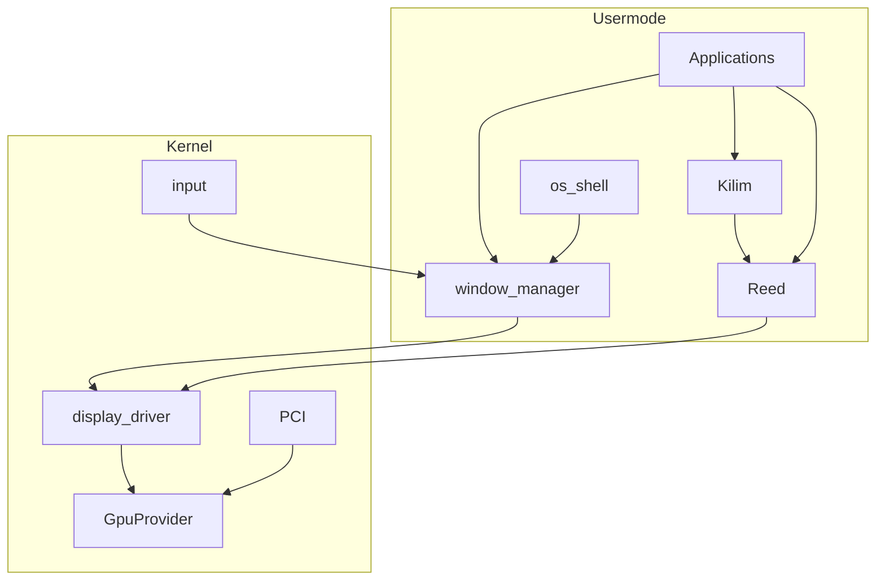

# GPU / Display / Reed + Kilim — End-to-End

## ⚠ Gerçeklik durumu (2026-07-29 — kod taramasi sonrasi)

Bu plan "backward compat yok, shim yok, kernel compositor/WM YASAK" diyor ve
`break-legacy` maddesini ilk adım gibi sıralıyor. Kod taramasi şunu gösterdi:
**tam tersi oldu** — proje kernel-side `dx` compositor'ı (`src/drivers/dx/`:
`compositor.c`, `window.c`, `server.c`, `console.c`, `draw.c`, `blur.c`, `font.c`,
`accel.c`, `render3d.c`, `context.c`, `device.c`, `dx_mod.c`) üzerine **çok daha
fazla** yatırım yaparak `SYS_WM_*`/`SYS_GX_*` (syscall.h 200-219, 275, 278) ABI'sini
production-grade hale getirdi: acrylic/blur, damage-rect, focus, topmost, class-based
window lookup, wallpaper. Bunun üstünde şu an **çalışan** bir masaüstü var:
`os-shell` (menubar + dinamik dock + tema + wifi/battery/clock), `os-settings`
(~1250 satır tam sayfa hub), `terminal` (~1545 satır), `files` (~471 satır Explorer),
`activity-monitor` (~754 satır), `imgui-demo`, `minesweeper` — hepsi `hsrc::sdk::gfx`
(kernel dx'e syscall ile bağlı) kullanıyor.

Buna karşılık bu planın gerçek teslimatı (Reed/Kilim/usermode WM) **hiç başlamadı**:

| Plan hedefi | Plandaki konum | Gerçek konum | Durum |
|---|---|---|---|
| Reed (low-level) | `userspace/reed` | `userspace/sdk/reed/reed.cpp` | 12 satır stub, `create_device()` → `-1` |
| Kilim (high-level) | `userspace/kilim` | `userspace/sdk/kilim/kilim.cpp` | 13 satır stub, `fill_rect()` → `-1` |
| usermode window-manager | `userspace/window-manager` | aynı yerde, gerçek | 13 satır — sadece `SYS_YIELD` döner, kendi yorumunda "compositor still kernel mkdx for now" diyor |
| `display.kmod` + `SYS_DISP_*` | yeni | yok | `syscall.h`'de `SYS_DISP_*` tanımı yok |
| `gpu_provider_ops` + `DRIVER_CLASS_GPU` | yeni | yok | `src/drivers/display/{bga,virtio_gpu}` hâlâ eski model, provider soyutlaması yok |

**Sonuç:** `break-legacy` maddesini plandaki gibi "ilk iş" olarak yapmak bugün
`os-shell`/`terminal`/`files`/`os-settings`/`activity-monitor`/`imgui-demo`/`minesweeper`'ın
hepsini aynı anda kırar (hepsi `SYS_WM_*`/`SYS_GX_*`'a bağımlı). Bu plan aşağıdaki
**kademeli migrasyon sırasına** göre revize edilmiştir — eski "1–5. Stack" ve "8. Sıra"
bölümleri artık bu sırayla okunmalı, çelişirse bu bölüm geçerlidir:

1. **Stage 0 (mevcut, dokunma):** Kernel `dx` compositor + `SYS_WM_*`/`SYS_GX_*` = tek
   çalışan grafik ABI'si. Silinmez, kırılmaz; yeni OS syscall numaraları (god-level plan)
   200-286 aralığıyla çakışmayacak şekilde eklenir.
2. **Stage 1 — gerçek Reed:** `gpu_provider_ops`, `display.kmod`, `SYS_DISP_*` yazılır;
   `userspace/sdk/reed/reed.cpp` gerçek implementasyona kavuşur. Bu aşamada `SYS_WM_*`'a
   dokunulmaz — iki ABI paralel yaşar.
3. **Stage 2 — Kilim parity:** Kilim, bugün `hsrc::sdk::gfx`'in sağladığı özellik
   kümesine ulaşana kadar yazılır: rounded-fill, text/font, SVG icon blit, acrylic/blur,
   damage-rect, wallpaper cover-scale. Parity olmadan hiçbir app migrate edilmez.
4. **Stage 3 — gerçek usermode window-manager:** `window-manager/main.cpp` placeholder'ı
   kaldırılır; focus≠hover, z-order, damage, `WindowOptions` boolean opts, process-death
   cleanup dahil `SYS_WM_*` semantiğinin tamamı Reed üzerinde yeniden inşa edilir.
5. **Stage 4 — app-by-app migrasyon:** `os-shell` → `os-settings` → `terminal` → `files`
   → `activity-monitor` → `imgui-demo`/`minesweeper` sırasıyla `hsrc::sdk::gfx`'ten
   Kilim/window-manager'a taşınır (god-level planın H9/H10/H13 phase'leriyle birebir
   örtüşür). Her app taşındıktan sonra kendi kabul kriteri regresyonsuz geçmeli.
6. **Stage 5 — break-legacy (asıl silme):** Tüm tüketiciler taşındıktan sonra
   `src/drivers/dx/*`, BGA, `ugx_font.inc`, `SYS_WM_*`/`SYS_GX_*` silinir. `rg
   SYS_WM_|SYS_GX_|ugx_|mkdx` → sıfır eşleşme kabul kriteri.

**Kırık referans:** `xmake_userspace_boot_a3be45ab.plan.md` artık `.cursor/plans/`
altında yok; bu dosyanın işaret ettiği init→systemd ayrımı zaten `userspace/systemd`
+ `userspace/init` + mevcut xmake kurulumuyla tamamlanmış durumda. Bu plandaki tüm
"xmake_userspace_boot" linkleri artık geçersiz sayılmalı; build/init konuları için
doğrudan `userspace/systemd/` ve `userspace/init/`'e bakılmalı.

**SMP/locking:** `src/drivers/dx/compositor.c` ve `window.c` kernel-side paylaşılan
state (window list, focus, z-order) tutuyor. `.cursor/rules/kernel-smp-state.mdc` /
`kernel-asm-locking.mdc` bu dosyalar için henüz taranmadı (`docs/smp-scan-report.md`
listesinde yok) — Stage 1-4 sırasında bu dosyalara dokunulmayacağı için acil değil,
ama Stage 5 öncesi (ve varsa yeni `display.kmod`/`SYS_DISP_*` kodu) için ayrı bir
SMP taraması yapılmadan "production-grade" denemez.

**İlişki**

| Konu | Plan |
|------|------|
| Build, `userspace/`, init→systemd, xmake | [xmake_userspace_boot_a3be45ab.plan.md](xmake_userspace_boot_a3be45ab.plan.md) |
| OS net/fs/Settings/Explorer… | [god-level_window_api_87fb7031.plan.md](god-level_window_api_87fb7031.plan.md) |
| Grafik / GPU / WM çizim | **bu dosya** |

Bu plan build omurgasını **tekrar etmez**. Kod `userspace/reed|kilim|window-manager|os-shell` altında yaşar; derleme xmake planına göre.

Teslimat: çalışan masaüstü grafik yığını (xmake planı ile birlikte). Ertelenmiş stub yok.

## İsimlendirme

| Katman | İsim |
|--------|------|
| Low-level | **Reed** (`userspace/reed`) |
| High-level | **Kilim** (`userspace/kilim`) |
| Orchestrator | `display.kmod` |
| GPU | `gpu_virtio` / `gpu_vga` |

Prefiks `reed*` / `kilim*`. Yasak: `mk*`, `ugx`.

## Politika

- Backward compat yok; shim yok.
- Focus ≠ hover; hibrit shell; boolean window opts.
- App doğrudan `display_*`/`gpu_*` çağırmaz.

## Kodlarken dikkat

1. `SYS_WM_*` / `mkdx_api` / kernel compositor → yok  
2. `ugx` / bitflag style → yok  
3. BGA / “BGA fallback derlensin” → yok  
4. Raw kernel pixel `wm_map` → handle export/import  
5. Kernel fill/font/blur/clipboard/console paint → yok  
6. Process exit cleanup → usermode WM  
7. Makefile aktif path / `src/user/apps` → yok (xmake plan)  
8. Kernel çoklu `.mke` spawn → yok (init→systemd)  
9. ISR compose / per-draw syscall → yok  

## WM / shell checklist (teslimatta)

Boolean opts (uint8_t), min/max/restore, owner/parent, z-order, hit-test, cursor, events+wait, damage rect, clipboard, AllocConsole usermode, ~64 windows, errno; dock pin + running zorunlu; deep-link menubar; frosted ~70% Kilim; process death cleanup.

## 1–5. Stack

1. **Reed** — device, buffers, DrawIndexed, present, fence, WSI  
2. **Kilim** — 2D/UI on Reed  
3. **GpuProvider** — `gpu.h`, PCI class 0x03, register/select  
4. **gpu_virtio** + **gpu_vga**; BGA sil  
5. **display.kmod** — submit çevirisi, handles, export/import, scanout, `SYS_DISP_*`  

## 6. WM + input

`userspace/window-manager` + focus≠hover + input feed. Kernel’de WM syscall yok.

## 7. Shell + apps

`userspace/os-shell` hibrit; diğer GUI app’ler aynı ağaçta (xmake plan layout).

## 8. Sıra

> **Güncel:** Bu sıra artık geçersiz — "Gerçeklik durumu" bölümündeki Stage 0-5
> kademeli sırası geçerlidir (legacy silme en sona alındı, çünkü tüm app'ler ona
> bağımlı hale geldi). Aşağıki liste sadece tarihsel referans.

1. ~~xmake_userspace_boot iskeleti~~ — zaten tamam (`userspace/systemd` + `userspace/init`)
2. ~~Legacy gfx sil~~ + GpuProvider + virtio/vga + display.kmod  
3. Reed → Kilim → WM → os-shell  
4. App rewrite + docs  

## 9. Docs

`docs/graphics-reed-kilim.{tr,en}.md` — esinlenme, terminoloji, katmanlar, focus≠hover, portability; build için xmake planına link.
