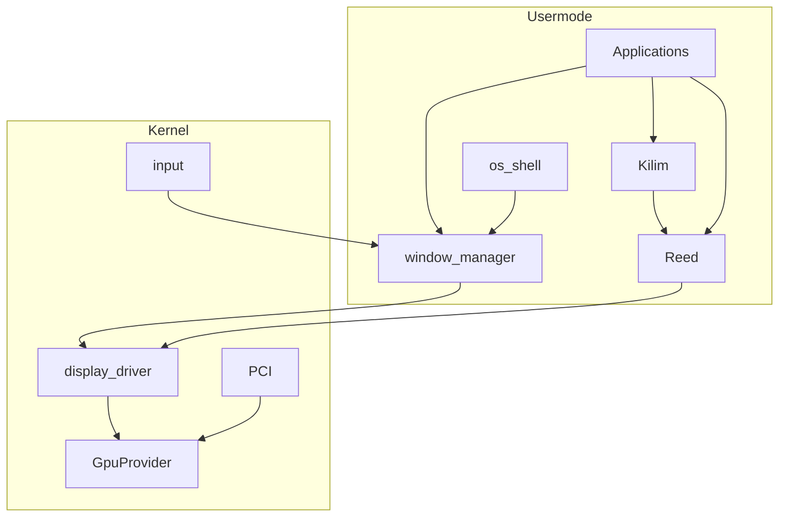

# GPU / Display / Reed + Kilim — End-to-End

**İlişki**

| Konu | Plan |
|------|------|
| Build, `userspace/`, init→systemd, xmake | [xmake_userspace_boot_a3be45ab.plan.md](xmake_userspace_boot_a3be45ab.plan.md) |
| OS net/fs/Settings/Explorer… | [god-level_window_api_87fb7031.plan.md](god-level_window_api_87fb7031.plan.md) |
| Grafik / GPU / WM çizim | **bu dosya** |

Bu plan build omurgasını **tekrar etmez**. Kod `userspace/reed|kilim|window-manager|os-shell` altında yaşar; derleme xmake planına göre.

Teslimat: çalışan masaüstü grafik yığını (xmake planı ile birlikte). Ertelenmiş stub yok.

## İsimlendirme

| Katman | İsim |
|--------|------|
| Low-level | **Reed** (`userspace/reed`) |
| High-level | **Kilim** (`userspace/kilim`) |
| Orchestrator | `display.kmod` |
| GPU | `gpu_virtio` / `gpu_vga` |

Prefiks `reed*` / `kilim*`. Yasak: `mk*`, `ugx`.

## Politika

- Backward compat yok; shim yok.
- Focus ≠ hover; hibrit shell; boolean window opts.
- App doğrudan `display_*`/`gpu_*` çağırmaz.

## Kodlarken dikkat

1. `SYS_WM_*` / `mkdx_api` / kernel compositor → yok  
2. `ugx` / bitflag style → yok  
3. BGA / “BGA fallback derlensin” → yok  
4. Raw kernel pixel `wm_map` → handle export/import  
5. Kernel fill/font/blur/clipboard/console paint → yok  
6. Process exit cleanup → usermode WM  
7. Makefile aktif path / `src/user/apps` → yok (xmake plan)  
8. Kernel çoklu `.mke` spawn → yok (init→systemd)  
9. ISR compose / per-draw syscall → yok  

## WM / shell checklist (teslimatta)

Boolean opts (uint8_t), min/max/restore, owner/parent, z-order, hit-test, cursor, events+wait, damage rect, clipboard, AllocConsole usermode, ~64 windows, errno; dock pin + running zorunlu; deep-link menubar; frosted ~70% Kilim; process death cleanup.

## 1–5. Stack

1. **Reed** — device, buffers, DrawIndexed, present, fence, WSI  
2. **Kilim** — 2D/UI on Reed  
3. **GpuProvider** — `gpu.h`, PCI class 0x03, register/select  
4. **gpu_virtio** + **gpu_vga**; BGA sil  
5. **display.kmod** — submit çevirisi, handles, export/import, scanout, `SYS_DISP_*`  

## 6. WM + input

`userspace/window-manager` + focus≠hover + input feed. Kernel’de WM syscall yok.

## 7. Shell + apps

`userspace/os-shell` hibrit; diğer GUI app’ler aynı ağaçta (xmake plan layout).

## 8. Sıra

1. xmake_userspace_boot iskeleti (init/systemd + userspace dirs)  
2. Legacy gfx sil + GpuProvider + virtio/vga + display.kmod  
3. Reed → Kilim → WM → os-shell  
4. App rewrite + docs  

## 9. Docs

`docs/graphics-reed-kilim.{tr,en}.md` — esinlenme, terminoloji, katmanlar, focus≠hover, portability; build için xmake planına link.
