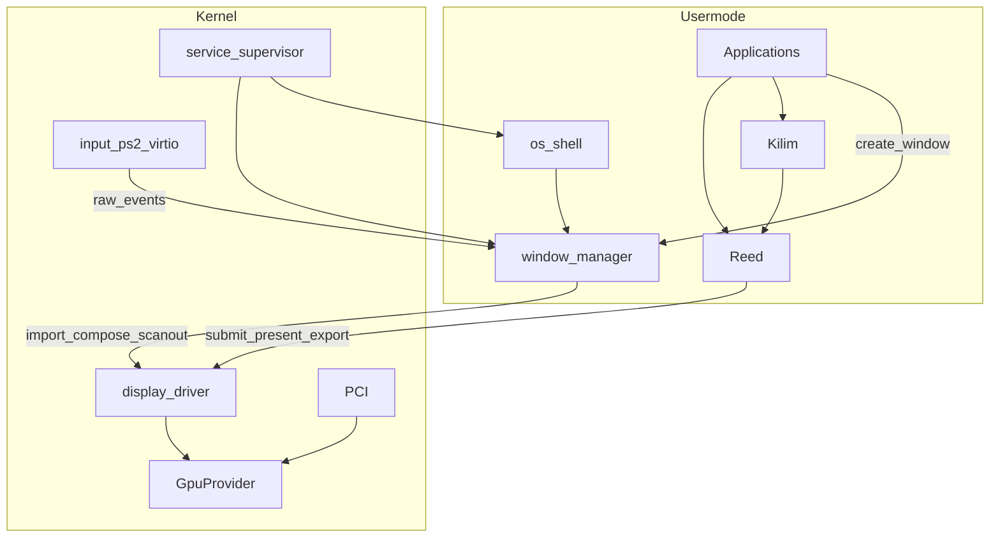

# GPU / Display / Reed + Kilim — End-to-End Teslimat

**İlişki:** Bu dosya **grafik + display + WM + GPU driver** omurgasının tek gerçek kaynağıdır. Process/fs/net/Settings sayfaları/Explorer/env → [god-level_window_api_87fb7031.plan.md](god-level_window_api_87fb7031.plan.md). Eski plandaki Wave A / H3 / H4 grafik katalogları **buraya taşındı ve eski plandan silindi**.

Yön değişmez. Aşağıdaki “Kodlarken dikkat” ve “Aktarılan WM/shell gereksinimleri” **genişletme**dir; mimariyi tersine çevirmez.

Teslimat: tek seferde çalışan tam grafik yığını. Ertelenmiş iş / stub / future TODO yok.

## İsimlendirme

| Katman | İsim | Rol |
|--------|------|-----|
| Low-level | **Reed** | Hasırın ham maddesi — GPU primitive (DX/GL-like) |
| High-level | **Kilim** | Bitmiş kilim — 2D/UI |
| Orchestrator | `display` | Markasız |
| Hardware | `gpu` / `gpu_virtio` / `gpu_vga` | Markasız |

Headers: `reed.h` / `reed.hpp`, `kilim.h` / `kilim.hpp`. Prefiks: `reed*` / `kilim*`. Yasak: `mk*`, ürün slogani, `ugx`.

## Politika

- Backward compatibility yok; shim yok.
- Masaüstü açılır: GPU detect → display → Reed/Kilim → WM → shell → app’ler.

---

## Kodlarken dikkat — eski plan uyumsuzlukları

Yön aynı kalır; şu eski yaklaşımlar **yeniden yazılmamalı**:

1. **`SYS_WM_*` / `mkdx_api` / kernel `window.c` compositor** — WM usermode IPC; kernel’de WM syscall tablosu yok.
2. **`ugx_*` / `gx.h` / `UGX_STYLE_*` bitflag** — silinir; window opts boolean + WM protokol struct (aşağıda); çizim Reed/Kilim.
3. **`display_ops` + BGA + “BGA fallback hâlâ derlensin”** — BGA kalıcı silinir; sadece GpuProvider.
4. **Raw kernel pixel pointer `wm_map`** — handle + map/export; zero-copy import.
5. **Kernel fill/font/blur/acrylic present path** — Kilim/Reed userspace; WM compose efekti userspace.
6. **Kernel AllocConsole paint** — console = usermode window (Kilim).
7. **Kernel static clipboard** — clipboard usermode WM (veya WM servisi).
8. **Process exit → `mkdx_api->wm_destroy_by_pid`** — process death → usermode WM’e bildirim / WM sahiplik cleanup.
9. **Tek global focus + hover yok** — focus ve hover ayrı; scroll varsayılan hover hedefi.
10. **Menubar/dock’u yalnızca shell’in tek buffer’ına boyamak** — hibrit: chrome shell; item `ReedImage`; dropdown app window.
11. **ISR içinde compose/present** — yasak (gfx-eng).
12. **Per-draw syscall** — Reed batch submit; Kilim Reed’e derler.

---

## Aktarılan gereksinimler (eski Wave A / shell — bu teslimatta)

Yön: hâlâ Reed → display → GpuProvider. Bunlar **WM / Kilim / shell** özellik checklist’i.

### WM protokolü (usermode)

- Window opts: **yalnızca boolean (`uint8_t`) + düz alanlar**; bit shift yok. Güncelleme: get → değiştir → set (tam struct).
- Geometry: x/y/w/h, min/max size, restore_frame; minimized / maximized / fullscreen.
- Owner/parent id (transient); class_name; title; opacity; rounded/acrylic flags (efekt userspace compose).
- Z-order: raise/lower/topmost/bottom; at_point; enum/find title/class; ~64 window.
- Hit-test: client / caption / close / min / max.
- Cursor: shape (ARROW/HAND/IBEAM/SIZE_*/NONE), hide, hotspot.
- Events (per-window queue + wait timeout): CLOSE, RESIZE, KEY_DOWN/UP (+mods/repeat), POINTER_*, SCROLL, FOCUS_GAIN/LOSS, HOVER_ENTER/LEAVE, PAINT (opsiyonel ipucu).
- Damage: window + **rect**; compose/present partial; occlusion skip.
- Clipboard text get/set (usermode).
- AllocConsole: usermode log window (Kilim); hide/show; write görünür.
- errno tutarlı (EINVAL, EPERM, ENOMEM, …).
- Process ölümünde sahip olunan pencereler temizlenir.

### Reed / Kilim

- Reed: device, VBO/IBO, `ReedImage`, Draw/DrawIndexed, viewport/scissor, clear, present, fence, staging, WSI swapchain.
- Kilim: fill/rounded, text, blit, widget helpers; shell frosted chrome (~%70 blur BG + opak ikon/metin) Kilim/Reed ile.
- App `display_*`/`gpu_*` doğrudan çağırmaz.

### Display / GPU

- `present` / dirty-rect flush / mümkünse vsync provider’da; display.kmod tek present/frame.
- virtio: TRANSFER+FLUSH dirty region; batch rects drag’de N sync round-trip yok.
- gfx-eng: batch, fence, damage, no ISR render, userspace draw.

### Hibrit shell (os-shell)

- Topbar/dock **layout + boş chrome**: shell.
- Item pixels: app `ReedImage` import.
- Dropdown: app window.
- Dock pin: Settings’ten; **çalışan app dock’ta zorunlu görünür** (pin olmasa da); çıkınca pin yoksa kaybolur.
- Menubar: sahte File/Edit yok; OS ikonu + Settings / System Information; **deep-link zorunlu** (settings://… — OS planındaki Settings app ile).
- Wallpaper: cover-scale scanout/WM scene; decode format kataloğu OS planı Wave J ile gelir, present yolu bu stack.

### Input feed

- PS/2 birincil fallback (silinmez); PCI virtio-input varsa tercih.
- Ham event → **usermode WM** (focus≠hover routing).
- Layout get/set syscall’ları OS/Settings planında; WM CHAR üretimi layout’u kullanır.

---

## 1. Reed — teslimatta zorunlu

(Önceki madde listesi + WSI; yukarıdaki checklist ile uyumlu.)

## 2. Kilim — teslimatta zorunlu

Fill/text/blit/widgets + frosted chrome yardımcıları; shell ve GUI app’ler Kilim ile.

## 3. GpuProvider framework — teslimatta zorunlu

`gpu.h` / `gpu.c`: `DRIVER_CLASS_GPU`, ops (bind, caps, resource_*, buffer_create, transfer/flush/blit, set_scanout, submit, fence_*), register, PCI class `0x03`.

## 4. GpuProvider’lar — teslimatta zorunlu

- `gpu_virtio.kmod` → `src/drivers/gpu/virtio/`
- `gpu_vga.kmod` → LFB (text buffer değil)
- Sil: BGA; eski present-only display_ops; kernel WM/compositor/draw/blur/font

## 5. Display Driver — teslimatta zorunlu

`display.kmod`: Reed submit çevirisi; handles; export/import; compose_submit; scanout; `SYS_DISP_*` batch.

## 6. Window Manager + input — teslimatta zorunlu

`/applications/window-manager.mke` + yukarıdaki WM protokol checklist + focus≠hover + input feed.

## 7. Services — teslimatta zorunlu

`roles`; `window-manager` + `os-shell`; isim özel-case yok.

## 8. Hibrit shell + app rewrite — teslimatta zorunlu

os-ui → os-shell; settings/terminal/files/monitor/minesweeper/imgui yolu yeni stack; ugx yok.

## 9. Sıra

1. Legacy sil → 2. GpuProvider+PCI → 3. virtio+vga → 4. display.kmod → 5. Reed → 6. Kilim → 7. WM+input → 8. services → 9. hibrit shell+apps → 10. Docs TR+EN

## 10. Docs — teslimatta zorunlu

`docs/graphics-reed-kilim.tr.md` + `.en.md`: esinlenme, terminoloji, katmanlar, focus≠hover, portability tablosu.
