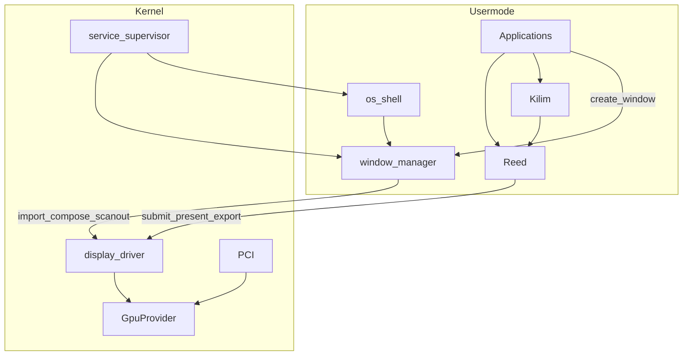

# GPU / Display / Reed + Kilim — End-to-End Teslimat

**İlişki:** Bu dosya **grafik + display + WM omurgasının** tek gerçek kaynağıdır. Geniş OS dalgaları (process/fs/net/Settings/Explorer/…) [god-level_window_api_87fb7031.plan.md](god-level_window_api_87fb7031.plan.md) içinde kalır; o plandaki eski “kernel mkdx / BGA / ugx” maddeleri buraya göre **güncellenmiştir**.

Bu planın çıktısı **tek seferde çalışan tam grafik yığınıdır**. “Sonra”, “ileride”, “v1 stub”, “future update”, TODO ertelemesi, dipnot ile kaçış **yok**. Kernel, driver’lar, display orchestrator, Reed, Kilim, WM, shell, app’ler ve docs aynı teslimatta biter.

## İsimlendirme

| Katman | İsim | Rol |
|--------|------|-----|
| Low-level | **Reed** | Hasırın ham maddesi — GPU primitive (DX/GL-like) |
| High-level | **Kilim** | Bitmiş kilim — 2D/UI (Reed üstünde) |
| Orchestrator | `display` | Markasız |
| Hardware | `gpu` / `gpu_virtio` / `gpu_vga` | Markasız |

Headers: `reed.h` / `reed.hpp`, `kilim.h` / `kilim.hpp`. Prefiks: `reed*` / `kilim*`. Yasak: `mk*`, ürün slogani, eski `ugx`.

## Politika

- Backward compatibility yok; eski grafik/WM yolu silinir.
- Shim yok.
- Teslimatta masaüstü açılır: GPU detect → display → Reed/Kilim → WM → shell → app pencereleri.

---

## 1. Reed (low-level) — teslimatta zorunlu

Tam userspace API + display backend:

- Device, queue/command submit (batch)
- Vertex / index buffer
- `ReedImage`, sampler
- Render target = window swapchain veya offscreen
- `reedDraw` / `reedDrawIndexed` (triangle list)
- Viewport, scissor, clear, present
- Fence
- Staging upload
- WSI: WM window → swapchain → display export

App doğrudan `display_*` / `gpu_*` çağırmaz; sadece Reed (UI için Kilim).

Portability yüzeyi (tasarım eşlemesi, ayrı iş değil): Device→VkDevice/D3D/GL, Buffer→VkBuffer, Image→VkImage, DrawIndexed→aynı, Fence→VkFence, Present→swapchain.

---

## 2. Kilim (high-level) — teslimatta zorunlu

Reed’e derlenen 2D/UI; kernel’e inmez. Teslimatta:

- Fill rect / rounded rect
- Text (bitmap/font path userspace)
- Image blit
- Temel widget çizim yardımcıları (shell ve app’lerin ihtiyaç duyduğu kadar)
- Shell chrome ve mevcut GUI app’ler Kilim ile boyanır

---

## 3. Kernel GpuProvider framework — teslimatta zorunlu

`include/drivers/gpu.h`, `src/drivers/gpu/gpu.c`:

- `DRIVER_CLASS_GPU`
- `gpu_provider_ops_t`: bind, caps/mode, resource_*, buffer_create, transfer/flush/blit, set_scanout, submit, fence_*
- `gpu_provider_register` + aktif provider seçimi
- PCI class `0x03` enumerate + provider id table

---

## 4. GpuProvider’lar — teslimatta zorunlu

- **`gpu_virtio.kmod`:** `src/drivers/gpu/virtio/` — virtio-pci + virtio-gpu; resource/transfer/flush/scanout/submit
- **`gpu_vga.kmod`:** LFB display context (text `0xB8000` değil); aynı ops
- **Silinen:** BGA ve tüm BGA build/initrd; eski `display_ops` present modeli; kernel WM/compositor/draw/blur/font

---

## 5. Display Driver — teslimatta zorunlu

`display.kmod`:

- Reed submit → provider komutları
- Handle namespace: buffers, images, swapchains, fences, export rights
- export / import (WM zero-copy share)
- compose_submit + scanout
- `SYS_DISP_*` batch ABI (eski gfx/wm syscall’lar silinir)

---

## 6. Window Manager + input — teslimatta zorunlu

`/applications/window-manager.mke`, critical supervised:

- Window create/destroy/move/resize/stack/focus
- App swapchain publish → WM import → Reed textured-quad compose → display scanout
- **Focus ≠ hover** (ayrı state); key→focus; scroll varsayılan hover; click→focus transfer; event’ler: `FOCUS_*`, `HOVER_*`, `POINTER_*`, `SCROLL`, `KEY_*`
- Kernel’de WM-özel kod/syscall yok

---

## 7. Services — teslimatta zorunlu

`service.c` + `roles` (`CRITICAL`, `SESSION_UI`, …). Builtin: `window-manager`, `os-shell`. İsimle özel-case yok; role + respawn.

---

## 8. Hibrit shell + app rewrite — teslimatta zorunlu

- Topbar/dock layout + chrome: os-shell (Kilim/Reed)
- Item pixels: app `ReedImage` → shell import
- Dropdown: app window
- Tüm mevcut GUI app’ler (os-ui, settings, terminal, files, activity-monitor, minesweeper, imgui yolu) yeni stack ile çalışır veya stack’e uyarlanır; eski ugx yolu kalmaz

---

## 9. Uygulama sırası (hepsi bu teslimat)

1. Legacy grafik/WM/BGA sil  
2. GpuProvider + PCI  
3. `gpu_virtio` + `gpu_vga`  
4. `display.kmod` + `SYS_DISP_*`  
5. Reed  
6. Kilim  
7. Usermode WM + focus/hover  
8. Service roles + critical start  
9. Hibrit shell + app rewrite  
10. Docs TR + EN  

gfx-eng: batch submit, fence, no ISR render, single present/frame, userspace draw.

---

## 10. Dokümantasyon — teslimatta zorunlu

| Dosya | Dil |
|-------|-----|
| `docs/graphics-reed-kilim.tr.md` | Türkçe |
| `docs/graphics-reed-kilim.en.md` | English |

İçerik (her dil kendi metni): esinlenme (Hasırcıoğlu / Reed–Kilim), terminoloji sözlüğü, katmanlar, sorumluluk sınırları, focus≠hover, portability eşleme tablosu.
