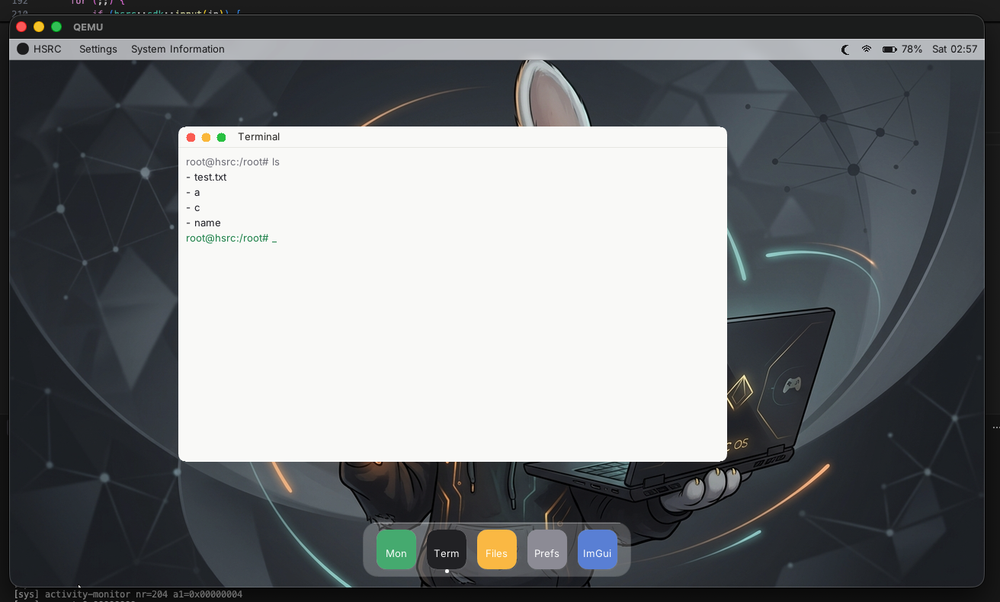

# mykernel

**bare metal. multiboot. your own damn desktop.**

> *Hobi OS — kernel'den dock'a, sıfırdan.*

i386 Multiboot kernel + loadable `.kmod` drivers + usermode C++ `.mke` apps, all running under QEMU with SMP, virtio, and an actual compositor. Not a toy shell loop. A tiny OS that boots, paints windows, and lets you open ImGui for fun.

---

## Showcase

Boots. Paints. Opens windows. Here's the desktop in the wild:



*More shots landing later.*

---

## Features

Stuff that actually exists in the tree — no LinkedIn buzzwords:

- **x86 Multiboot kernel** — `i686-elf` freestanding, boots under QEMU (`qemu-system-i386`)
- **SMP** — LAPIC + APs; default run is **3 vCPUs**
- **Preemptive scheduler** — timer IRQ context-switches CPU hogs; cooperative yield still works
- **Usermode processes** — C++17 apps packed as **`.mke`**, flat address space, syscalls
- **Threading + sync** — `Thread`, kernel **Event**, **ConditionVariable** (block for real, don't spin on `yield(0)`)
- **MKDX** — window/surface compositor (layers, acrylic blur, wallpaper, drag) as a loadable module
- **Desktop stack** — `os-ui` dock/shell, terminal, files, settings, activity-monitor
- **imgui-demo** — Dear ImGui on a custom UGX backend, because why not
- **Driver modules (`.kmod`)** — packed into initrd; PCI, VGA, PS/2, VFS/block stack, …
- **Virtio** — `virtio-blk` disk + `virtio-net` + DHCP / sockets
- **VFS zoo** — fat, ext, ntfs, exfat, iso9660, tmpfs, procfs, sysfs, and friends (as loadable FS drivers)
- **Boot splash** — because staring at serial alone is for cowards

---

## Architecture peek

```
┌─────────────────────────────────────────────────────────┐
│  usermode .mke apps                                     │
│  os-ui · terminal · files · settings · activity · imgui │
│  C++ SDK: gfx / thread / Event / CV / fs / net          │
└──────────────────────────┬──────────────────────────────┘
                           │ syscalls
┌──────────────────────────▼──────────────────────────────┐
│  kernel                                                 │
│  process · scheduler · SMP · sync · VFS · net · mm      │
└──────────────────────────┬──────────────────────────────┘
                           │ .kmod / initrd
┌──────────────────────────▼──────────────────────────────┐
│  drivers                                                │
│  MKDX compositor · virtio · block/fs · input · display  │
└─────────────────────────────────────────────────────────┘
```

Graphics rule of thumb: **kernel owns windows & present; apps own pixels.** MKDX composes; SDK commits. No "draw a button in ring 0" nonsense.

---

## Build & Run

**Toolchain:** `nasm`, `i686-elf-gcc` / `g++`, `qemu-system-i386`

```bash
make            # kernel.bin + initrd + disk.img (parallel by default)
make run        # QEMU: 1G RAM, -smp 3, virtio disk+net, serial on stdio
make clean
make disk       # (re)build disk image helpers as needed
```

Serial goes to your terminal. GUI is the VGA window. Smash apps from the dock like a civilized chaos agent.

Override parallelism if you want: `make JOBS=1`.

---

## Project layout

```
apps/           # imgui-demo (+ Dear ImGui)
assets/         # fonts, wallpaper, icons, showcase shots
include/        # kernel + user SDK headers
mk/             # Makefile fragments (kernel, drivers, userapps, qemu)
src/arch/x86/   # GDT/IDT/IRQ/CPU
src/kernel/     # boot, mm, process, scheduler, SMP, sync, syscall, …
src/drivers/    # .kmod sources (MKDX, virtio, VFS, …)
src/user/       # SDK + usermode apps (.mke)
tools/          # pack_initrd, pack_mke, mkfatimg, …
```

---

## Status

Hobby OS. Expect sharp edges, late-night commits, and the occasional "wait that actually works?" moment. Contributions are welcome if you like pain and pixels in equal measure.

No root license file yet — treat it as a personal/hobby project unless one shows up.
